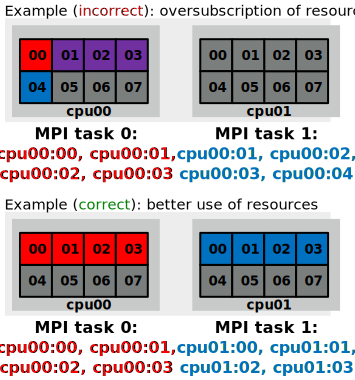

# Using MPI with OpenMP threads {.section}

# Thread support in MPI

{.center width=80%}


# Thread safe initialization

`MPI_Init_thread(required, provided)`
  : `argc`{.input}, `argv`{.input}
    : Command line arguments in C
  : `required`{.input}
    : Required thread safety level
  : `provided`{.output}
    : Supported thread safety level
  : `error`{.output}
    : Error value; in C/C++ it's the return value of the function,
      and in Fortran an additional output parameter

- Pre-defined integer constants:<br>
  <code style="font-size:0.8em">
  MPI_THREAD_SINGLE < MPI_THREAD_FUNNELED < MPI_THREAD_SERIALIZED < MPI_THREAD_MULTIPLE
  </code>


# Hybrid programming styles: fine/coarse grained

- Fine-grained
    - use **omp parallel do/for** on the most intensive loops
    - possible to hybridize an existing MPI code with little effort and in
      parts

- Coarse-grained
    - use OpenMP threads to replace MPI tasks
    - whole (or most of) program within the same parallel region
    - more likely to scale over the whole node, enables all cores to
      communicate (if supported by MPI implementation)


# Multiple thread communication

- Hybrid programming is relatively straightforward in cases where
  communication is done by only a single thread at a time
- In the *multiple* thread safety level all threads can make MPI calls
  independently
  ```c
  int required=MPI_THREAD_MULTIPLE, provided;
  MPI_Init_thread(&argc, &argv, required, &provided)
  ```
- When multiple threads communicate, the sending and receiving threads
  normally need to match
    - thread-specific tags
    - thread-specific communicators


# Thread-specific tags

- In point-to-point communication the thread ID can be used to
  generate a tag that guides the messages to the correct thread

{.center width=60%}


# Thread-specific tags

- In point-to-point communication the thread ID can be used to
  generate a tag that guides the messages to the correct thread

```fortran
!$omp parallel private(tid, tidtag, ierr)
tid = omp_get_thread_num()
tidtag = 2**10 + tid

! mpi communication to the corresponding thread on another process
call mpi_sendrecv(senddata, n, mpi_real, pid, tidtag, &
                  recvdata, n, mpi_real, pid, tidtag, &
                  mpi_comm_world, stat, ierr)

!$omp end parallel
```


# Collective operations in the multiple mode

- MPI standard allows multiple threads to call collectives simultaneously
    - programmer must ensure that the same communicator is not being
      concurrently used by two different collective communication calls at
      the same process
- In most cases, even with `MPI_THREAD_MULTIPLE` it is beneficial to
  perform the collective communication from a single thread (usually the
  master thread)
- Note that MPI collective communication calls do not guarantee
  synchronization of the thread order


# MPI thread support levels

- Modern MPI libraries support all threading levels
    - OpenMPI: Build time configuration, check with
    ```bash
    ompi_info | grep 'Thread support'
    ```
    - Intel MPI: When compiling with `-qopenmp` a thread safe version of the
      MPI library is automatically used
    - Cray MPI: Set `MPICH_MAX_THREAD_SAFETY` environment variable to
      `single`, `funneled`, `serialized`, or `multiple` to select the
      threading level
- Note that using `MPI_THREAD_MULTIPLE` requires the MPI library to
  internally lock some data structures to avoid race conditions
    - may result in additional overhead in MPI calls


# Summary

- Multiple threads may make MPI calls simultaneously
- Thread specific tags and/or communicators
- For collectives it is often better to use a single thread for
  communication


# Thread and process affinity {.section}

# Thread and process affinity

- Normally, operating system can run threads and processes in any
  logical core
- Operating system may even move the running process/thread from one core to
  another
    - can be beneficial for load balancing
    - for HPC workloads often detrimental as private caches get
      invalidated and NUMA locality is lost
- User can control where tasks are run via affinity masks
    - task can be *pinned* to a specific logical core or a set of logical
      cores


# Controlling affinity

- Affinity for a *process* can be set with the `numactl` command
    - limit the process to logical cores 0,3,7:
      <br><span style="padding-left:2em">
      `numactl --physcpubind=0,3,7 ./my_exe`
      </span>
    - threads inherit the affinity of their parent process
- On LUMI, process affinity is set by using SLURM options
    - `--distribution={nodes}:{sockets}:{cores}`
        - `{nodes|sockets|cores} ∈ [block, cyclic, plane=<size>, ...]`
    - e.g. `--distribution=block:cyclic:fcyclic`


# Controlling affinity

- Affinity of a thread can be set with OpenMP environment variables
    - `OMP_PROC_BIND=true/false|auto|spread|close|master`
        - e.g. `export OMP_PROC_BIND=spread`
    - `OMP_PLACES=threads|cores|sockets`
        - e.g. `export OMP_PLACES=cores`
- OpenMP runtime prints the affinity with `OMP_DISPLAY_AFFINITY=true`

- Useful on-line resources:
    - LUMI User Guide:<br>
      <span style="font-size:0.72em">
      <https://docs.lumi-supercomputer.eu/runjobs/scheduled-jobs/distribution-binding/>
      </span>
    - Frontier User Guide:<br>
      <span style="font-size:0.72em">
      <https://docs.olcf.ornl.gov/systems/frontier_user_guide.html#process-and-thread-mapping-examples>
      </span>


# Controlling affinity

```bash
export OMP_AFFINITY_FORMAT="Thread %0.3n affinity %A"
export OMP_DISPLAY_AFFINITY=true
./test
Thread 000 affinity 0-7
Thread 001 affinity 0-7
Thread 002 affinity 0-7
Thread 003 affinity 0-7
```

```bash
OMP_PLACES=cores ./test
Thread 000 affinity 0,4
Thread 001 affinity 1,5
Thread 002 affinity 2,6
Thread 003 affinity 3,7
```


# MPI+OpenMP thread affinity

<div class="column">
- MPI library must be aware of the underlying OpenMP for correct
  allocation of resources
    - oversubscription of CPU cores may cause significant performance
      penalty
- Additional complexity from batch job schedulers
- Heavily dependent on the platform used!
</div>

<div class="column">
{.center width=70%}
</div>


# Slurm configuration at CSC

- Within a node, `--tasks-per-node` MPI tasks are spread
  `--cpus-per-task` apart
- Threads within a MPI tasks have the affinity mask for the
  corresponding `--cpus-per-task` cores
  ```bash
  export OMP_AFFINITY_FORMAT="Process %P thread %0.3n affinity %A"
  export OMP_DISPLAY_AFFINITY=true
  srun ... --tasks-per-node=2 --cpus-per-task=4 ./test
  Process 250545 thread 000 affinity 0-3
  ...
  Process 250546 thread 000 affinity 4-7
  ...
  ```
- Slurm configurations in other HPC centers can be very different
    - always experiment before production calculations!


# Summary

- Performance of HPC applications is often improved when processes and
  threads are pinned to CPU cores
- MPI and batch system configurations may affect the affinity
    - very system dependent, try to always investigate
