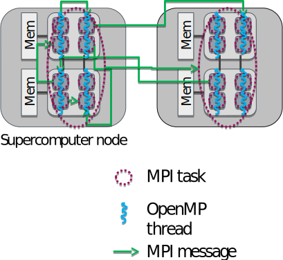
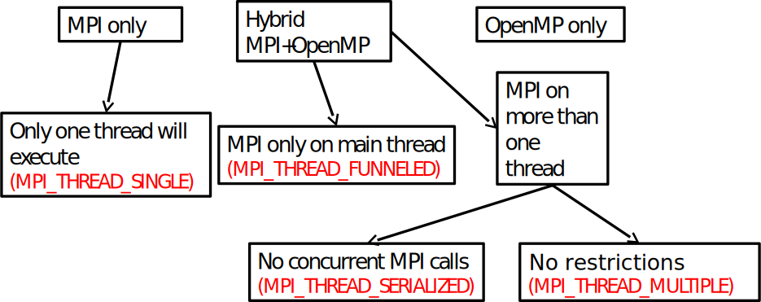

# Basic concepts {.section}

# Processes and threads

{.center width=100%}

<div class="column">

## Process

- Independent execution units
- Have their own state information and *own memory* address space

</div>

<div class="column">

## Thread

- A single process may contain multiple threads
- Have their own state information, but *share* the *same memory*
  address space


</div>


# Processes and threads

{.center width=100%}


<div class="column">
## Process

- Long-lived: spawned when parallel program started, killed when
  program is finished
- Explicit communication between processes

**MPI**

</div>

<div class="column">

## Thread

- Short-lived: created when entering a parallel region, destroyed
  (joined) when region ends
- Communication through shared memory

**OpenMP**

</div>


# Hybrid programming

<div class=column>
* **Process**  (MPI)  
	- Independent execution units
	- MPI launches N processes at application startup


</div>
<div class=column>
* **Thread**   (Openmp)  
	- Threads share memory space
	- Threads are created and destroyed (_parallel regions_)
</div>
` `  
**Hybrid programming:**  
Launch threads (OpenMP) _within_ processes (MPI)

# Hybrid programming

<div class=column>
* Shared memory programming inside a node, message passing between nodes
* Matches well modern supercomputer hardware
* Often one MPI task / socket, but one should experiment with the ratio
</div>
<div class=column>
{.center width=90%}
</div>


# Hybrid hello

<div class=column>
```c
int main(int argc, char *argv[]){
 int my_id, omp_rank;
 int required=MPI_THREAD_FUNNELED, provided;
 MPI_Init_thread(&argc,&argv,
 	required,provided);

 MPI_Comm_rank(MPI_COMM_WORLD,&my_id);
#pragma omp parallel private(omp_rank)
 {
  omp_rank=omp_get_thread_num();
  printf("I'm thread %d in process %d\n", 
         omp_rank, my_id);
 }
 MPI_Finalize();
}
```
</div>
<div class=column>
```bash
> aprun -n 4 -d 4 ./hybhello
I'm thread 0 in process 0
I'm thread 0 in process 1
I'm thread 2 in process 1
I'm thread 3 in process 1
I'm thread 1 in process 1
I'm thread 3 in process 0
I'm thread 1 in process 0
I'm thread 2 in process 0
I'm thread 0 in process 2
I'm thread 0 in process 3
I'm thread 1 in process 3
I'm thread 3 in process 3
I'm thread 2 in process 3
I'm thread 1 in process 2
I'm thread 3 in process 2
```
</div>

# Thread support in MPI

{.center width=100%}

# Thread safe initialization

**`MPI_Init_thread`(`required`{.input}, `provided`{.output})**    
  
(`argc`{.input}, `argv`{.input}	Command line arguments in C)  
`required`{.input} 		Required thread safety level  
`provided`{.output}		Supported thread safety level  
`error`{.output}			Error value; in C/C++ it’s the return value of the function, and in Fortran an additional output parameter  
  
Pre-defined integer constants:   
	`MPI_THREAD_SINGLE < MPI_THREAD_FUNNELED < MPI_THREAD_SERIALIZED < MPI_THREAD_MULTIPLE`  

# Hybrid programming styles: fine/coarse grained

* Fine-grained
	- Use `omp parallel do/for` on the most intensive loops
	- Possible to hybridize an existing MPI code with little effort and in parts
* Coarse-grained
	- Use OpenMP threads to replace MPI tasks
	- Whole (or most of) program within the same parallel region
	- More likely to scale over the whole node, enables all cores to communicate (if supported by MPI implementation)

# Potential advantages of the hybrid approach

* Fewer MPI processes for a given amount of cores
	- Improved load balance
	- All-to-all communication bottlenecks alleviated
	- Decreased memory consumption if an implementation uses replicated data
* Additional parallelization levels may be available
* Possibility for dedicating threads for different tasks
	- e.g., dedicated communication thread or parallel I/O
	- Note that OpenMP worksharing constructs (e.g. OMP DO) will not be applicable when dedicating threads

# Disadvantages of hybridization

* Increased overhead from thread creation/destruction
* More complicated programming
	- Code readability and maintainability issues
	- Synchronization
* Thread support in MPI and other libraries needs to be considered


# Real-world hybrid applications

* Vlasiator – space weather simulations
	- Fluid in 6D spatial/velocity space: spatial grid with MPI, velocity grid with OpenMP
	- Lower memory footprint and better load balancing
* CP2K `–` electronic structure simulations
	- Especially so called hybrid functionals benefit from threading
	- Lower memory footprint allows more efficient computations

# Real-world hybrid applications

* Vlasiator, 200 nodes (4800 cores) on Sisu
<small>

|Threads per process|Hyperthreads per core|MPI ranks per node|Performance (10^8 cells/s)|Memory use per node (GB)|
|-------------------|---------------------|------------------|--------------------------|------------------------|
|1		    |1			  |24		     |1.06			|28.4			 |
|2		    |1			  |12		     |1.06			|24.6			 |
|4		    |1			  |6		     |1.04			|22.8			 |
|6		    |1			  |4	    	     |1.02   			|22.2			 |
|1		    |2			  |24		     |1.35			|28.5			 |
|2		    |2			  |12		     |1.33			|24.6			 |
|6		    |2			  |8		     |1.32			|23.4			 |
|12		    |2			  |4		     |1.25			|22.2			 |

</small>


# Summary
* Hybrid programming maps well to modern hardware
* In theory, hybrid programming offers several advantages
* In practice, all the advantages can be difficult to realize
* As number of cores inside a node increases, advantages of hybrid approach are likely to become more and more relevant
* MPI provides different levels of thread support

