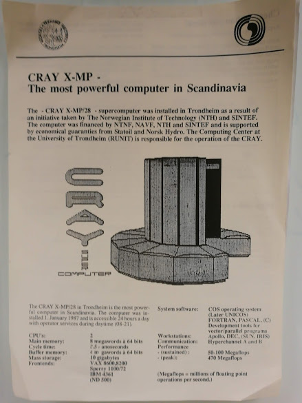
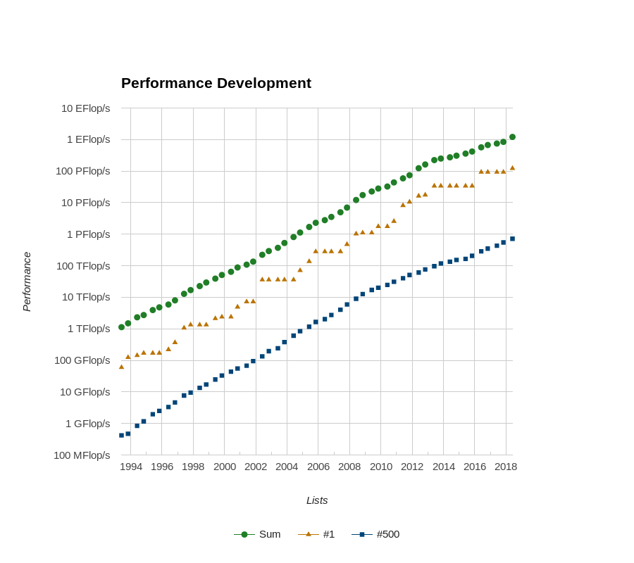
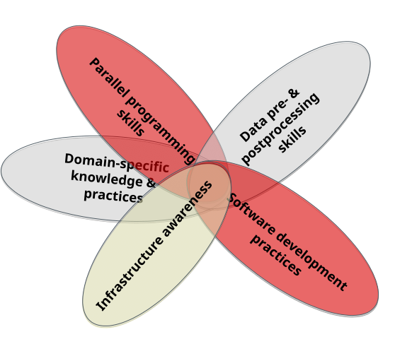
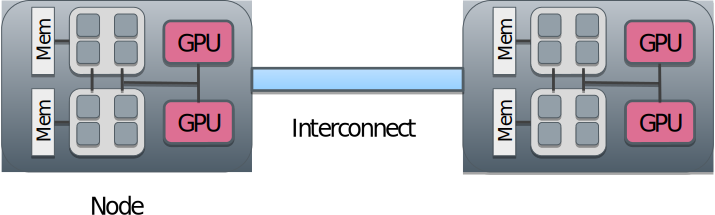
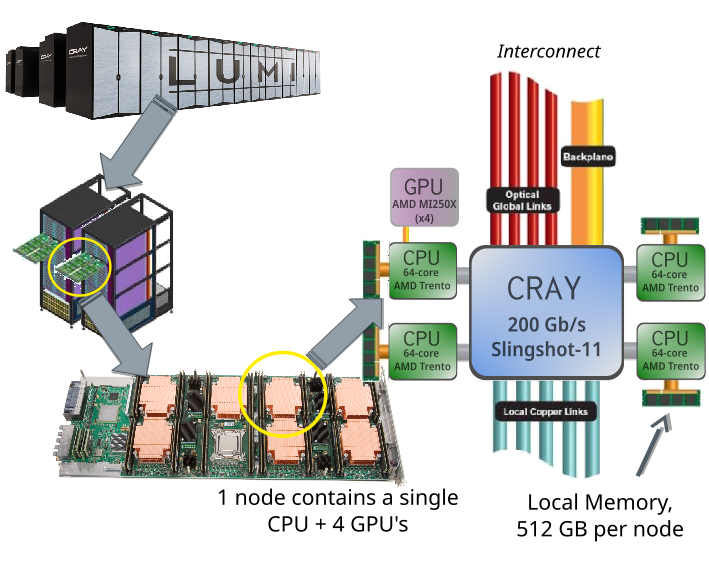

# What is high-performance computing?

* Utilising computing power that is much larger than available in typical desktop computer
* Performance of HPC systems (i.e. supercomputers) is often measured in floating point operations per second (flop/s)
	- For software, other measures can be more meaningful
* Currently, the most powerful system reaches > $10^{18}$ flop/s (1 Eflop / s)

# What is high-performance computing?

 {.center width=30%}

# Top 500 list

 {.center width=50%}

# What are supercomputers used for? {.section}

# Materials science

* New materials
	- Design of meta-materials
	- Hydrogen storage
* New methods for catalysis
	- Industrial processes
	- Air and water purification
* Design of devices from first principles

{.center width=80%}

# Life sciences

* Natural language processing
* Identifying genomic variants associated with common complex diseases
* Spreading of aerosols in the air
* Medical imaging and diagnostics
* Predicting protein folding

<!-- Source: Adobe Stock, CC BY-SA 3.0 -->
 {.center width=90%}

# Earth sciences

* Long term climate modeling
	- Understanding and predicting climate change
* High-resolution weather prediction
	- Predicting extreme weather conditions
	- District-scale forecasts
* Whole-Earth seismological models
* Modelling space weather

 {.center width=80%}

# Artificial intelligence

* Machine learning
	- deep neural networks
* Large scale data analysis
* Interpreting experimental data
* Prediction of material properties

 {.center width=80%}

# Utilizing HPC in scientific research

 {.center width=40%}

* **Goal for this school: everyone is able to write and modify HPC applications!**

# What are supercomputers made of? {.section}

# CPU frequency development
* Power consumption of CPU: $~f^3$

 {.center width=45%}

# Parallel processing

* Modern (super)computers rely on parallel processing
* **Multiple** CPU cores & accelerators (GPUs)
	- `#`1 system has `~`9 000 000 cores & `~`40 000 GPUs
* Vectorization
	- A single instruction can process multiple data (SIMD)
* Pipelining
	- Core executes different parts of instructions in parallel

# Anatomy of a supercomputer

* Supercomputers consist of nodes connected with high-speed network
	- Latency `~`1 µs, bandwidth `~`20 GB / s
* A node can contain several multicore CPUS
* Additionally, a node can contain one or more accelerators
* Memory within the node is directly usable by all CPU cores

 {.center width=60%}

# Supercomputer autopsy – Lumi

 {.center width=50%}

# From laptop to Tier-0

 {.center width=80%}

* The most fundamental difference between a small university cluster and Tier-0 supercomputer is the number of nodes
	- The interconnect in high end systems is often also more capable

# Cloud computing

* Cloud infrastructure is run on top of normal HPC system:
	- Shared memory nodes connected by network
* User obtains **virtual** machines
* Infrastructure as a service (IaaS)
	- User has full freedom (and responsibility) of operating system and the whole software environment
* Platform as a service (PaaS)
	- User develops and runs software within the provided environment

# Cloud computing and HPC

* Suitability of cloud computing for HPC depends heavily on application
	- Single node performance is often ok
* Virtualization adds overhead especially for the networking
	- Some providers offer high-speed interconnects with a higher price
* Moving data out from the cloud can be expensive
* Currently, cloud computing is not very cost-effective solution for most large scale HPC simulations

# Parallel computing concepts {.section}

# Computing in parallel
* Parallel computing
	- A problem is split into smaller subtasks
	- Multiple subtasks are processed simultaneously using multiple cores

 {.center width=40%}

# Types of parallel problems
* Tightly coupled
	- Lots of interaction between subtasks
	- Weather simulation
	- Low latency, high speed interconnect is essential
* Embarrassingly parallel
	- Very little (or no) interaction between subtasks
	- Sequence alignment queries for multiple independent sequences in bioinformatics

# Exposing parallelism

* Data parallelism
	- Data is distributed across cores
	- Each core performs simultaneously (nearly) identical operations with different data
	- Cores may need to interact with each other, e.g. exchange information about data on domain boundaries

 {.center width=80%}

# Exposing parallelism
* Task farm (master / worker)

 {.center width=60%}

* Master sends tasks to workers and receives results
* There are normally more tasks than workers, and tasks are assigned dynamically

# Parallel scaling

* Strong parallel scaling
	- Constant problem size
	- Execution time decreases in proportion to the increase in the number of cores
* Weak parallel scaling
	- Increasing problem size
	- Execution time remains constant when number of cores increases in proportion to the problem size

 {.center width=80%}

# What limits parallel scaling

* Load imbalance
	- Distribution of workload to different cores varies
* Parallel overheads
	- Additional operations which are not present in serial calculation
	- Synchronization, redundant computations, communications
* Amdahl’s law: the fraction of non-parallelizable parts establishes the limit on how many cores can be harnessed

  {.right width=100%}

# Parallel programming {.section}

# Programming languages

- The de-facto standard programming languages in HPC are (still!)
  C/C++ and Fortran 
- Higher level languages like Python and Julia are gaining popularity
    - Often computationally intensive parts are still written in C/C++
      or Fortran 
- For some applications there are high-level frameworks with
  interfaces to multiple languages
    - SYCL, Kokkos, Petsc, Trilinos
    - TensorFlow, PyTorch for deep learning
    - Spark for MapReduce

# Parallel programming models
* Parallel execution is based on threads or processes (or both) which run at the same time on different CPU cores
* Processes
	- Interaction is based on exchanging messages between processes
	- MPI (Message passing interface)
* Threads
	- Interaction is based on shared memory, i.e. each thread can access directly other threads data
	- OpenMP, pthreads

# Parallel programming models

 {.center width=80%}

**MPI: Processes**

* Independent execution units
* MPI launches N processes at application startup
* Works over multiple nodes

**OpenMP: Threads**  

* Threads share memory space
* Threads are created and destroyed  (parallel regions)
* Limited to a single node

# Parallel programming models

{.center width=100%}

# Future of High-performance computing {.section}

# Post-Exascale challenges

* Performance of supercomputers has increased exponentially for a long time
* However, there are still challenges in continuing onwards from exascale supercomputers ($> 1 \times 10^{18}$ flop/s)
	- Power consumption: current `#`1 energy efficient system requires `~`20 MW for exascale performances
	- Cost & Maintaining: Global chip shortage
	- Application scalability: how to program for 100 000 000 cores?

# Quantum computing
* Quantum computers can solve certain types of problems exponentially faster than classical computers
* General purpose quantum computer is still far away
* For optimisation problems, D-Wave computer based on quantum annealing is already commercially available
