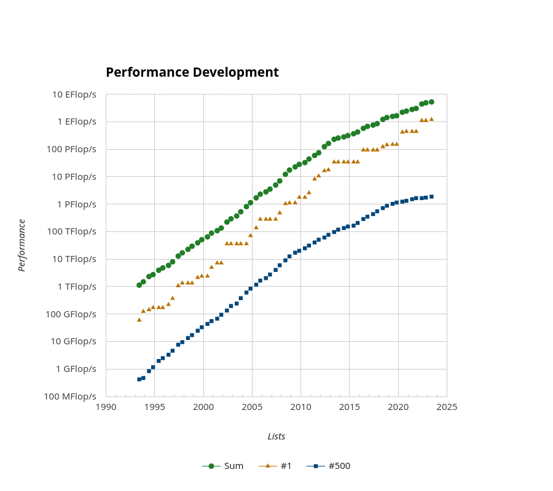
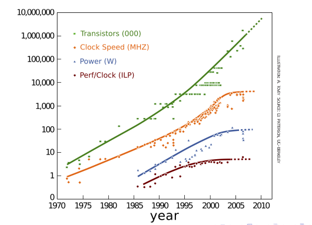
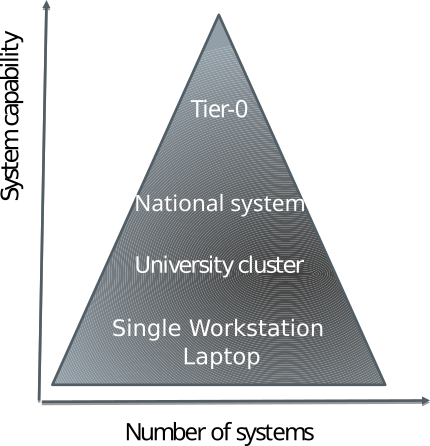
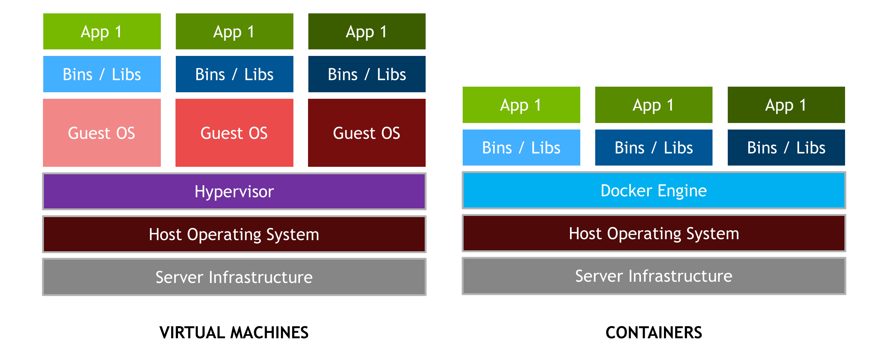

# What is high-performance computing?

- Utilizing computing power that is much larger than available in a typical desktop computer
- Performance of HPC systems (i.e. supercomputers) is often measured in floating point operations per second (flop/s)
    - For software, other measures can be more meaningful
- Currently, the most powerful system reaches > $10^{18}$ flop/s (1 Eflop / s)

# What is high-performance computing?

<!-- Copyright CSC -->
 {.center width=30%}

# Top 500 list

<!-- Source: top500.org, Copyright 1993-2023 TOP500.org (c) -->
 {.center width=48%}

# What are supercomputers used for? {.section}

# General use cases

- Simulations of very different scales
    - From subatomic particles to cosmic scales
- Problems with very large datasets
- Complex computational problems
- Problems that are hard to experiment on
    - Simulations with decade-long timescales
- Many of these are very time consuming, or even 
  impossible to solve on a standard computer

# Application areas

- Fundamental sciences such as particle physics and cosmology
- Climate, weather and earth sciences
- Life sciences and medicine
- Chemistry and material science
- Energy, e.g renewable sources and fusion research
- Engineering, e.g. manufacturing and infrastructure
- etc.

# Climate change

- Simulating ice sheets, air pollutants, sea-level rise etc.
- Building short and long-term simulations
- Analyzing with different parameters for future predictions and possible solutions
- Modeling space weather

{.center width=90%}

# Covid-19 fast track with Puhti

- Modeling particles in airflows
- A large part of the calculations used for solving turbulent flow
- A third of Puhti was reserved for running the simulations
- The results have had an impact on e.g. ventilation instructions and the use of masks

{.center width=100%}

# Gravitational waves

- Computational modeling of sources of gravitational waves
- Identifying a phase transition of the Higgs boson “turning on” (10 picoseconds after Big Bang)
- Large simulations with over ten thousand CPU cores
- Experimental data from ESA's LISA satellite (Launch date 2037)

{.center width=90%}

#  Topological superconductors

- Topological superconductors are possible building blocks for qubits
- Based on an elusive quantum state of electrons in thin layers
- Electronic properties simulated with the density-functional theory
    - These confirm that experimentally measured signals are due to this special quantum state

{.center width=100%}

# Deep language model of Finnish

- Web-scale Finnish language data together with very deep neural networks utilizing GPUs
- Open GPT-3 model ("Finnish ChatGPT")

<!-- Source: Adobe Stock, CC BY-SA 3.0 -->
 {.center width=100%}

# Utilizing HPC in scientific research

<!-- Copyright CSC -->
 {.center width=40%}

- **Goal for this school: everyone is able to write and modify HPC applications!**

# What are supercomputers made of? {.section}

# CPU frequency development

- Power consumption of CPU: $~f^3$

 {.center width=45%}

# Parallel processing

- Modern (super)computers rely on parallel processing
- **Multiple** CPU cores & accelerators (GPUs)
    - `#`1 system has `~`600 000 cores and `~`40 000 GPUs
    - `#`2 system (CPU-only) has `~`8 000 000 cores
- Vectorization
    - A single instruction can process multiple data (SIMD)
- Instruction level parallelism and pipelining
    - Core executes multiple instructions in parallel (superscalar execution)
    - Core executes different parts of instructions in parallel

# Anatomy of a supercomputer

<!-- Copyright CSC -->
 {.center width=55%}

- Supercomputers consist of nodes connected by a high-speed network
    - Latency `~`1 µs, bandwidth `~`100 GB / s
- A node can contain several multicore CPUs and several GPUs
- Memory within the node is directly usable by all CPU cores
- GPUs have their own local memory

# Supercomputer autopsy – Lumi

 {.center width=50%}

# From laptop to Tier-0

<!-- Copyright CSC -->
 {.center width=80%}

- The most fundamental difference between a small university cluster and Tier-0 supercomputer is the number of nodes
    - The interconnect in high end systems is often also more capable

# Cloud computing {.section}

# Cloud computing

- Cloud infrastructure is run on top of normal HPC system:
    - Shared memory nodes connected by network
- User obtains **virtual** machines
- Several providers offer also bare metal instances
- Infrastructure as a service (IaaS)
    - User has full freedom (and responsibility) of operating system and the whole software environment
- Platform as a service (PaaS)
    - User develops and runs software within the provided environment

# Cloud computing and HPC

- Suitability of cloud computing for HPC depends heavily on application
- Virtualization adds overhead especially for the networking
- Bare metal cloud with high-speed interconnects can provide similar performance as traditional cluster
- Moving data out from the cloud can be time-consuming (and have a monetary cost)
- Cost-effectiveness of cloud depends heavily on the use case

# Containers {.section}

# Containers

- Problem: Moving applications between different systems
    - Library dependencies
    - Using different library versions
    - Different operating systems
- Security
    - Isolating an application

# Containers

- Differs from a virtual machine
    - Does not contain kernel modules
    - Often only contains the application and its dependencies
- Performance efficient way to move applications

{.center width=50%}

# Common pitfalls with containers in HPC

- Using the interconnect in an efficient way
    - MPI incompatibility
- GPU incompatibility
    - Nvidia - AMD
- The host and container Linux kernels need to be compatible
    - Rarely incompatible

# Future of High-performance computing {.section}

# Quantum computing

- Solving certain types of problems exponentially faster than classical computers
- General purpose quantum computer is still far away
- Use cases still largely experimental and hypothetical
- Hybrid approaches

{.center width=50%}

# Post-Exascale challenges

- Performance of supercomputers has increased exponentially for a long time
- However, there are still challenges in continuing onwards from exascale supercomputers ($> 1 \times 10^{18}$ flop/s)
    - Power consumption: current `#`1 energy efficient system requires `~`20 MW for exascale performances
    - Cost & Maintaining: Global chip shortage
    - Application scalability: how to program for 100 000 GPUs / 100 000 000 cores?
