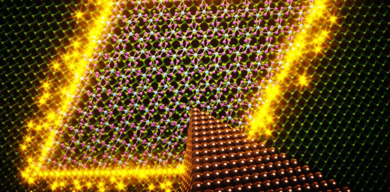
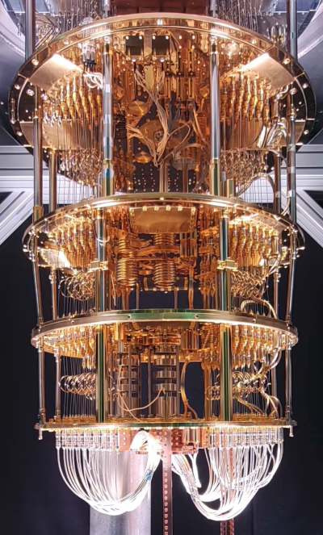

# What is high-performance computing?

* Utilising computing power that is much larger than available in a typical desktop computer
* Performance of HPC systems (i.e. supercomputers) is often measured in floating point operations per second (flop/s)
    - For software, other measures can be more meaningful
* Currently, the most powerful system reaches > $10^{18}$ flop/s (1 Eflop / s)

# What is high-performance computing?

 {.center width=30%}

# Top 500 list

<!-- Source: top500.org, Copyright 1993-2022 TOP500.org (c) -->
 {.center width=50%}

# What are supercomputers used for? {.section}

# General use cases

* Simulations of very different scales
    - From subatomic particles to cosmic scales
* Problems with very large datasets
* Complex computational problems
* Problems that are hard to experiment on
    - Simulations with decade-long timescales
* Very time consuming or even impossible to   solve on a standard computer

# Application areas

* Fundamental sciences such as particle physics and cosmology
* Climate, weather and Earth sciences
* Life sciences and medicine
* Chemistry and material science
* Energy, e.g oil and gas exploration and fusion research
* Engineering, e.g. infrastructure and manufacturing
* etc.

# Climate change

* Simulating ice sheets, air pollutants, sea-level rise etc.
* Building short and long-term simulations
* Analyzing with different parameters for future predictions and possible solutions
* Modeling space weather

{.center width=90%}

# Covid-19 fast track with Puhti

* Modeling particles in airflows
* A large part of the calculations used for solving turbulent flow
* A third of Puhti was reserved for running the simulations
* The results have had an impact on e.g. ventilation instructions and the use of masks

{.center width=100%}

# Gravitational waves

* Computational modeling of sources of gravitational waves
* Identifying a phase transition of the Higgs boson “turning on” (10 picoseconds after Big Bang)
* Large simulations with over ten thousand CPU cores
* Experimental data from ESA's LISA satellite (Launch date 2037)

{.center width=90%}

#  Topological superconductors

* Topological superconductors are possible building blocks for qubits
* Based on an elusive quantum state of electrons in thin layers
* Electronic properties simulated with the density-functional theory
    - These confirm that experimentally measured signals are due to this special quantum state

{.center width=100%}

# Deep language model of Finnish

* Web-scale Finnish language data together with very deep neural networks utilizing GPUs
* New model for Finnish
     - Comparable in coverage and quality to the best language models available today for any language

<!-- Source: Adobe Stock, CC BY-SA 3.0 -->
 {.center width=100%}

# Utilizing HPC in scientific research

 {.center width=40%}

* **Goal for this school: everyone is able to write and modify HPC applications!**

# What are supercomputers made of? {.section}

# CPU frequency development
* Power consumption of CPU: $~f^3$

 {.center width=45%}

# Parallel processing

* Modern (super)computers rely on parallel processing
* **Multiple** CPU cores & accelerators (GPUs)
    - `#`1 system has `~`9 000 000 cores and `~`40 000 GPUs
* Vectorization
    - A single instruction can process multiple data (SIMD)
* Pipelining
    - Core executes different parts of instructions in parallel

# Anatomy of a supercomputer

* Supercomputers consist of nodes connected by a high-speed network
    - Latency `~`1 µs, bandwidth `~`20 GB / s
* A node can contain several multicore CPU's
* Additionally, a node can contain one or more accelerators
* Memory within the node is directly usable by all CPU cores

 {.center width=60%}

# Supercomputer autopsy – Lumi

 {.center width=50%}

# From laptop to Tier-0

 {.center width=80%}

* The most fundamental difference between a small university cluster and Tier-0 supercomputer is the number of nodes
    - The interconnect in high end systems is often also more capable

# Cloud computing

* Cloud infrastructure is run on top of normal HPC system:
    - Shared memory nodes connected by network
* User obtains **virtual** machines
* Infrastructure as a service (IaaS)
    - User has full freedom (and responsibility) of operating system and the whole software environment
* Platform as a service (PaaS)
    - User develops and runs software within the provided environment

# Cloud computing and HPC

* Suitability of cloud computing for HPC depends heavily on application
    - Single node performance is often sufficient
* Virtualization adds overhead especially for the networking
    - Some providers offer high-speed interconnects at a higher price
* Moving data out from the cloud can be time-consuming
* Currently, cloud computing is not very cost-effective solution for most large scale HPC simulations

# Parallel computing concepts {.section}

# Computing in parallel
* Parallel computing
    - A problem is split into smaller subtasks
    - Multiple subtasks are processed simultaneously using multiple cores

 {.center width=40%}

# Types of parallel problems
* Tightly coupled
    - Lots of interaction between subtasks
    - Weather simulation
    - Low latency, high speed interconnect is essential
* Embarrassingly parallel
    - Very little (or no) interaction between subtasks
    - Sequence alignment queries for multiple independent sequences in bioinformatics

# Exposing parallelism

* Data parallelism
    - Data is distributed across cores
    - Each core performs simultaneously (nearly) identical operations with different data
    - Cores may need to interact with each other, e.g. exchange information about data on domain boundaries

 {.center width=80%}

# Exposing parallelism
* Task farm (master / worker)

 {.center width=60%}

* Master sends tasks to workers and receives results
* There are normally more tasks than workers, and tasks are assigned dynamically

# Parallel scaling

* Strong parallel scaling
    - Constant problem size
    - Execution time decreases in proportion to the increase in the number of cores
* Weak parallel scaling
    - Increasing problem size
    - Execution time remains constant when number of cores increases in proportion to the problem size

 {.center width=80%}

# What limits parallel scaling

* Load imbalance
    - Variation in workload over different cores
* Parallel overheads
    - Additional operations which are not present in serial calculation
    - Synchronization, redundant computations, communications
* Amdahl’s law: the fraction of non-parallelizable parts establishes the limit on how many cores can be harnessed

  {.right width=100%}

# Parallel programming {.section}

# Programming languages

- The de-facto standard programming languages in HPC are (still!)
  C/C++ and Fortran
- Higher level languages like Python and Julia are gaining popularity
    - Often computationally intensive parts are still written in C/C++
      or Fortran
- For some applications there are high-level frameworks with
  interfaces to multiple languages
    - SYCL, Kokkos, PETSc, Trilinos
    - TensorFlow, PyTorch for deep learning
    - Spark for MapReduce

# Parallel programming models
* Parallel execution is based on threads or processes (or both) which run at the same time on different CPU cores
* Processes
    - Interaction is based on exchanging messages between processes
    - MPI (Message passing interface)
* Threads
    - Interaction is based on shared memory, i.e. each thread can access directly other threads data
    - OpenMP, pthreads

# Parallel programming models

 {.center width=80%}

**MPI: Processes**

* Independent execution units
* MPI launches N processes at application startup
* Works over multiple nodes

**OpenMP: Threads**

* Threads share memory space
* Threads are created and destroyed  (parallel regions)
* Limited to a single node

# Parallel programming models

{.center width=100%}

# Future of High-performance computing {.section}

# Post-Exascale challenges

* Performance of supercomputers has increased exponentially for a long time
* However, there are still challenges in continuing onwards from exascale supercomputers ($> 1 \times 10^{18}$ flop/s)
    - Power consumption: current `#`1 energy efficient system requires `~`20 MW for exascale performances
    - Cost & Maintaining: Global chip shortage
    - Application scalability: how to program for 100 000 000 cores?

# Quantum computing

* Quantum computers can solve certain types of problems exponentially faster than classical computers
* General purpose quantum computer is still far away
* Use cases still largely experimental and hypothetical
* Hybrid approaches

{.center width=50%}

