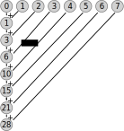
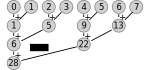
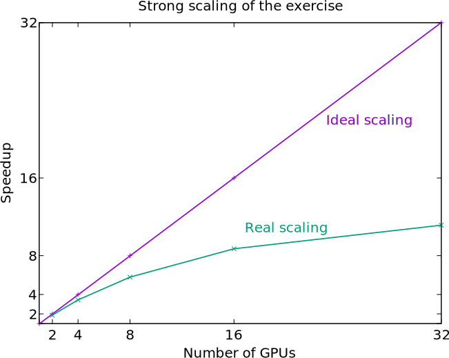

# Outline

- Parallel computing concepts
- Parallel algorithms
- Parallel performance
- Parallel programming

# Parallel computing concepts {.section}

# Computing in parallel

<div class=column>
- Parallel computing
  - A problem is split into smaller subtasks
  - Multiple subtasks are processed simultaneously using multiple computing units
- Parallel overheads
  - Additional operations which are not present in serial calculation
  - Synchronization, redundant computations, communications

</div>
<div class=column>
<!-- Copyright CSC -->
 {.center width=100%}
</div>

# Communication: latency and bandwidth

- Bandwidth (GB/s): the transfer speed of (large) amounts of data
- Latency (µs): the time it takes to transfer data (even a tiny piece)
- One should try to communicate large batches of data at once
  - Collect individual small data items together and send them once
- Sometimes it is possible to overlap communication and computation
  - Might require proper hardware support


# Types of parallel problems

- Tightly coupled
    - Lots of interaction between subtasks
    - Example: Weather simulation
    - Low latency, high speed interconnect is essential
- Embarrassingly parallel
    - Very little (or no) interaction between subtasks
    - Example: Sequence alignment queries for multiple independent sequences in bioinformatics


# Exposing parallelism: Data parallelism

<div class=column>
- Data parallelism
  - Data is distributed across cores
  - Each core performs simultaneously (nearly) identical operations with different data
  - Cores may need to interact with each other, e.g. exchange information about data on domain boundaries
</div>
<div class=column>

<!-- Copyright CSC -->
 {.center width=80%}

</div>


# Exposing parallelism: Tasking

- Task farm (main / worker)

<!-- Copyright CSC -->
 {.center width=60%}

<br>

- Main worker sends tasks to workers and receives results
- There are normally more tasks than workers, and tasks are assigned dynamically


# Parallel algorithms {.section}

# Calculating a sum of numbers

```
  23 + 99 = ...
```

# Calculating a sum of numbers

```
  23 + 99 + 97 + 62 =  ...
```

# Calculating a sum of numbers

```
  23 + 99 + 97 + 62 + 40 + 30 + 72 + 19 + 88 + 12 + 14 + 66 +  4 + 61 + 49 + 58 + 39 + 28 + 86 + 84
= ...
```

# Calculating a sum of numbers

```
  23 + 99 + 97 + 62 + 40 + 30 + 72 + 19 + 88 + 12 + 14 + 66 +  4 + 61 + 49 + 58 + 39 + 28 + 86 + 84
+ 65 + 92 + 49 + 48 + 93 + 75 + 32 + 82 + 92 + 75 + 31 +  8 + 55 + 70 +  1 + 80 + 23 + 78 + 73 + 62
+ 11 + 31 + 99 + 50 + 26 + 82 + 98 + 22 + 82 + 48 + 85 + 69 + 71 + 60 + 27 + 55 + 29 +  7 +  9 + 99
+ 86 + 36 + 95 + 50 + 94 + 87 + 69 +  7 + 59 + 85 + 22 + 50 +  5 + 70 +  5 + 59 + 94 + 69 + 48 + 50
+ 45 + 73 +  2 + 64 + 93 + 50 + 72 +  5 + 66 + 21 + 84 + 33 + 12 + 58 + 35 + 42 + 63 + 33 +  5 + 22
+ 70 + 91 + 71 + 97 + 79 + 13 +  2 +  8 +  3 + 41 + 50 + 74 + 28 + 87 + 39 + 41 +  2 + 72 + 23 + 19
+ 26 + 32 + 64 + 66 + 61 + 29 + 30 + 48 +  8 + 64 + 34 + 75 + 20 +  1 + 97 + 14 + 37 + 46 + 56 + 88
+ 85 + 88 + 79 + 78 + 50 + 25 + 95 + 77 + 17 + 36 + 68 +  3 + 19 + 62 +  1 + 24 + 88 + 33 + 43 + 82
+ 17 + 98 + 20 + 19 + 88 +  8 + 60 + 85 + 35 + 27 + 67 + 77 + 69 + 70 +  2 + 80 + 58 +  1 +  7 + 98
+ 98 + 14 + 41 +  2 + 27 + 73 +  8 + 68 + 43 + 66 + 20 + 52 + 97 + 67 + 42 + 21 + 12 + 37 + 65 + 90
+ 93 + 49 + 25 + 34 + 55 + 77 + 63 +  9 + 75 + 47 + 74 + 80 + 33 + 62 + 62 + 51 + 42 + 29 + 13 + 87
+  4 + 73 + 59 +  5 + 26 + 83 + 90 + 93 + 35 + 81 + 14 + 14 + 53 + 15 + 62 +  3 + 28 + 31 +  8 + 36
+ 48 + 34 + 83 +  8 +  4 + 88 + 84 + 49 + 50 + 10 + 68 + 95 + 31 +  5 + 15 + 32 + 11 + 38 + 43 + 40
+ 76 + 29 + 26 + 66 + 57 + 71 + 30 +  8 + 65 + 10 + 66 + 91 + 23 + 91 + 39 + 93 + 75 + 10 + 32 + 95
+ 41 +  8 + 97 + 63 + 20 + 64 + 10 +  8 +  9 + 76 + 48 + 38 + 76 + 82 + 45 +  8 + 61 + 15 + 89 + 57
+ 93 + 80 + 54 + 53 + 64 +  5 + 68 + 28 + 51 + 66 + 51 + 52 + 72 + 54 + 75 + 24 + 68 + 51 +  7 + 91
+ 34 + 85 + 45 + 99 + 21 + 50 +  9 + 21 + 54 + 57 + 72 + 38 + 66 + 94 + 12 + 86 + 23 +  4 + 55 + 39
= ...
```

# Group work: Calculating a sum of numbers in parallel

- Task: Design an algorithm to calculate the sum of N numbers
- Assumptions:
  - Adding up two numbers takes **1 s** and communicating a single number takes **0.1 s**
  - No time is needed for setting up the problem and distributing the work
- How much time is needed for summing up N=20 and N=1020 numbers with 1, 2, 4, and 8 workers?
- What is the speedup with different number of workers?


# Reductions

- Reduction is an operation that combines data from multiple execution units into a single number
  - Typical reduction operations: **sum**, **product**, **max**, **min**
- Many parallel algorithms need reductions *e.g.* integrals over domains
- Many parallel programming libraries provide efficient implementations for reduction

# Reductions - example algorithms
<div class=column>
<center>
Simple
{.center width=80%}
</center>
</div>
<div class=column>
<center>
Tree
{.center width=80%}
</center>
</div>

# What can be calculated in parallel?

There needs to be independent computations<br><br>

<div class=column>
Gauss-Seidel iteration:
```
while True:
  for i:
    u[i] = (u[i-1] + u[i+1]
            - h**2 * f[i]) / 2

until converged(u)
```

Loop cannot be parallelized over `i` due to data dependency

</div>
<div class=column>
Jacobi iteration:
```
while True:
  for i:
    u_new[i] = (u_old[i-1] + u_old[i+1]
                - h**2 * f[i]) / 2
  swap(u_new, u_old)
until converged(u)
```

Loop can be parallelized over `i`

</div>

# What happens when two processes compete over the same data?

- Race condition
    - Two (or more) processes access shared data concurrently
    - The final outcome depends on the sequence or timing of execution
    - Unpredictable and often leads to bugs
    - Example: Two threads incrementing the same counter simultaneously might overwrite each other’s result

- Deadlock
    - Two (or more) processes wait indefinitely for each other to release resources (or e.g. to send data)
    - System halts or stalls due to resource unavailability

# Data distribution

- Single node cannot typically hold all the data of large simulation
    - Data needs to be distributed
    - Data is often logically distributed also inside the node
- Computations may require data from other execution data
    - *Local* dependencies: data is needed only from few other units
    - *Global* dependencies: data is needed from all the execution units
- Data distribution should try to minimize communication time
- Data distribution should try to maximize load balance

# Data distribution: local vs. global dependencies

<div class=column>
Local dependencies

- Stencils: 
  ```
  v[i,j] = u[i-1, j] + u[i+1, j] + u[i, j-1] ...
  ```
- Finite elements methods
- Particle based methods with short range interactions
- Number of communications remains constant
</div>
<div class=column>
Global dependencies

- Fourier transform 
  $X_k = \sum_{n=0}^{N-1} x_n \exp(-i \frac{2\pi}{N}k \cdot n)$
- Linear algebra: $C = A \times B$

  <!-- Copyright CSC -->
  {.center width=50%}

- Number of communication events increases with number of execution units

# Data distribution: load balance

<div class=column>
Simple domains with similar computational cost

<br>
<!-- Copyright CSC -->
{.center width=50%}
</div>

<div class=column>
Simple domains with different computational cost

<br>
<!-- Copyright CSC -->
{.center width=40%}
</div>

# Data distribution: load balance

<div class=column>
Complex FEM meshes
<br>
<br>
<!-- Copyright CSC / Peter Råback -->
{.center width=70%}
</div>

<div class=column>
Moving particles
<br>
<br>
<!-- Copyright CSC -->
{.center width=70%}
</div>


# Parallel performance {.section}

# Parallel scaling

<div class=column>
- Strong parallel scaling
    - Constant problem size
    - Execution time decreases in proportion to the increase in the number of cores / GPUs / nodes
- Weak parallel scaling
    - Increasing problem size
    - Execution time remains constant when the number of cores / GPUs / nodes increases in proportion to the problem size
</div>
<div class=column>

<!-- Copyright CSC -->
 {.center width=80%}

</div>

# What limits parallel scaling?

- Load imbalance
    - Variation in workload over different execution units
- Parallel overheads
    - Additional operations which are not present in serial calculation
    - Synchronization, redundant computations, communications

# Amdahl's law

The fraction of non-parallelizable parts limits the maximum speedup

{.center width=50%}


# Communication to computation ratio

- Communication to computation ratio is important metric for scalability
  - If ratio increases, algorithm stops scaling with certain number of processors
- Example: domain decomposition of a square grid of dimension $N^2$, $p$ processors
  - Computational cost per process: $T_\text{comp} = \frac{N^2}{p}$

<div class=column>
One dimensional decomposition

- Communication cost of boundary: $T_\text{comm} = N$
- Ratio: $\frac{T_\text{comm}}{T_\text{comp}} = \frac{p}{N}$

</div>
<div class=column>
Two dimensional decomposition

- Communication cost of boundary: $T_\text{comm} = 2\frac{N}{\sqrt{p}}$
- Ratio: $\frac{T_\text{comm}}{T_\text{comp}} = \frac{\sqrt{p}}{2N}$

</div>


# Parallel programming models {.section}

# Programming languages

- The de-facto standard programming languages in HPC are (still)
  C/C++ and Fortran
- Higher level languages like Python and Julia are gaining popularity
  - Often computationally intensive parts are still written in C/C++ or Fortran
- Low level GPU programming with CUDA or HIP
- For some applications there are high-level frameworks with interfaces to multiple languages
  - SYCL, Kokkos, PETSc, Trilinos
  - TensorFlow, PyTorch for deep learning

# Parallel programming models

- Parallel execution is based on threads or processes (or both) which run at the same time on different CPU cores
- Processes
    - Interaction is based on exchanging messages between processes
    - MPI (Message passing interface)
- Threads
    - Interaction is based on shared memory, i.e. each thread can access directly other threads data
    - OpenMP, pthreads

# Parallel programming models

<!-- Copyright CSC -->
 {.center width=80%}
<div class=column>
**MPI: Processes**

- Independent execution units
- MPI launches N processes at application startup
- Works over multiple nodes
</div>
<div class=column>

**OpenMP: Threads**

- Threads share memory space
- Threads are created and destroyed  (parallel regions)
- Limited to a single node

</div>

# GPU programming models

- GPUs are co-processors to the CPU
- CPU controls the work flow:
  - *offloads* computations to GPU by launching *kernels*
  - allocates and deallocates the memory on GPUs
  - handles the data transfers between CPU and GPUs
- GPU kernels run multiple threads
    - Typically much more threads than "GPU cores"
- When using multiple GPUs, CPU runs typically multiple processes (MPI) or multiple threads (OpenMP)

# GPU programming models

{.center width=40%}
<br>

- CPU launches kernel on GPU
- Kernel execution is normally asynchronous
    - CPU remains active
- Multiple kernels may run concurrently on same GPU

# Parallel programming models

{.center width=100%}

# Summary {.section}

# Summary

- Utilizing supercomputers requires parallel algorithms
- Parallelization causes an extra cost not present in a serial program
  - Optimal algorithm for serial execution is not the as the optimal algorithm for parallelized execution
  - Also the hardware target (GPU vs CPU, details of the exact hardware) affect the algorithm choice
- Main parallel programming models include MPI, OpenMP, CUDA/HIP, and higher-level frameworks
