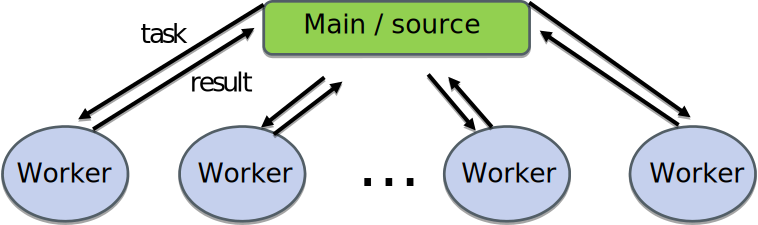
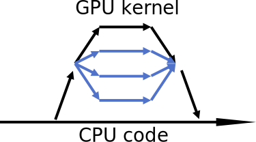

# Parallel computing concepts {.section}

# Computing in parallel

- Parallel computing
    - A problem is split into smaller subtasks
    - Multiple subtasks are processed simultaneously using multiple cores

<!-- Copyright CSC -->
 {.center width=40%}

# Types of parallel problems

- Tightly coupled
    - Lots of interaction between subtasks
    - Weather simulation
    - Low latency, high speed interconnect is essential
- Embarrassingly parallel
    - Very little (or no) interaction between subtasks
    - Sequence alignment queries for multiple independent sequences in bioinformatics

# Exposing parallelism

- Data parallelism
    - Data is distributed across cores
    - Each core performs simultaneously (nearly) identical operations with different data
    - Cores may need to interact with each other, e.g. exchange information about data on domain boundaries

<!-- Copyright CSC -->
 {.center width=80%}

# Exposing parallelism

- Task farm (master / worker)

<!-- Copyright CSC -->
 {.center width=60%}

 

- Master sends tasks to workers and receives results
- There are normally more tasks than workers, and tasks are assigned dynamically

# Parallel scaling

- Strong parallel scaling
    - Constant problem size
    - Execution time decreases in proportion to the increase in the number of cores
- Weak parallel scaling
    - Increasing problem size
    - Execution time remains constant when number of cores increases in proportion to the problem size

<!-- Copyright CSC -->
 {.center width=80%}

# What limits parallel scaling

- Load imbalance
    - Variation in workload over different execution units
- Parallel overheads
    - Additional operations which are not present in serial calculation
    - Synchronization, redundant computations, communications
- Amdahl’s law: the fraction of non-parallelizable parts limits maximum speedup

  {.center width=100%}

# Parallel programming {.section}

# Programming languages

- The de-facto standard programming languages in HPC are (still!)
  C/C++ and Fortran
- Higher level languages like Python and Julia are gaining popularity
    - Often computationally intensive parts are still written in C/C++
      or Fortran
- Low level GPU programming with CUDA or HIP
- For some applications there are high-level frameworks with
  interfaces to multiple languages
    - SYCL, Kokkos, PETSc, Trilinos
    - TensorFlow, PyTorch for deep learning

# Parallel programming models

- Parallel execution is based on threads or processes (or both) which run at the same time on different CPU cores
- Processes
    - Interaction is based on exchanging messages between processes
    - MPI (Message passing interface)
- Threads
    - Interaction is based on shared memory, i.e. each thread can access directly other threads data
    - OpenMP, pthreads

# Parallel programming models

<!-- Copyright CSC -->
 {.center width=80%}

**MPI: Processes**

- Independent execution units
- MPI launches N processes at application startup
- Works over multiple nodes

**OpenMP: Threads**

- Threads share memory space
- Threads are created and destroyed  (parallel regions)
- Limited to a single node

# GPU programming models

- GPUs are co-processors to the CPU
- CPU controls the work flow:
  - *offloads* computations to GPU by launching *kernels*
  - allocates and deallocates the memory on GPUs
  - handles the data transfers between CPU and GPUs
- GPU kernels run multiple threads
    - Typically much more threads than "GPU cores"
- When using multiple GPUs, CPU runs typically multiple processes (MPI) or multiple threads (OpenMP)

# GPU programming models

{.center width=40%}
 

- CPU launches kernel on GPU
- Kernel execution is normally asynchronous
    - CPU remains active
- Multiple kernels may run concurrently on same GPU

# Parallel programming models

{.center width=100%}

