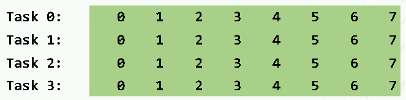
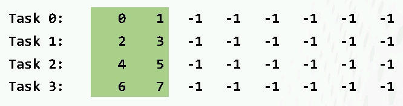
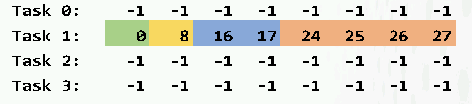
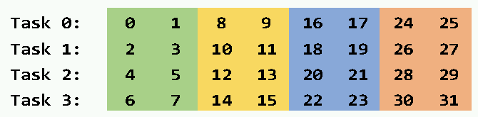

## Collective operations

In this exercise we test different routines for collective
communication. Write a program for four MPI processes, such that each
process has a data vector with the following data:

In addition, each task has a receive buffer for eight elements and the
values in the buffer are initialized to -1.

Implement communication that sends and receives values from these data
vectors to the receive buffers using a single collective routine in
each case, so that the receive buffers will have the following values:

a) 

b) 

c) 

d) 

You can start from scratch or use the skeleton code found in
[c/collective.c](c/collective.c) or
[fortran/collective.F90](fortran/collective.F90).

