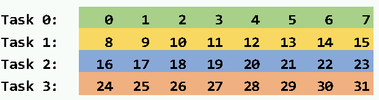
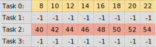

## Communicators and collectives

In this exercise we combine collective communcation with user defined
communicators. Write a program for four MPI processes, such that each
process has a data vector with the following data:

In addition, each task has a receive buffer for eight elements and the
values in the buffer are initialized to -1.

Implement now a pattern with user defined communicators and collective
operation so that the receive buffers will have the following values:

You can start from scratch or use the skeleton code of
[Collectives exercise](../collectives) found in
[collective.c](../collectives/c/collective.c) or
[collective.F90](../collectives/fortran/collective.F90).

