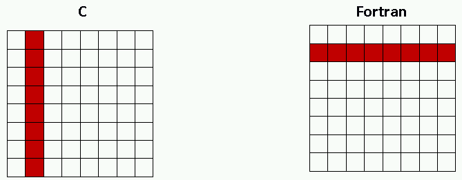
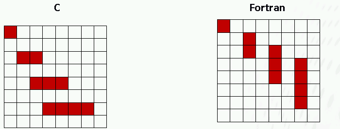

## Using custom datatypes 

Write a program that sends the highlighted elements of a 2D array
using user defined datatypes from one MPI task to another. Note the
different assignments for C and Fortran, and remember that C stores
arrays in a row-major order and Fortran in a column-major order. You can
start from skeleton codes in [C](./c) or [Fortran](./fortran)

a) 

b)

c) Write a program that sends an array of structures (derived types in
Fortran) between two tasks. Implement a user-defined datatype that can
be used for sending the structured data and verify that the
communication is performed successfully. Check the size and true
extent of your type. A skeleton code is provided in
[c/struct_type.c](c/struct_type.c) or
[fortran/struct_type.F90](fortran/struct_type.F90).

d) Implement the sending of structured data also by sending just a
stream of bytes (type `MPI_BYTE`). Verify correctness and compare the
performance of these two approaches.

