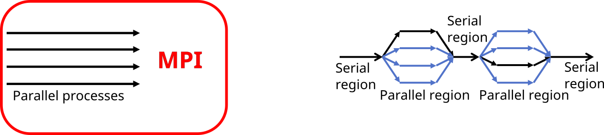
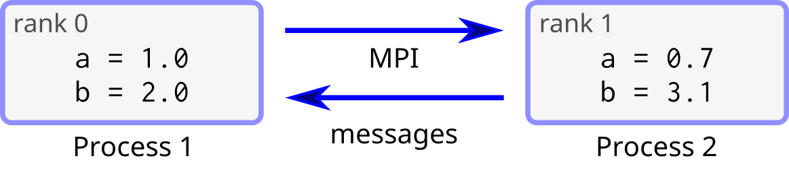

# Basic concepts in MPI {.section}

# Message-passing interface

- MPI is an application programming interface (API) for distributed parallel
  computing
- MPI programs are portable and scalable
    - the same program can run on different types of computers, from
      laptops to supercomputers
- MPI is flexible and comprehensive
    - large (hundreds of procedures)
    - concise (only 10-20 procedures are typically needed)
- First version of standard (1.0) published in 1994, latest (4.0) in June 2021
    - <https://www.mpi-forum.org/docs/>

# Processes and threads

{.center width=90%}

<div class="column">

**Process**

- Independent execution units
- Have their own state information and *own memory* address space

</div>

<div class="column">

**Thread**

- A single process may contain multiple threads
- Have their own state information, but *share* the *same memory*
  address space

</div>


# Execution model in MPI

- Normally, parallel program is launched as set of *independent*, *identical
  processes*
    - execute the *same program code* and instructions
    - processes can reside in different nodes (or even in different computers)
- The way to launch parallel program depends on the computing system
    - **`mpiexec`**, **`mpirun`**, **`srun`**, **`aprun`**, ...
    - **`srun`** on LUMI, Mahti, and Puhti
- MPI supports also dynamic spawning of processes and launching *different*
  programs communicating with each other
    - rarely used in HPC systems

# MPI ranks

<div class="column">
- MPI runtime assigns each process a unique rank
    - identification of the processes
    - ranks start from 0 and extend to N-1
- Processes can perform different tasks and handle different data based
  on their rank
</div>
<div class="column">
```c
if (rank == 0) {
   ...
   }
if (rank == 1) {
   ...
   }
```
</div>

# Data model

- All variables and data structures are local to the process
- Processes can exchange data by sending and receiving messages

{.center width=100%}

# The MPI library

- Information about the communication framework
    - number of processes
    - rank of the process
- Communication between processes
    - sending and receiving messages between two processes
    - sending and receiving messages between several processes
- Synchronization between processes
- Advanced features
    - Communicator manipulation, user defined datatypes, one-sided communication, ...

# MPI communicator

- Communicator is an object connecting a group of processes, i.e. the
  communication framework
- Most MPI functions require communicator as an argument
- Initially, there is always a communicator **MPI_COMM_WORLD** which
  contains all the processes
- Users can define custom communicators

# Programming MPI

- The MPI standard defines interfaces to C and Fortran programming
  languages
    - No C++ bindings in the standard, C++ programs use the C interface
    - There are unofficial bindings to eg. Python, Rust, R
- C call convention (*case sensitive*)<br>
`rc = MPI_Xxxx(parameter,...)`
    - some arguments have to be passed as pointers
- Fortran call convention (*case insensitive*)<br>
`call mpi_xxxx(parameter,..., rc)`
    - return code in the last argument

# Writing an MPI program

- C: include the MPI header file
```c
#include <mpi.h>
```
- Fortran: use MPI module
```fortran
use mpi_f08
```
(older Fortran codes might have `use mpi` or `include 'mpif.h'`)

- Start by calling the routine **MPI_Init**
- Write the program
- Call **MPI_Finalize** before exiting from the main program

# Compiling an MPI program

- MPI is a library (+ runtime system)
- In principle, MPI programs can be build with standard compilers
  (*i.e.* `gcc` / `g++` / `gfortran`) with the appropriate `-I` / `-L` / `-l`
  options
- Most MPI implementations provide convenience wrappers, typically
  `mpicc` / `mpicxx` / `mpif90`, for easier building
    - no need for MPI related options

```bash
mpicc -o my_mpi_prog my_mpi_code.c
mpicxx -o my_mpi_prog my_mpi_code.cpp
mpif90 -o my_mpi_prog my_mpi_code.F90
```

# Presenting syntax

- MPI calls are presented as pseudocode
    - actual C and Fortran interfaces are given in reference section
    - Fortran error code argument not included

MPI_Function(`arg1`{.input}, `arg2`{.output})
  : `arg1`{.input}
    : input arguments in red
  : `arg2`{.output}
    : output arguments in blue. Note that in C the output arguments are always
      pointers


# First five MPI commands: Initialization and finalization

MPI_Init
  : (in C `argc`{.input} and `argv`{.input} pointer arguments are needed)

MPI_Finalize
  :

# First five MPI commands: Information about the communicator

MPI_Comm_size(`comm`{.input}, `size`{.output})
  : `comm`{.input}
    : communicator
  : `size`{.output}
    : number of processes in the communicator

MPI_Comm_rank(`comm`{.input}, `rank`{.output})
  : `comm`{.input}
    : communicator
  : `rank`{.output}
    : rank of this process

# First five MPI commands: Synchronization

- Wait until everybody within the communicator reaches the call

MPI_Barrier(`comm`{.input})
  : `comm`{.input}
    : communicator


# Summary

- In parallel programming with MPI, the key concept is a set of
  independent processes
- Data is always local to the process
- Processes can exchange data by sending and receiving messages
- The MPI library contains functions for communication and
  synchronization between processes

# Web resources

- List of MPI functions with detailed descriptions
    - <http://mpi.deino.net/mpi_functions/>
    - <https://www.rookiehpc.com/mpi/docs/>
- Good online MPI tutorials
    - <https://hpc-tutorials.llnl.gov/mpi/>
    - <http://mpitutorial.com/tutorials/>
    - <https://www.youtube.com/watch?v=BPSgXQ9aUXY>
- MPI coding game in C <br>
<https://www.codingame.com/playgrounds/47058/have-fun-with-mpi-in-c/lets-start-to-have-fun-with-mpi>

# Web resources

- MPI 4.0 standard <http://www.mpi-forum.org/docs/>
- MPI implementations
    - OpenMPI <http://www.open-mpi.org/>
    - MPICH <https://www.mpich.org/>
    - Intel MPI <https://software.intel.com/content/www/us/en/develop/tools/oneapi/components/mpi-library.html>
