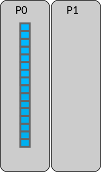
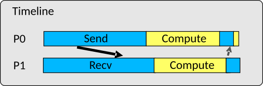

# Outline

- Point-to-point communication in MPI
- Blocking routines in MPI

# Point-to-point communication in MPI {.section}

# Communication in MPI

- Data is local to the MPI processes
    - They need to *communicate* to coordinate work
- Point-to-point communication
    - Messages are sent between two processes
- Collective communication
    - Involving a number of processes at the same time

{.center width=50%}

# MPI point-to-point operations

- One process *sends* a message to another process that *receives* it with `MPI_Send` and `MPI_Recv` routines
- Sends and receives in a program should match – one receive per send
- Each message contains
  - Data
    - A *buffer*, the *datatype* of the data elements, and the *number* of the data elements
  - Envelope
    - The ranks of the *source* and *destination* processes
    - An identification number for the message (*tag*)
    - Used *communicator*

# MPI point-to-point operations

MPI_Send(`buffer`{.input}, `count`{.input}, `datatype`{.input}, `dest`{.input}, `tag`{.input}, `comm`{.input})
  : Performs a blocking send
  : **Note!** The `count` parameter is the number of elements to send

MPI_Recv(`buffer`{.output}, `count`{.input}, `datatype`{.input}, `source`{.input}, `tag`{.input}, `comm`{.input}, `status`{.output})
  : Performs a blocking receive
  : **Note!** The `count` parameter is the **maximum** number of elements to receive
  : The `status` parameter is discussed later; use special `MPI_STATUS_IGNORE` for now

- Demo: `send_and_recv.c`

# Buffers in MPI

- The `buffer` arguments are memory addresses
- MPI assumes a contiguous chunk of memory
  - The `count` elements are send starting from the address
  - The received elements are stored starting from the address
- In C/C++ `buffer` is pointer
  - For C++ `<array>` and `<vector>` containers, use `array.data()` or `&array[i]`
- In Fortran arguments are passed by reference and variables can be passed as such to MPI calls
  - Note: be careful if passing non-contiguous array segmens such as  `a(1, 1:N)`

# MPI datatypes

- On a low level, MPI sends and receives stream of bytes
- MPI datatypes specify how the bytes should be interpreted
  - Allows data conversions in heterogenous environments (*e.g.* little endian to big endian)
- MPI has a number of predefined basic datatypes corresponding to C or Fortran datatypes
  - Listed in the next slides
- Datatype `MPI_BYTE` for raw bytes is available both in C and Fortran
  - Portability can be an issue when using `MPI_BYTE` - be careful
- One can also define custom datatypes for communicating complex data

# Common MPI datatypes specific for C

| MPI type     |  C type       |
| ------------ | ------------- |
| `MPI_CHAR`   | `signed char` |
| `MPI_SHORT`  | `short int`   |
| `MPI_INT`    | `int`         |
| `MPI_LONG`   | `long int`    |
| `MPI_FLOAT`  | `float`       |
| `MPI_DOUBLE` | `double`      |

# Common MPI datatypes specific for Fortran

| MPI type               |  Fortran type    |
| ---------------------- | ---------------- |
| `MPI_CHARACTER`        | character        |
| `MPI_INTEGER`          | integer          |
| `MPI_REAL`             | real32           |
| `MPI_DOUBLE_PRECISION` | real64           |
| `MPI_COMPLEX`          | complex          |
| `MPI_DOUBLE_COMPLEX`   | double complex   |
| `MPI_LOGICAL`          | logical          |

# Case study: parallel sum on two processes

{.center width=45%}

- Demo: `parallel_sum.c`

- Array initially on process #0 (P0)
- Parallel algorithm:
    1. **Scatter**:
    P0 sends half of the array to process P1

    2. **Compute**:
    P0 & P1 sum independently their segments

    3. **Reduction**:
    Partial sum on P1 is sent to P0 and
    P0 sums the partial sums

# Case study: parallel sum on two processes

{.center width=45%}

- Demo: `parallel_sum.c`

**Step 1**: Scatter array

{.center width=90%}

# Case study: parallel sum on two processes

{.center width=45%}

- Demo: `parallel_sum.c`

**Step 2**: Compute the sum in parallel

{.center width=90%}

# Case study: parallel sum on two processes

{.center width=45%}

- Demo: `parallel_sum.c`

**Step 3.1**: Gather partial sums

{.center width=90%}

# Case study: parallel sum on two processes

{.center width=45%}

- Demo: `parallel_sum.c`

**Step 3.2**: Compute the total sum

{.center width=90%}

# Blocking routines in MPI {.section}

# Blocking routines and deadlocks

- `MPI_Send` and `MPI_Recv` are *blocking* routines
- `MPI_Send` returns once the send buffer can be safely read and written to
  - **Note!** This does not necessarily mean that the communication has taken place when `MPI_Send` returns  
    → See exercise
- `MPI_Recv` returns once it has received the message in the receive buffer
- In general, the completion may depend on other processes → risk for *deadlocks*
  - For example, all processes are waiting in `MPI_Recv` but no-one is sending  
    → the program is stuck forever (deadlock)

# Summary {.section}

# Summary

- Point-to-point communication = messages are sent between two MPI processes
- Point-to-point operations enable any parallel communication pattern
  - `MPI_Send` and `MPI_Recv` would be (in principle) enough
- `MPI_Send` and `MPI_Recv` are blocking routines
  - Beware of deadlocks
