# Point-to-point communication{.section}

# Communication

- Data is local to the MPI processes
    - They need to *communicate* to coordinate work
- Point-to-point communication
    - Messages are sent between two processes
- Collective communication
    - Involving a number of processes at the same time

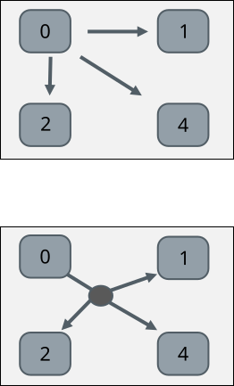{.center width=50%}

# MPI point-to-point operations

- One process *sends* a message to another process that *receives* it
  with **`MPI_Send`** and **`MPI_Recv`** routines
- Sends and receives in a program should match – one receive per send
- Each message (envelope) contains
    - The actual *data* that is to be sent
    - The *datatype* of each element of the data
    - The *number of elements* in the data
    - An identification number for the message (*tag*)
    - The ranks of the *source* and *destination* processes

# Case study: parallel sum on two processes

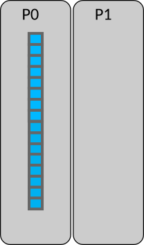{.center width=45%}

- Array initially on process #0 (P0)
- Parallel algorithm:
    1. **Scatter**:
    Half of the array is sent to process P1

    2. **Compute**:
    P0 & P1 sum independently their segments

    3. **Reduction**:
    Partial sum on P1 is sent to P0 and
    P0 sums the partial sums

# Case study: parallel sum on two processes

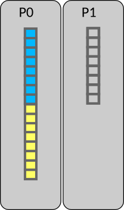{.center width=45%}

**Step 1.1**: Receive call in scatter

{.center width=45%}

P1 issues `MPI_Recv` to receive half of the array from P0

# Case study: parallel sum on two processes

{.center width=45%}

**Step 1.2**: Send call in scatter

{.center width=45%}

P0 issues an `MPI_Send` to send the lower part of the array to P1

# Case study: parallel sum on two processes

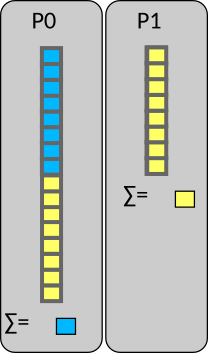{.center width=45%}

**Step 2**: Compute the sum in parallel

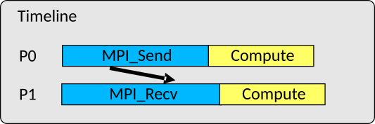{.center width=45%}

Both P0 & P1 compute their partial sums and store them locally

# Case study: parallel sum on two processes

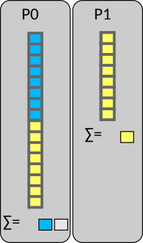{.center width=45%}

**Step 3.1**: Receive call in reduction

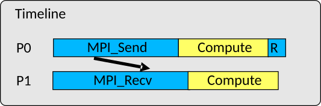{.center width=45%}

P0 issues an `MPI_Recv` operation for receiving P1's partial sum

# Case study: parallel sum on two processes

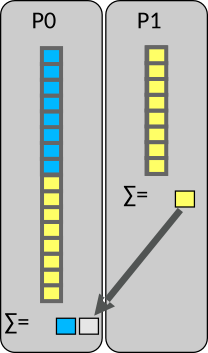{.center width=45%}

**Step 3.2**: Send call in reduction

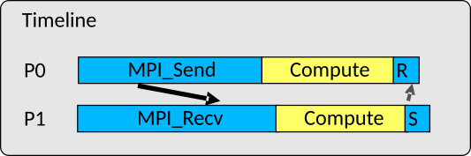{.center width=45%}

P1 issues an `MPI_Send` to send the partial sum to P0

# Case study: parallel sum on two processes

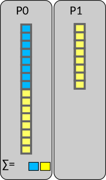{.center width=45%}

**Step 3.3**: Compute the total sum

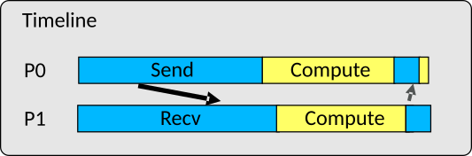{.center width=45%}

P0 sums up the partial sums

# Send operation {.split-definition}

MPI_Send(`buffer`{.input}, `count`{.input}, `datatype`{.input}, `dest`{.input}, `tag`{.input}, `comm`{.input})
  : `buffer`{.input}
    : The data to be sent

    `count`{.input}
    : The number of elements sent from the buffer

    `datatype`{.input}
    : The type of the elements in the buffer (see later slides)

    `-`{.ghost}
    : `-`{.ghost}

    `dest`{.input}
    : The rank of the receiver

    `tag`{.input}
    : An integer identifying the message

    `comm`{.input}
    : Communicator

    `error`{.output}
    : Error value; in C/C++ it’s the return value of the function, and
      in Fortran an additional output parameter

<!--    `-`{.ghost}
    : `-`{.ghost} -->

# Receive operation {.split-definition}

MPI_Recv(`buffer`{.output}, `count`{.input}, `datatype`{.input}, `source`{.input}, `tag`{.input}, `comm`{.input}, `status`{.output})
  : `buffer`{.output}
    : A buffer for storing received data

    `count`{.input}
    : The number of elements in the buffer, not the number of element that are
      actually received

    `datatype`{.input}
    : The type of the elements in the buffer

    `-`{.ghost}
    : `-`{.ghost}

    `source`{.input}
    : The rank of the sender

    `tag`{.input}
    : An integer identifying the message

    `comm`{.input}
    : Communicator

    `status`{.output}
    : Information on the received message

    `error`{.output}
    : As for send operation

<!--    `-`{.ghost}
    : `-`{.ghost} -->

# "Buffers" in MPI

- The `buffer` arguments are memory addresses
- MPI assumes contiguous chunk of memory
    - `count` elements are send starting from the address
    - received elements are stored starting from the address
- In C/C++ `buffer` is pointer
    - For C++ `<array>` and `<vector>` containers, use `data()` method
- In Fortran arguments are passed by reference and variables can be
  passed as such to MPI calls
    - Note: be careful if passing non-contiguous array segmens such as  `a(1, 1:N)`

# MPI datatypes

- On a low level, MPI sends and receives stream of bytes
- MPI datatypes specify how the bytes should be interpreted
    - Allows data conversions in heterogenous environments (*e.g.*
      little endian to big endian)
- MPI has a number of predefined basic datatypes corresponding to C or
  Fortran datatypes
    - C examples: `MPI_INT` for `int` and `MPI_DOUBLE` for
      `double`
    - Fortran examples: `MPI_INTEGER` for `integer`,
      `MPI_DOUBLE_PRECISION` for `real64`
- One can also define custom datatypes for communicating more complex
  data

# Blocking routines & deadlocks

- `MPI_Send` and `MPI_Recv` are blocking routines
    - `MPI_Send` exits once the send buffer can be safely read and
      written to
    - `MPI_Recv` exits once it has received the message in the receive
      buffer
- Completion depends on other processes -> risk for *deadlocks*
    - For example, all processes are waiting in `MPI_Recv` but no-one is sending ->
      the program is stuck forever (deadlock)

# Status parameter

- The status parameter in `MPI_Recv` contains information about the
  received data after the call has completed
    - The number of actually received elements
    - The tag of the received message
    - The rank of the sender
- In C the status parameter is a struct
- In Fortran the status parameter is of type `mpi_status`
    - Old interface: integer array of size `MPI_STATUS_SIZE`

# Status parameter

- The number of actually received elements
  - Use the function **`MPI_Get_count`(`status`{.input}, `datatype`{.input}, `count`{.output})**
- The tag of the received message
  - C: `status.MPI_TAG`
  - Fortran: `status%mpi_tag` (old version `status(MPI_TAG)`)
- The rank of the sender
  - C: `status.MPI_SOURCE`
  - Fortran: `status%mpi_source` (old version `status(MPI_SOURCE)`)

# Summary

- Point-to-point communication = messages are sent between two MPI
  processes
- Point-to-point operations enable any parallel communication pattern
  (in principle)
    - `MPI_Send` and `MPI_Recv`
- Status parameter of `MPI_Recv` contains information about the
  message after the receive is completed
