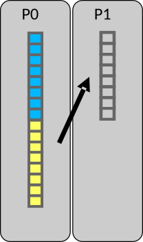

# Point-to-point communication{.section}

# Communication

- Data is local to the MPI processes
    - They need to *communicate* to coordinate work
- Point-to-point communication
    - Messages are sent between two processes
- Collective communication
    - Involving a number of processes at the same time

{.center width=50%}

# MPI point-to-point operations

- One process *sends* a message to another process that *receives* it
  with `MPI_Send` and `MPI_Recv` routines
- Sends and receives in a program should match – one receive per send
- Each message (envelope) contains
    - The actual *data* that is to be sent
    - The *datatype* of each element of data
    - The *number of elements* the data consists of
    - An identification number for the message (*tag*)
    - The ranks of the *source* and *destination* process

# Case study: parallel sum 

{.center width=45%}

- Array initially on process #0 (P0)
- Parallel algorithm
    * **Scatter**  
    Half of the array is sent to process 1

    * **Compute**  
    P0 & P1 sum independently their segments

    * **Reduction**  
    Partial sum on P1 sent to P0
    P0 sums the partial sums

# Case study: parallel sum 

{.center width=45%}

**Step 1.1**: Receive call in scatter

{.center width=45%}

P1 issues MPI_Recv to receive half of the array from P0

# Case study: parallel sum 

{.center width=45%}

**Step 1.2**: Send call in scatter

{.center width=45%}

P0 issues an MPI_Send to send the lower part of the array to P1

# Case study: parallel sum 

{.center width=45%}

**Step 2**: Compute the sum in parallel

{.center width=45%}

Both P0 & P1 compute their partial sums and store them locally

# Case study: parallel sum 

{.center width=45%}

**Step 3.1**: Receive call in reduction

{.center width=45%}

P0 issues an MPI_Recv operation for receiving P1’s partial sum

# Case study: parallel sum 

{.center width=45%}

**Step 3.2**: Send call in reduction

{.center width=45%}

P1 sends the partial sum to P0

# Case study: parallel sum 

{.center width=45%}

**Step 3.3**: compute the final answer

{.center width=45%}

P0 computes the total sum

# Send operation {.split-definition}

MPI_Send(`buffer`{.input}, `count`{.input}, `datatype`{.input}, `dest`{.input}, `tag`{.input}, `comm`{.input})
  : `buffer`{.input}
    : The data to be sent
    
    `count`{.input}
    : Number of elements in buffer

    `datatype`{.input}
    : Type of elements in buffer (see later slides)

    `dest`{.input}
    : The rank of the receiver

    `tag`{.input}
    : An integer identifying the message

    `comm`{.input}
    : Communicator

    `error`{.output}
    : Error value; in C/C++ it’s the return value of the function, and
      in Fortran an additional output parameter

<!--    `-`{.ghost}
    : `-`{.ghost} -->

# Receive operation {.split-definition}

MPI_Recv(`buffer`{.output}, `count`{.input}, `datatype`{.input}, `source`{.input}, `tag`{.input}, `comm`{.input}, `status`{.output})
  : `buffer`{.output}
    : Buffer for storing received data
    
    `count`{.input}
    : Number of elements in buffer, not the number of element that are
      actually received

    `datatype`{.input} 
    : Type of each element in buffer
    
    `source`{.input}
    : Sender of the message
    
    `tag`{.input}
    : Number identifying the message

    `comm`{.input}
    : Communicator

    `status`{.output}
    : Information on the received message

    `error`{.output}
    : As for send operation

<!--    `-`{.ghost}
    : `-`{.ghost} -->

# "Buffers" in MPI

- The "buffer" arguments are memory addresses
- MPI assumes contiguous chunk of memory
    - `count` elements are send starting from the address
	- received elements are stored starting from the address
- In Fortran, arguments are passed by reference, *i.e.* variables can be
  passed as such
    - Note: be careful if passing non-contiguous array segmens such as `a(1, 1:N)`
- In C/C++ "buffer" is pointer
    - `data()` method of C++ `<array>` and `<vector>` containers can be used
   
# MPI datatypes

- On low level, MPI sends and receives stream of bytes
- MPI datatypes specify how the bytes should be interpreted
	- Allows data conversios in heterogenous environments (*e.g.*
      little endian to big endian)
- MPI has a number of predefined basic datatypes corresponding to C or
  Fortran datatypes
    - C examples: `MPI_INT` for `int` and `MPI_DOUBLE` for
      `double`
    - Fortran examples: `MPI_INTEGER` for `integer`,
      `MPI_DOUBLE_PRECISION` for `real64`
- One can also define custom datatypes for communicating more complex
  data

# Blocking routines & deadlocks

- MPI_Send and MPI_Recv are blocking routines
    - `MPI_Send` exits once the send buffer can be safely read and
      written to
    - `MPI_Recv` exits once it has received the message in the receive
      buffer
- Completion depends on other processes => risk for *deadlocks*
    - For example, all processes are in `MPI_Recv`
    - If deadlocked, the program is stuck forever

# Status parameter 

- The status parameter in `MPI_Recv` contains information about the
  received data after the call has completed, e.g.
    - Number of received elements
    - Tag of the received message
    - Rank of the sender
- In C the status parameter is a struct
- In Fortran the status parameter is of type `mpi_status`
    - Old interface: integer array of size `MPI_STATUS_SIZE`

# Status parameter

- Received elements  
&emsp;Use the function  
&emsp;**`MPI_Get_count`(`status`{.input}, `datatype`{.input}, `count`{.output})**
- Tag of the received message  
&emsp;C: `status.MPI_TAG`  
&emsp;Fortran: `status%mpi_tag` (old version `status(MPI_TAG)`)
- Rank of the sender  
&emsp;C: `status.MPI_SOURCE`  
&emsp;Fortran: `status%mpi_source` (old version `status(MPI_SOURCE)`)

# Summary 

- Point-to-point communication = messages are sent between two MPI
  processes
- Point-to-point operations enable any parallel communication pattern
  (in principle)
    - `MPI_Send` and `MPI_Recv`
- Status parameter of `MPI_Recv` contains information about the
  message after the receive is completed

