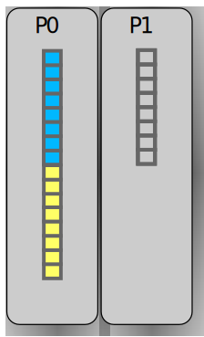
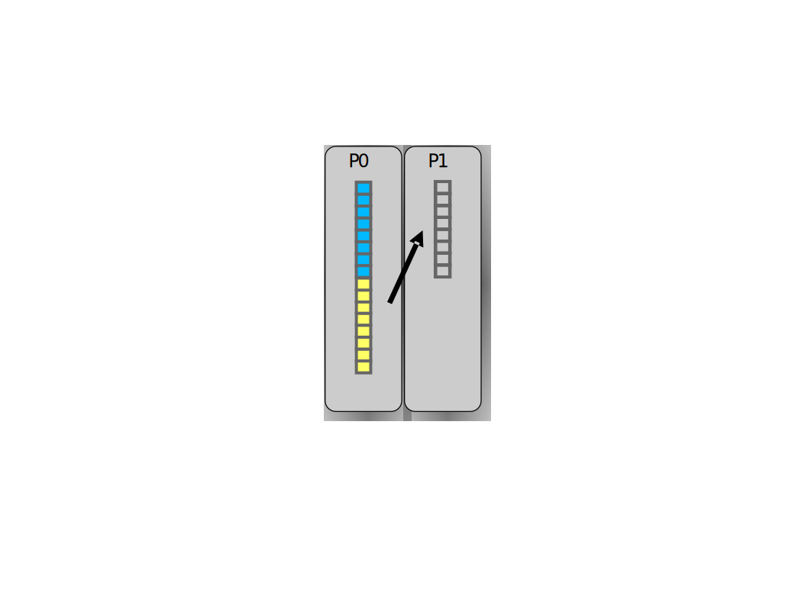
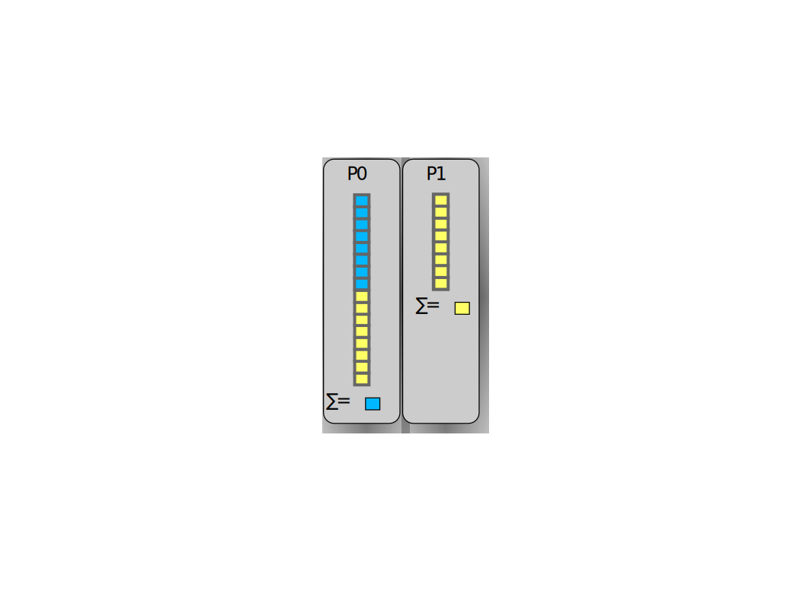
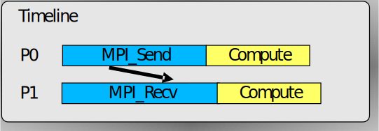
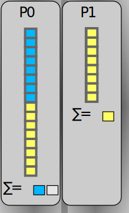
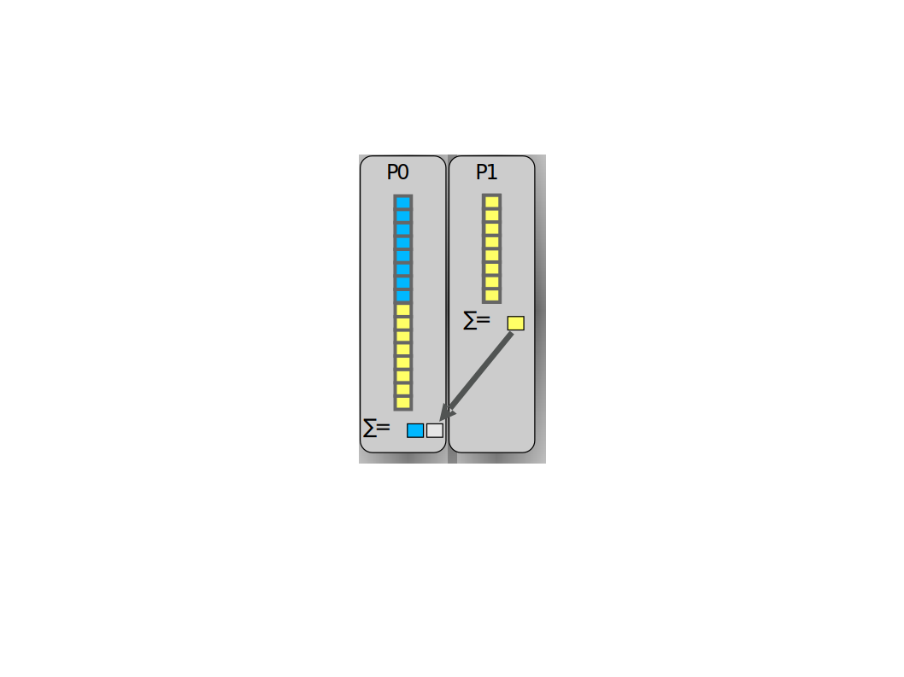
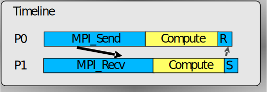
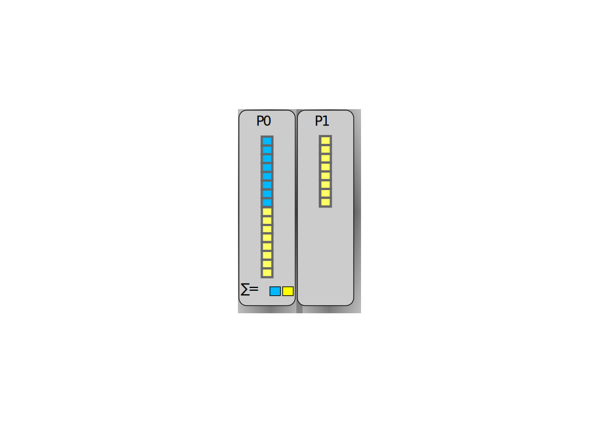

# Point-to-point communication{.section}

# Communication

- Data is local to the MPI processes
    - they need to *communicate* to coordinate work
- Point-to-point communication
    - Messages are sent between two processes
- Collective communication
    - Involving a number of processes at the same time

{.center width=50%}

# MPI point-to-point operations

- One process *sends* a message to another process that *receives* it with
  `MPI_Send` and `MPI_Recv` routines
- Sends and receives in a program should match – one receive per send
- Each message (envelope) contains
    - The actual *data* that is to be sent
    - The *datatype* of each element of data
    - The *number of elements* the data consists of
    - An identification number for the message (*tag*)
    - The ranks of the *source* and *destination* process

# Case study: parallel sum 

{.center width=45%}

- Array originally on process #0 (P0)
- Parallel algorithm
	* **Scatter**  
	Half of the array is sent to process 1

	* **Compute**  
	P0 & P1 sum independently their segments

	* **Reduction**  
	Partial sum on P1 sent to P0 
	P0 sums the partial sums

# Case study: parallel sum 

{.center width=45%}

 Step 1.1: Receive operation in scatter

 {.center width=50%}

  P1 issues MPI_Recv to receive half of the array from P0

# Case study: parallel sum 

{.center width=45%}

 Step 1.2: Send operation in scatter 

{.center width=50%}

 P0 issues an MPI_Send to send the lower part of the array to P1

# Case study: parallel sum 

{.center width=45%}

 Step 2: Compute the sum in parallel

{.center width=50%}

 Both P0 & P1 compute their partial sums and store them locally

# Case study: parallel sum 

{.center width=45%}

 Step 3.1: Receive operation in reduction

{.center width=50%}

 P0 issues an MPI_Recv operation for receiving P1’s partial sum 

# Case study: parallel sum 

{.center width=45%}

 Step 3.2: send operation in reduction

{.center width=50%}

 P1 sends the partial sum to P0

# Case study: parallel sum 

{.center width=45%}

 Step 3.3: compute the final answer

{.center width=50%}

 P0 computes the total sum

# Send operation

`MPI_Send(buffer, count, datatype, dest, tag, comm)`
: `buffer`{.input} 	The data to be sent
: `count`{.input}	Number of elements in buffer
: `datatype`{.input}	Type of elements in buffer (see later slides)
: `dest`{.input}  	The rank of the receiver
: `tag`{.input} 		An integer identifying the message
: `comm`{.input} 	Communicator
: `error`{.output}	Error value; in C/C++ it’s the return value of the function, and in Fortran an additional output parameter

# Receive operation

# MPI datatypes

- MPI has a number of predefined datatypes to represent data
- Each C or Fortran datatype has a corresponding MPI datatype
    - C examples: `MPI_INT` for `int` and `MPI_DOUBLE` for `double`
    - Fortran example: `MPI_INTEGER` for `integer`
- One can also define custom datatypes

# MORE FEATURES IN POINT-TO-POINT COMMUNICATION {.section}

# Blocking routines & deadlocks
- MPI_Send and MPI_Recv are blocking routines
	* `MPI_Send` exits once the send buffer can be safely read and written to
	* MPI_Recv exits once it has received the message in the receive buffer
- Completion depends on other processes => risk for  *deadlocks*
	* For example, all processes are in `MPI_Recv`
	* If deadlocked, the program is stuck forever

# Typical point-to-point communication patterns

{.center width=100%}

* Incorrect ordering of sends/receives may give a rise to a deadlock (or unnecessary idle time)

# Combined send & receive 

**MPI_Sendrecv(sendbuf, sendcount, sendtype, dest, 
sendtag, recvbuf, recvcount, recvtype, 
source, recvtag, comm, status)**

* Sends one message and receives another one, with a single command
	- Reduces risk for deadlocks
* Parameters as in `MPI_Send` and `MPI_Recv` 
* Destination rank and source rank can be same or different 

# Special parameter values 

**MPI_Send(buffer, count, datatype, dest, tag, comm)**     
` `  
    
     
| Parameter | Special value   | Implication				   |
| ----------| ----------------|--------------------------------------------|
| dest	    | `MPI_PROC_NULL` | Null destination, no operation takes place |

# Special parameter values

**MPI_Recv(buffer, count, datatype, source, tag, comm, status)**

# Testing

