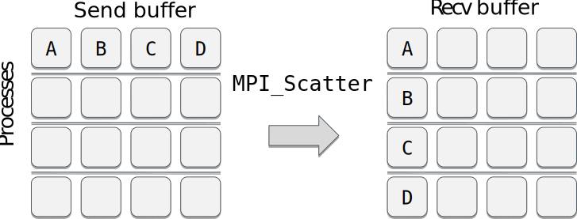
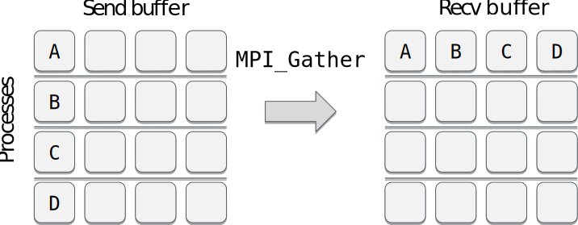
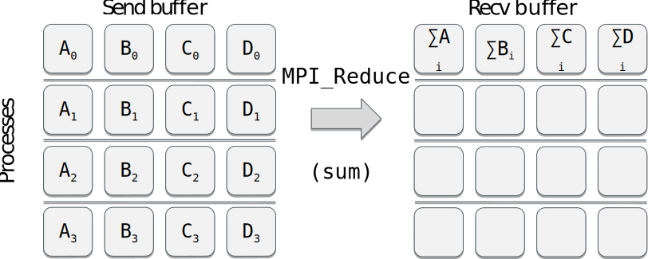
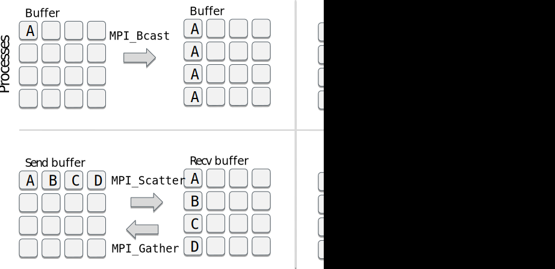

# Collective communication {.section}

# Introduction

- Collective communication transmits data among all processes in a
  process group (communicator)
- Collective communication includes
	- data movement
	- collective computation
	- synchronization

# Introduction

- Collective communication typically outperforms
  point-to-point communication
- Code becomes more compact and easier to read:

<div class=column>
```fortran
if (my_id == 0) then
	do i = 1, ntasks-1
		call mpi_send(a, 1048576, &
			MPI_REAL, i, tag, &
			MPI_COMM_WORLD, rc)
	end do
else
	call mpi_recv(a, 1048576, &
		MPI_REAL, 0, tag, &
		MPI_COMM_WORLD, status, rc)
end if
```
</div>
<div class=column>
```fortran
call mpi_bcast(a, 1048576, &
          MPI_REAL, 0, & 	
          MPI_COMM_WORLD, rc)

``` 
Communicating a vector **a** consisting of 1M float elements from
the task 0 to all other tasks

</div>

# Introduction

- These routines _must be called by all the processes_ in the communicator
- Amount of sent and received data must match
- No tag arguments
	- Order of execution must coincide across processes

# Broadcasting

- Replicate data from one process to all others

{.center width=80%}

# Broadcasting {.split-definition}

- With `MPI_Bcast`, the task root sends a buffer of data to all other tasks

MPI_Bcast(`buf`{.input}`fer`{.output}, `count`{.input}, `datatype`{.input}, `root`{.input}, `comm`{.input})
  : `buf`{.input}`fer`{.output} 
    : data to be distributed

    `count`{.input} 
    : number of entries in buffer

    `datatype`{.input} 
    : data type of buffer

    `root`{.input} 
    : rank of broadcast root

    `comm`{.input} 
    : communicator
    
    `-`{.ghost}
    : `-`{.ghost}

# Scattering

- Send equal amount of data from one process to others

{.center width=80%}

<p>
- Segments A, B, … may contain multiple elements

# Scattering {.split-definition}

- Task root sends an equal share of data to all other processes

MPI_Scatter(`sendbuf`{.input}, `sendcount`{.input}, `sendtype`{.input}, `recvbuf`{.output}, `recvcount`{.input}, `recvtype`{.input}, `root`{.input}, `comm`{.input})
  : `sendbuf`{.input} 
    : send buffer (data to be scattered)
	 
    `sendcount`{.input} 
    : number of elements sent to each process
    
    `sendtype`{.input}
    : data type of send buffer elements
    
    `recvbuf`{.output}
    : receive buffer
    
    `recvcount`{.input}
  	: number of elements to receive at each process
    
    `recvtype`{.input}
    : data type of receive buffer elements
    
    `root`{.input}
  	: rank of sending process
    
    `comm`{.input} 
    : communicator

# Examples

Assume 4 MPI tasks. What would the (full) program print?

<div class=column>
```fortran
if (my_id==0) then
	do i = 1, 16
		a(i) = i
	end do
end if
call mpi_bcast(a, 16, MPI_INTEGER, 0, &
		MPI_COMM_WORLD, rc)
if (my_id==3) print *, a(:)
```
<small>
 **A)** `1 2 3 4`  
 **B)** `13 14 15 16`  
 **C)** `1 2 3 4 5 6 7 8 9 10 11 12 13 14 15 16`
</small>

</div>
<div class=column>
```fortran
if (my_id==0) then
	do i = 1, 16
		a(i) = i
	end do
end if
call mpi_scatter(a, 4, MPI_INTEGER, aloc, 4 &
	MPI_INTEGER, 0, MPI_COMM_WORLD, rc)
if (my_id==3) print *, aloc(:)
```
<small>
 **A)** `1 2 3 4`  
 **B)** `13 14 15 16`  
 **C)** `1 2 3 4 5 6 7 8 9 10 11 12 13 14 15 16`
</small>
</div>

# Vector version of MPI_Scatter {.split-definition}

MPI_Scatterv(`sendbuf`{.input}, `sendcounts`{.input}, `displs`{.input}, `sendtype`{.input}, `recvbuf`{.output}, `recvcount`{.input}, `recvtype`{.input}, `root`{.input}, `comm`{.input})
  : `sendbuf`{.input}
    : send buffer

    `sendcounts`{.input} 
    : array (of length ntasks) specifying the number of elements to
      send to each processor

    `displs`{.input} 
    : array (of length ntasks). Entry i specifies the
      displacement(relative to sendbuf)

    `sendtype`{.input} 
    : data type of send buffer elements

    `recvbuf`{.output} 
    : receive buffer

    `recvcount`{.input} 
    : number of elements to receive

    `recvtype`{.input} 
    : data type of receive buffer elements

    `root`{.input} 
    : rank of sending process

    `comm`{.input} 
    : communicator

# Scatterv example

<div class=column>
```fortran
if (my_id==0) then
  do i = 1, 10
    a(i) = i
  end do
end if

scounts(0:3) = [ 1, 2, 3, 4 ]
displs(0:3) = [ 0, 1, 3, 6 ]

call mpi_scatterv(a, counts, &
    displs, MPI_INTEGER, &
    aloc, scounts(my_id), &
    MPI_INTEGER, 0, &
    MPI_COMM_WORLD, rc)

```

</div>
<div class=column>
Assume 4 MPI tasks. What are the values in aloc in the last task (#3)?

<br>

**A)** `1 2 3`    
**B)** `7 8 9 10`  
**C)** `1 2 3 4 5 6 7 8 9 10`  
</div>

# Gathering data

- Collect data from all the process to one process

{.center width=80%}

- Segments A, B, ... may contain multiple elements

# Gathering data {.split-definition}

- `MPI_Gather`: Collect an equal share of data from all processes to root

MPI_Gather(`sendbuf`{.input}, `sendcount`{.input}, `sendtype`{.input}, `recvbuf`{.output},`recvcount`{.input}, `recvtype`{.input}, `root`{.input}, `comm`{.input})
  : `sendbuf`{.input}
    : send buffer (data to be gathered)

    `sendcount`{.input}
    : number of elements pulled from each process

    `sendtype`{.input}
    : data type of send buffer elements

    `recvbuf`{.output}
    : receive buffer

    `recvcount`{.input}
   	: number of elements in any single receive

    `recvtype`{.input}
    : data type of receive buffer elements

    `root`{.input}
    : rank of receiving process

    `comm`{.input}
    : communicator

# Vector version of MPI_Gather {.split-def-3}

MPI_Gatherv(`sendbuf`{.input}, `sendcount`{.input}, `sendtype`{.input}, `recvbuf`{.output}, `recvcounts`{.input}, `displs`{.input}, `recvtype`{.input}, `root`{.input}, `comm`{.input})
  : `sendbuf`{.input}
    : send buffer

    `sendcount`{.input}
 	: the number of elements to send

    `sendtype`{.input} 
    : data type of send buffer elements
    
    `-`{.ghost}
    : `-`{.ghost}
    
    `recvbuf`{.output} 	
    : receive buffer

    `recvcounts`{.input}
 	: array (of length ntasks). Entry _i_ specifies how many to
       receive from that process

    `displs`{.input} 
    : array (of length ntasks). Entry _i_ specifies the displacement
      (relative to recvbuf)

    `recvtype`{.input}
 	: data type of receive buffer elements

    `root`{.input}
 	: rank of receiving process

    `comm`{.input}
    : communicator
    
    `-`{.ghost}
    : `-`{.ghost}

# Reduce operation

- Applies an operation over set of processes and places result in single process  

{.center width=80%}

# Available reduction operations

<div class=column>
| Operation    | Meaning              |
|--------------|----------------------|
| `MPI_MAX`    | Max value            |
| `MPI_MIN`    | Min value            |
| `MPI_SUM`    | Sum                  |
| `MPI_PROD`   | Product              |
| `MPI_MAXLOC` | Max value + location |
| `MPI_MINLOC` | Min value + location |
</div>
<div class=column>
| Operation  | Meaning      |
|------------|--------------|
| `MPI_LAND` | Logical AND  |
| `MPI_BAND` | Bytewise AND |
| `MPI_LOR`  | Logical OR   |
| `MPI_BOR`  | Bytewise OR  |
| `MPI_LXOR` | Logical XOR  |
| `MPI_BXOR` | Bytewise XOR |
</div>

# Reduce operation {.split-definition}

- Applies a reduction operation op to `sendbuf` over the set of tasks
  and places the result in `recvbuf` on root

MPI_Reduce(`sendbuf`{.input}, `recvbuf`{.output}, `count`{.input}, `datatype`{.input}, `op`{.input}, `root`{.input}, `comm`{.input})
  : `sendbuf`{.input} 
    : send buffer

    `recvbuf`{.output} 
    : receive buffer

    `count`{.input} 
    : number of elements in send buffer

    `datatype`{.input} 
    : data type of elements in send buffer

    `op`{.input} 
    : operation

    `root`{.input} 
    : rank of root process

    `comm`{.input}
    : communicator

    `-`{.ghost}
    : `-`{.ghost}

# Global reduction {.split-definition}

- `MPI_Allreduce` combines values from all processes and distributes
  the result back to all processes
	- Compare: `MPI_Reduce` + `MPI_Bcast` 

MPI_Allreduce(`sendbuf`{.input}, `recvbuf`{.output}, `count`{.input}, `datatype`{.input}, `op`{.input}, `comm`{.input})
  : `sendbuf`{.input} 
    : starting address of send buffer

    `recvbuf`{.output}
    : starting address of receive buffer

    `count`{.input}
    : number of elements in send buffer

    `datatype`{.input}
    : data type of elements in send buffer

    `op`{.input} 
    : operation

    `comm`{.input} 
    : communicator

# Allreduce example: parallel dot product

<div class=column>
```fortran
real :: a(1024), aloc(128)
...
if (my_id==0) then
    call random_number(a)
end if
call mpi_scatter(a, 128, MPI_INTEGER, &
                 aloc, 128, MPI_INTEGER, &
                 0, MPI_COMM_WORLD, rc)
rloc = dot_product(aloc,aloc)
call mpi_allreduce(rloc, r, 1, MPI_REAL,&
                   MPI_SUM, MPI_COMM_WORLD,
                   rc)
```
</div>
<div class=column>
```
> aprun -n 8 ./mpi_pdot
 id= 6 local= 39.68326  global= 338.8004
 id= 7 local= 39.34439  global= 338.8004
 id= 1 local= 42.86630  global= 338.8004
 id= 3 local= 44.16300  global= 338.8004
 id= 5 local= 39.76367  global= 338.8004
 id= 0 local= 42.85532  global= 338.8004
 id= 2 local= 40.67361  global= 338.8004
 id= 4 local= 49.45086  global= 338.8004
```
</div>


# All gather

- `MPI_Allgather` gathers data from each task and distributes the resulting data to each task
	- Compare: `MPI_Gather` + `MPI_Bcast`
    
<p>
{.center width=50%}


# All gather {.split-definition}

MPI_Allgather(`sendbuf`{.input}, `sendcount`{.input}, `sendtype`{.input}, `recvbuf`{.output}, `recvcount`{.input}, `recvtype`{.input}, `comm`{.input})
  : `sendbuf`{.input} 
    : send buffer

    `sendcount`{.input} 
    : number of elements in send buffer

    `sendtype`{.input} 
    : data type of send buffer elements

    `recvbuf`{.output} 
    : receive buffer

    `recvcount`{.input} 
    : number of elements received from any process

    `recvtype`{.input} 
    : data type of receive buffer

# All to all

- Send a distinct message from each task to every task

<p>
{.center width=80%}

<p>
- "Transpose" like operation

# All to all {.split-definition}

- Sends a distinct message from each task to every task
    - Compare: "All scatter"

MPI_Alltoall(`sendbuf`{.input}, `sendcount`{.input}, `sendtype`{.input}, `recvbuf`{.output},`recvcount`{.input}, `recvtype`{.input}, `comm`{.input})
  : `sendbuf`{.input}
    : send buffer
    
    `sendcount`{.input}
    : number of elements to send
    
    `sendtype`{.input}
    : data type of send buffer elements

    `recvbuf`{.output}
    : receive buffer

    `recvcount`{.input}
    : number of elements received
    
    `recvtype`{.input} 
    : data type of receive buffer elements

    `comm`{.input} 
    : communicator
    
    `-`{.ghost}
    : `-`{.ghost}

# All-to-all example

<div class=column>
```fortran
if (my_id==0) then
  do i = 1, 16
    a(i) = i
  end do
end if
call mpi_bcast(a, 16, MPI_INTEGER, 0, &
	MPI_COMM_WORLD, rc)

call mpi_alltoall(a, 4, MPI_INTEGER, &
                  aloc, 4, MPI_INTEGER, &
                  MPI_COMM_WORLD, rc) 
```
Assume 4 MPI tasks. What will be the values of **aloc in the process #0?**
</div>

<div class=column>
**A)** `1, 2, 3, 4`  
**B)** `1, ..., 16`  
**C)** `1, 2, 3, 4, 1, 2, 3, 4,`  
`1, 2, 3, 4, 1, 2, 3, 4`
</div>


# Common mistakes with collectives

- Using a collective operation within one branch of an if-test of the rank  
`if (my_id == 0) call mpi_bcast(...`
	- All processes, both the root (the sender or the gatherer) and
      the rest (receivers or senders), must call the collective
      routine!
- Assuming that all processes making a collective call would complete
  at the same time
- Using the input buffer as the output buffer  
`call mpi_allreduce(a, a, n, mpi_real,...`
	- One should employ MPI_IN_PLACE for this purpose

# Summary

- Collective communications involve all the processes within a
  communicator
	- All processes must call them
- Collective operations make code more transparent and compact
- Collective routines allow optimizations by MPI library

# Summary

{.center width=100%}

