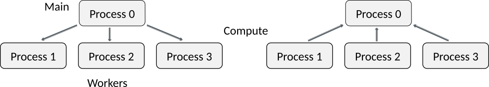

# Outline

- MPI Status parameter
- Common communication patterns
- MPI programming practices
- "Special" parameter values in MPI


# MPI Status parameter {.section}


# MPI point-to-point operations (recap)

MPI_Send(`buffer`{.input}, `count`{.input}, `datatype`{.input}, `dest`{.input}, `tag`{.input}, `comm`{.input})
  : Performs a blocking send
  : **Note!** The `count` parameter is the number of elements to send

MPI_Recv(`buffer`{.output}, `count`{.input}, `datatype`{.input}, `source`{.input}, `tag`{.input}, `comm`{.input}, `status`{.output})
  : Performs a blocking receive
  : **Note!** The `count` parameter is the **maximum** number of elements to receive
  : The `status` parameter is discussed on the next slide


# Status parameter

- The status parameter contains information about the received message
  - The number of received elements
  - The rank of the sender (source)
  - The tag of the received message
- Examining the status parameter is needed in communication patterns where the receiver does not know this information a priori
- When the information is known or irrelevant, the status can be ignored
  - Use the special constant `MPI_STATUS_IGNORE` as status
  - Benefit: Cleaner code & allows (small) optimizations in the MPI library


# Arbitrary receives

- In some communication patterns one might want to receive from arbitrary sender or a message with arbitrary tag
- Use special `MPI_ANY_SOURCE` and/or `MPI_ANY_TAG` in `MPI_Recv`
    - The actual sender and tag can be queried from `status` if needed

<div class=column style="width:48%">
- There needs to be still a `MPI_Recv` for each `MPI_Send`
- `MPI_ANY_SOURCE` may introduce performance overhead
    - Typically used only when there is clear benefit (*e.g.* in load balancing)
</div>

<div class=column style="width:50%">
```c++
if (rank == 0) {
  for (int i=1; i < ntasks; i++) {
    MPI_Recv(&data, n, MPI_INT, MPI_ANY_SOURCE,
             42, MPI_COMM_WORLD, &status);
  }
} else {
  calculate(data);  // takes varying time
  MPI_Send(&data, n, MPI_INT, 0,
           42, MPI_COMM_WORLD);
}
```
</div>


# Examining status: Example

<div class="column">
**C**

```c++
MPI_Status status;
int nrecv, tag, source;


MPI_Recv(buffer, buffer_size, MPI_INT,
         MPI_ANY_SOURCE, MPI_ANY_TAG,
         MPI_COMM_WORLD, &status);

// Get the number of received elements
MPI_Get_count(status, MPI_DOUBLE, &nrecv);

// Get the tag of the received message
tag = status.MPI_TAG;

// Get the rank of the sender
source = status.MPI_SOURCE;
```
</div>

<div class="column">
**Fortran 2008** (`use mpi_f08`)

```fortranfree
type(mpi_status) :: status
integer :: nrecv, tag, source
...

call mpi_recv(buffer, buffer_size, mpi_integer, &
              mpi_any_source, mpi_any_tag, &
              mpi_comm_world, status)

! Get the number of received elements
call mpi_get_count(status, mpi_integer, nrecv)

! Get the tag of the received message
tag = status%mpi_tag

! Get the rank of the sender
source = status%mpi_source
```
</div>

# Message probing

MPI_Probe(`source`{.input}, `tag`{.input}, `comm`{.input}, `status`{.output})
: Blocking test for a message without receiving it

<p>
- The call returns only after a matching message has been found
  - Like `MPI_Recv`, but not receiving the data part of the message
- Can be used to determine the size of the incoming data<br>
  → Use to allocate large enough buffer for `MPI_Recv`


# Common communication patterns {.section}

# Main - worker

{.center width=100%}

<br>

- Each process is only sending or receiving at the time


# Pairwise neighbour communication

{.center width=90%}

<br>

- Incorrect ordering of sends/receives may give a rise to a deadlock or unnecessary idle time
- Can be generalized to multiple dimensions


# MPI programming practices {.section}

# The rank 0

- The rank 0 is always present even in the serial case
  - Use rank 0 for any tasks that need to happen no matter how many processes are used
- Example: scatter and gather type operations

```c++
if (0 == rank) {
  for (int i=1; i < ntasks; i++) {
    MPI_Send(&data, 1, MPI_INT, i, 42, MPI_COMM_WORLD);
  }
} else {
  MPI_Recv(&data, 1, MPI_INT, 0, 42, MPI_COMM_WORLD, &status);
}
```

- **Note!** MPI provides better collective operations; discussed tomorrow


# Generalizing to arbitrary number of processes

- Avoid hard-coding the `source`  and `destination` arguments (like in most illustratory examples thus far)
  - Such a program would work correctly only with a fixed number of processes
- Better approach: Store `source` and `destination` in variables and place MPI calls outside `if`s when possible
  - This produces typically code that is easier to read 
  - The program is generalizable to arbitrary number of processes


# Example

<div class=column>
Hard to read and works only with two processes:

```c++
if (rank == 0) {
  MPI_Send(message, msgsize, MPI_INT,
           1, 42, MPI_COMM_WORLD);
  MPI_Recv(recvbuf, bufsize, MPI_INT,
           1, 42, MPI_COMM_WORLD,
           &status);
} else if (rank == 1) {
  MPI_Send(message, msgsize, MPI_INT,
           0, 42, MPI_COMM_WORLD);
  MPI_Recv(recvbuf, bufsize, MPI_INT,
           0, 42, MPI_COMM_WORLD,
           &status);
}
```
</div>

<div class=column>
Clearer and works with any number of processes:

```c++
// Modulo operation for wrapping around
dst = (rank + 1) % ntasks;
src = (rank - 1 + ntasks) % ntasks;

MPI_Send(message, msgsize, MPI_INT,
         dst, 42, MPI_COMM_WORLD);
MPI_Recv(recvbuf, bufsize, MPI_INT,
         src, 42, MPI_COMM_WORLD,
         &status);
```
</div>
- **Note!** Clear code makes it clear that this code will deadlock!


# Combined send & receive

MPI_Sendrecv(`sendbuf`{.input}, `sendcount`{.input}, `sendtype`{.input}, `dest`{.input}, `sendtag`{.input}, `recvbuf`{.output}, `recvcount`{.input}, `recvtype`{.input}, `source`{.input}, `recvtag`{.input}, `comm`{.input}, `status`{.output})
  : `-`{.ghost}

- Sends one message and receives another one, with a single command
  - Reduces risk for deadlocks and improves performance
- Destination rank and source rank can be same or different


# Example

```c++
// Modulo operation for wrapping around
dst = (rank + 1) % ntasks;
src = (rank - 1 + ntasks) % ntasks;

MPI_Sendrecv(message, msgsize, MPI_INT,
             dst, 42, 
             recvbuf, bufsize, MPI_INT,
             src, 42, MPI_COMM_WORLD,
             &status);
```

- **Note!** No deadlock here!


# Coping with boundaries

- In some communication patterns there are boundary processes that do not send or receive while all the other processes do
- A special constant `MPI_PROC_NULL` can be used for turning `MPI_Send` / `MPI_Recv` into a dummy call
    - No matching `MPI_Recv` / `MPI_Send` is needed


# Example

```C++
dst = rank + 1;
src = rank - 1;

if (0 == rank) {
    src = MPI_PROC_NULL;
}
if (ntasks - 1 == rank) {
    dst = MPI_PROC_NULL;
}

MPI_Send(message, msgsize, MPI_INT, dst, 42, MPI_COMM_WORLD);
MPI_Recv(recvbuf, bufsize, MPI_INT, src, 42, MPI_COMM_WORLD, &status);
```

# Summary {.section}

# Summary

- Status parameter of `MPI_Recv` / `MPI_Probe` contains information about the message
- Make MPI programs to work with arbitrary number of processes
  - Use rank 0 for special tasks
- Employ special parameter values for simplifying the implementation of certain communication patterns
  - Summarized in the next slides
- When there is always both sending and receiving, `MPI_Sendrecv` can prevent deadlocks and serialization of communication


# Summary of special parameter values {.section}

# Special parameter values

MPI_Send(`buffer`{.input}, `count`{.input}, `datatype`{.input}, `dest`{.input}, `tag`{.input}, `comm`{.input})
  : `-`{.ghost}

| Parameter          | Special value    | Implication                                  |
| ----------         | ---------------- | -------------------------------------------- |
| **`dest`{.input}** | `MPI_PROC_NULL`  | No operation takes place; return immediately |


# Special parameter values

MPI_Recv(`buffer`{.output}, `count`{.input}, `datatype`{.input}, `source`{.input}, `tag`{.input}, `comm`{.input}, `status`{.output})
  : `-`{.ghost}

| Parameter             | Special value       | Implication                                  |
| ----------            | ----------------    | -------------------------------------------- |
| **`source`{.input}**  | `MPI_PROC_NULL`     | No operation takes place; return immediately |
|                       | `MPI_ANY_SOURCE`    | Receive from any sender                      |
| **`tag`{.input}**     | `MPI_ANY_TAG`       | Receive messages with any tag                |
| **`status`{.output}** | `MPI_STATUS_IGNORE` | Do not store any status data                 |

# Special parameter values

MPI_Probe(`source`{.input}, `tag`{.input}, `comm`{.input}, `status`{.output})
  : `-`{.ghost}

| Parameter             | Special value       | Implication                                  |
| ----------            | ----------------    | -------------------------------------------- |
| **`source`{.input}**  | `MPI_PROC_NULL`     | No operation takes place; return immediately |
|                       | `MPI_ANY_SOURCE`    | Receive from any sender                      |
| **`tag`{.input}**     | `MPI_ANY_TAG`       | Receive messages with any tag                |
| **`status`{.output}** | `MPI_STATUS_IGNORE` | Do not store any status data                 |
