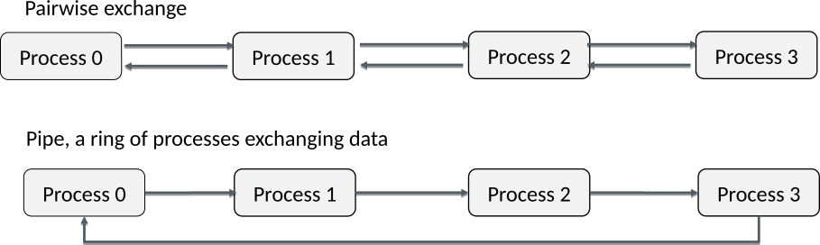

# "Special" parameters {.section}

# MPI programming practices

- For the sake of illustration, we have so far hard-coded the `source`
  and `destination` arguments, and placed the MPI
  calls within `if` constructs
- This produces typically code which is difficult to read and to
  generalize to arbitrary number of processes
- Store source and destination in variables and place MPI calls
  outside **`if`**s when possible.

# Example

<div class=column>
```fortran
if (myid == 0) then
   call mpi_send(message, msgsize, &
                 MPI_INTEGER, 1, &
                 42, MPI_COMM_WORLD, rc)
   call mpi_recv(recvBuf, arraysize, &
                 MPI_INTEGER, 1, &
                 42, MPI_COMM_WORLD, &
                 status, rc)
else if (myid == 1) then
   call mpi_send(message, msgsize, &
                 MPI_INTEGER, 0, &
                 42, MPI_COMM_WORLD, rc)
   call mpi_recv(recvBuf, arraysize, &
                 MPI_INTEGER, 0, &
                 42, MPI_COMM_WORLD, &
                 status, rc)
```
</div>

<div class=column>
```fortran
! Modulo operation can be used for
! wrapping around
dst = mod(myid + 1, ntasks)
src = mod(myid - 1 + ntasks, ntasks)

call mpi_send(message, msgsize, &
              MPI_INTEGER, dst, &
              42, MPI_COMM_WORLD, rc)
call mpi_recv(recvBuf, arraysize, &
              MPI_INTEGER, src, &
              42, MPI_COMM_WORLD, &
              status, rc)

```
</div>


# MPI programming practices

- As rank 0 is always present even in the serial case, it is normally
  chosen as the special task in scatter and gather type operations

```c++
if (0 == myid) {
  for (int i=1; i < ntasks; i++) {
     MPI_Send(&data, 1, MPI_INT, i, 42, MPI_COMM_WORLD);
  }
} else {
     MPI_Recv(&data, 1, MPI_INT, 0, 42, MPI_COMM_WORLD, &status);
}
```

# Coping with boundaries

- In some communication patterns there are boundary processes that do
  not send or receive while all the other processes do
- A special constant `MPI_PROC_NULL` can be used for turning
  `MPI_Send` / `MPI_Recv` into a dummy call
    - No matching `receive` / `send` is needed

# Example

```fortran
if (myid == 0) then
    src = MPI_PROC_NULL
end if
if (myid == ntasks - 1) then
    dst = MPI_PROC_NULL
end if

call mpi_send(message, msgsize, MPI_INTEGER, dst, 42, MPI_COMM_WORLD, rc)
call mpi_recv(message, msgsize, MPI_INTEGER, src, 42, MPI_COMM_WORLD, status, rc)
```


# Arbitrary receives

- In some communication patterns one might want to receive from
  arbitrary sender or a message with arbitrary tag
- `MPI_ANY_SOURCE` and `MPI_ANY_TAG`
    - The actual sender and tag can be queried from **`status`** if
      needed

<div class=column style="width:48%">
- There needs to be still `receive` for each `send`
- `MPI_ANY_SOURCE` may introduce performance overhead
    - Use only when there is clear benefit *e.g.* in load balancing
</div>

<div class=column style="width:50%">
```c++
if (0 == myid) {
  for (int i=1; i < ntasks; i++) {
     MPI_Recv(&data, 1, MPI_INT, MPI_ANY_SOURCE,
              42, MPI_COMM_WORLD, &status);
     process(data);
  }
} else {
     MPI_Send(&data, 1, MPI_INT, 0,
              42, MPI_COMM_WORLD);
}
```
</div>


# Ignoring status

- When `source`, `tag`, and the number of received elements are known,
  there is no need to examine `status`
- A special constant `MPI_STATUS_IGNORE` can be used for the `status`
  parameter
- Saves memory in the user program and allows optimizations in the MPI library

# Special parameter values in sending

MPI_Send(`buffer`{.input}, `count`{.input}, `datatype`{.input}, `dest`{.input}, `tag`{.input}, `comm`{.input})
  : `-`{.ghost}
    : `-`{.ghost}

| Parameter          | Special value    | Implication                                  |
| ----------         | ---------------- | -------------------------------------------- |
| **`dest`{.input}** | `MPI_PROC_NULL`  | No operation takes place                     |

# Special parameter values in receiving

MPI_Recv(`buffer`{.output}, `count`{.input}, `datatype`{.input}, `source`{.input}, `tag`{.input}, `comm`{.input}, `status`{.output})
  : `-`{.ghost}
    : `-`{.ghost}

| Parameter             | Special value       | Implication                                  |
| ----------            | ----------------    | -------------------------------------------- |
| **`source`{.input}**  | `MPI_PROC_NULL`     | No operation takes place                     |
|                       | `MPI_ANY_SOURCE`    | Receive from any sender                      |
| **`tag`{.input}**     | `MPI_ANY_TAG`       | Receive messages with any tag                |
| **`status`{.output}** | `MPI_STATUS_IGNORE` | Do not store any status data                 |

# Common communication patterns {.section}

# Main - worker

{.center width=100%}

<br>

- Each process is only sending or receiving at the time

# Pairwise neighbour communication

{.center width=90%}

<br>

- Incorrect ordering of sends/receives may give a rise to a deadlock
  or unnecessary idle time
- Can be generalized to multiple dimensions

# Combined send & receive

MPI_Sendrecv(`sendbuf`{.input}, `sendcount`{.input}, `sendtype`{.input}, `dest`{.input}, `sendtag`{.input}, `recvbuf`{.output}, `recvcount`{.input}, `recvtype`{.input}, `source`{.input}, `recvtag`{.input}, `comm`{.input}, `status`{.output})
  : `-`{.ghost}
    : `-`{.ghost}

- Sends one message and receives another one, with a single command
    - Reduces risk for deadlocks and improves performance
- Parameters as in `MPI_Send` and `MPI_Recv`
- Destination rank and source rank can be same or different
- `MPI_PROC_NULL` can be used for coping with the boundaries


# Summary

- Generally, it is advisable to make MPI programs to work with
  arbitrary number of processes
- When possible, MPI calls should be placed outside `if` constructs
- Employing special parameter values may simplify the implementations
  of certain communication patterns
- Individual `MPI_Send` and `MPI_Recv` are suitable for irregular communication
- When there is always both sending and receiving, `MPI_Sendrecv` can prevent deadlocks
  and serialization of communication
