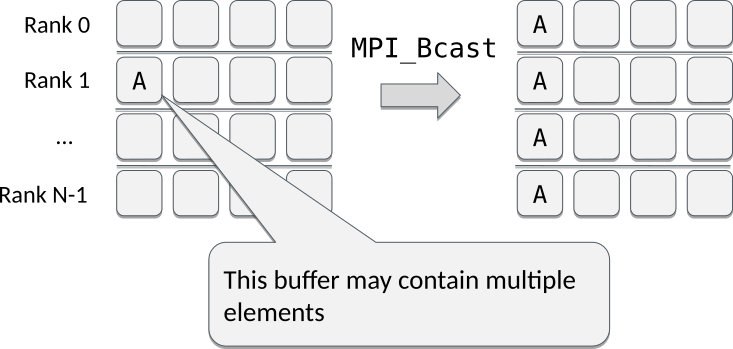
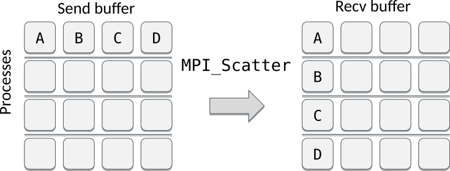
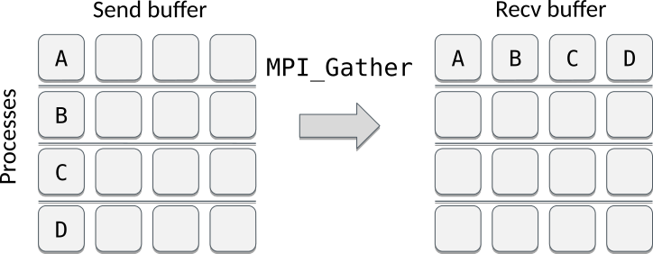
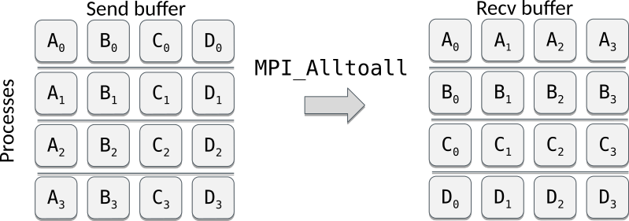
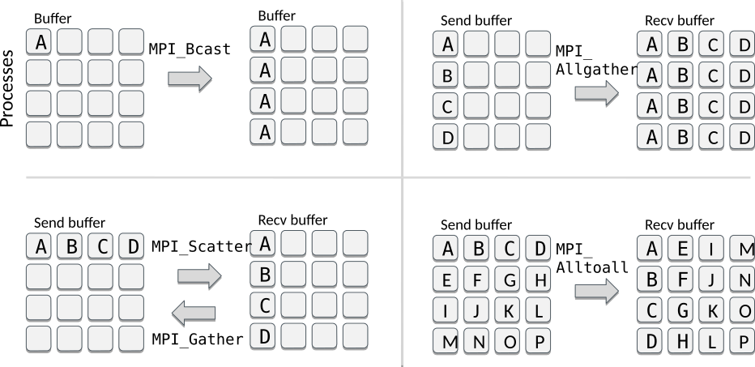

# Introduction

- Collective communication transmits data among all processes in a
  process group (communicator)
- Collective communication includes
    - data movement
    - collective computation
    - synchronization

# Introduction

- Collective communication typically outperforms
  point-to-point communication
- Code becomes more compact and easier to read:

<div class=column>
```fortranfree
if (rank == 0) then
    do i = 1, ntasks-1
        call mpi_send(a, 1048576, &
            MPI_REAL, i, tag, &
            MPI_COMM_WORLD, rc)
    end do
else
    call mpi_recv(a, 1048576, &
        MPI_REAL, 0, tag, &
        MPI_COMM_WORLD, status, rc)
end if
```
</div>
<div class=column>
```fortranfree
call mpi_bcast(a, 1048576, &
               MPI_REAL, 0, &
               MPI_COMM_WORLD, rc)

```
Communicating a vector **a** consisting of 1M float elements from
the task 0 to all other tasks

</div>

# Introduction

- These routines **must be called by all the processes** in the communicator
- Amount of sent and received data must match
- No tag arguments
    - Order of execution must coincide across processes

# Broadcasting

- Replicate data from one process to all others

{.center width=80%}

# Broadcasting

MPI_Bcast(`buf`{.input}`fer`{.output}, `count`{.input}, `datatype`{.input}, `root`{.input}, `comm`{.input})
: Broadcasts data from the root process to all other processes of the group


# Scattering

- Send data from one process to other processes

{.center width=80%}

<p>
- Segments A, B, … may contain multiple elements

# Scattering

MPI_Scatter(`sendbuf`{.input}, `sendcount`{.input}, `sendtype`{.input}, `recvbuf`{.output}, `recvcount`{.input}, `recvtype`{.input}, `root`{.input}, `comm`{.input})
: Sends data from the root process to all other processes of the group

<p>
- Data is scattered in portions of equal size (`sendcount`)


# Examples

Assume 4 MPI tasks. What would the (full) program print?

<div class=column>
```fortranfree
if (rank==0) then
    do i = 1, 16
        a(i) = i
    end do
end if
call mpi_bcast(a, 16, MPI_INTEGER, 0, &
        MPI_COMM_WORLD, rc)
if (rank==3) print *, a(:)
```
<small>
 **A)** `1 2 3 4`<br>
 **B)** `13 14 15 16`<br>
 **C)** `1 2 3 4 5 6 7 8 9 10 11 12 13 14 15 16`
</small>

</div>
<div class=column>
```fortranfree
if (rank==0) then
    do i = 1, 16
        a(i) = i
    end do
end if
call mpi_scatter(a, 4, MPI_INTEGER, aloc, 4 &
    MPI_INTEGER, 0, MPI_COMM_WORLD, rc)
if (rank==3) print *, aloc(:)
```
<small>
 **A)** `1 2 3 4`<br>
 **B)** `13 14 15 16`<br>
 **C)** `1 2 3 4 5 6 7 8 9 10 11 12 13 14 15 16`
</small>

</div>

# Vector version of scatter

MPI_Scatterv(`sendbuf`{.input}, `sendcounts`{.input}, `displs`{.input}, `sendtype`{.input}, `recvbuf`{.output}, `recvcount`{.input}, `recvtype`{.input}, `root`{.input}, `comm`{.input})
: Sends data from the root process to all other processes of the group

<p>
- Data is scattered in portions given by `sendcounts` and `displs`


# Scatterv example

<div class=column>
```fortranfree
if (rank==0) then
  do i = 1, 10
    a(i) = i
  end do
end if

scounts(0:3) = [ 1, 2, 3, 4 ]
displs(0:3) = [ 0, 1, 3, 6 ]

call mpi_scatterv(a, scounts, &
    displs, MPI_INTEGER, &
    aloc, scounts(rank), &
    MPI_INTEGER, 0, &
    MPI_COMM_WORLD, rc)

```

</div>
<div class=column>
Assume 4 MPI tasks. What are the values in `aloc` in the last task (#3)?

<br>

**A)** `1 2 3`<br>
**B)** `7 8 9 10`<br>
**C)** `1 2 3 4 5 6 7 8 9 10`
</div>

# Gathering data

- Collect data from all the processes to one process

{.center width=80%}

- Segments A, B, ... may contain multiple elements


# Gathering data

MPI_Gather(`sendbuf`{.input}, `sendcount`{.input}, `sendtype`{.input}, `recvbuf`{.output}, `recvcount`{.input}, `recvtype`{.input}, `root`{.input}, `comm`{.input})
: Gathers data to the root process from all other processes of the group

<p>
- Data is gathered in portions of equal size (`recvcount`)

# Vector version of gather

MPI_Gatherv(`sendbuf`{.input}, `sendcount`{.input}, `sendtype`{.input}, `recvbuf`{.output}, `recvcounts`{.input}, `displs`{.input}, `recvtype`{.input}, `root`{.input}, `comm`{.input})
: Gathers data to the root process from all other processes of the group

<p>
- Data is gathered in portions given by `recvcounts` and `displs`


# All gather

- Collect data from all the processes and replicate the resulting data to all of them
    - Similar to `MPI_Gather` + `MPI_Bcast` but more efficient

<p>
{.center width=50%}


# All gather

MPI_Allgather(`sendbuf`{.input}, `sendcount`{.input}, `sendtype`{.input}, `recvbuf`{.output}, `recvcount`{.input}, `recvtype`{.input}, `comm`{.input})
: Gathers data from all processes and distributes it to all processes


# All to all

- Send a distinct message from every process to every processes
    - Kind of "All scatter" or "transpose" like operation

<p>
{.center width=80%}

<p>


# All to all

MPI_Alltoall(`sendbuf`{.input}, `sendcount`{.input}, `sendtype`{.input}, `recvbuf`{.output},`recvcount`{.input}, `recvtype`{.input}, `comm`{.input})
: All processes send data to all processes


# All-to-all example

<div class=column>
```fortranfree
if (rank==0) then
  do i = 1, 16
    a(i) = i
  end do
end if
call mpi_bcast(a, 16, MPI_INTEGER, 0, &
    MPI_COMM_WORLD, rc)

call mpi_alltoall(a, 4, MPI_INTEGER, &
                  aloc, 4, MPI_INTEGER, &
                  MPI_COMM_WORLD, rc)
```
Assume 4 MPI tasks. What will be the values of **aloc in the process #0?**
</div>

<div class=column>
**A)** `1, 2, 3, 4`</br>
**B)** `1, ..., 16`</br>
**C)** `1, 2, 3, 4, 1, 2, 3, 4,`
`1, 2, 3, 4, 1, 2, 3, 4`
</div>


# Common mistakes with collectives

1. Using a collective operation within if-rank test:<br>
`if (rank == 0) call mpi_bcast(...`
    - All the processes, both the root (the sender or the receiver) and
      the rest (receivers or senders), must call the collective routine!
2. Assuming that all processes making a collective call would complete at the same time

# Summary

- Collective communications involve all the processes within a
  communicator
    - All processes must call them
- Collective operations make code more transparent and compact
- Collective routines allow optimizations by MPI library

# Summary

{.center width=100%}
