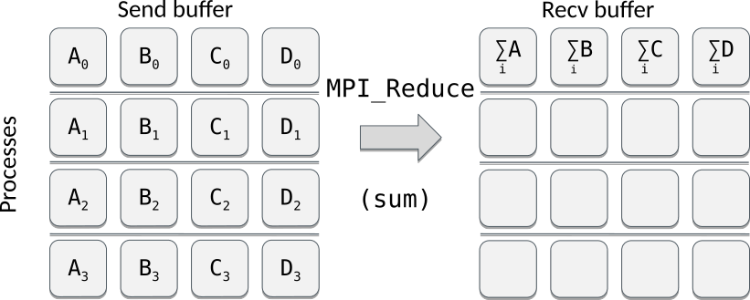

# Collective communication {.section}

# Introduction

- Collective communication transmits data among all processes in a
  process group (communicator)
- Collective communication includes
    - data movement
    - collective computation
    - synchronization

# Introduction

- Collective communication typically outperforms
  point-to-point communication
- Code becomes more compact and easier to read:

<div class=column>
```fortranfree
if (rank == 0) then
    do i = 1, ntasks-1
        call mpi_send(a, 1048576, &
            MPI_REAL, i, tag, &
            MPI_COMM_WORLD, rc)
    end do
else
    call mpi_recv(a, 1048576, &
        MPI_REAL, 0, tag, &
        MPI_COMM_WORLD, status, rc)
end if
```
</div>
<div class=column>
```fortranfree
call mpi_bcast(a, 1048576, &
               MPI_REAL, 0, &
               MPI_COMM_WORLD, rc)

```
Communicating a vector **a** consisting of 1M float elements from
the task 0 to all other tasks

</div>

# Introduction

- These routines _must be called by all the processes_ in the communicator
- Amount of sent and received data must match
- No tag arguments
    - Order of execution must coincide across processes

# Broadcasting

- Replicate data from one process to all others

{.center width=80%}

# Broadcasting {.split-definition}

- The root process sends the same data to all other processes

MPI_Bcast(`buf`{.input}`fer`{.output}, `count`{.input}, `datatype`{.input}, `root`{.input}, `comm`{.input})
  : `buf`{.input}`fer`{.output}
    : Data to be broadcasted / Buffer for receiving data

    `count`{.input}
    : Number of elements in buffer

    `datatype`{.input}
    : Type of elements in buffer

    `root`{.input}
    : The rank of sending process

    `comm`{.input}
    : Communicator

    `-`{.ghost}
    : `-`{.ghost}

# Scattering

- Send data from one process to other processes

{.center width=80%}

<p>
- Segments A, B, … may contain multiple elements

# Scattering {.split-definition}

- The root process sends an equal share of the data to all other processes

MPI_Scatter(`sendbuf`{.input}, `sendcount`{.input}, `sendtype`{.input}, `recvbuf`{.output}, `recvcount`{.input}, `recvtype`{.input}, `root`{.input}, `comm`{.input})
  : `sendbuf`{.input}
    : Data to be scattered

    `sendcount`{.input}
    : Number of elements to send to each process

    `sendtype`{.input}
    : Type of elements in send buffer

    `recvbuf`{.output}
    : Buffer for receiving data

    `recvcount`{.input}
    : Number of elements to receive

    `recvtype`{.input}
    : Type of elements to receive

    `root`{.input}
    : The rank of sending process

    `comm`{.input}
    : Communicator

# Examples

Assume 4 MPI tasks. What would the (full) program print?

<div class=column>
```fortranfree
if (rank==0) then
    do i = 1, 16
        a(i) = i
    end do
end if
call mpi_bcast(a, 16, MPI_INTEGER, 0, &
        MPI_COMM_WORLD, rc)
if (rank==3) print *, a(:)
```
<small>
 **A)** `1 2 3 4`<br>
 **B)** `13 14 15 16`<br>
 **C)** `1 2 3 4 5 6 7 8 9 10 11 12 13 14 15 16`
</small>

</div>
<div class=column>
```fortranfree
if (rank==0) then
    do i = 1, 16
        a(i) = i
    end do
end if
call mpi_scatter(a, 4, MPI_INTEGER, aloc, 4 &
    MPI_INTEGER, 0, MPI_COMM_WORLD, rc)
if (rank==3) print *, aloc(:)
```
<small>
 **A)** `1 2 3 4`<br>
 **B)** `13 14 15 16`<br>
 **C)** `1 2 3 4 5 6 7 8 9 10 11 12 13 14 15 16`
</small>

</div>

# Vector version of MPI_Scatter {.split-definition}

MPI_Scatterv(`sendbuf`{.input}, `sendcounts`{.input}, `displs`{.input}, `sendtype`{.input}, `recvbuf`{.output}, `recvcount`{.input}, `recvtype`{.input}, `root`{.input}, `comm`{.input})
  : `sendbuf`{.input}
    : Data to be scattered

    `sendcounts`{.input}
    : Array (of length `ntasks`) specifying the number of elements to send to each process

    `displs`{.input}
    : Array (of length `ntasks`) specifying the starting indices (relative to `sendbuf`)

    `sendtype`{.input}
    : Type of elements in send buffer

    `recvbuf`{.output}
    : Buffer for receiving data

    `recvcount`{.input}
    : Number of elements to receive

    `recvtype`{.input}
    : Type of elements to receive

    `root`{.input}
    : The rank of sending process

    `comm`{.input}
    : Communicator

# Scatterv example

<div class=column>
```fortranfree
if (rank==0) then
  do i = 1, 10
    a(i) = i
  end do
end if

scounts(0:3) = [ 1, 2, 3, 4 ]
displs(0:3) = [ 0, 1, 3, 6 ]

call mpi_scatterv(a, scounts, &
    displs, MPI_INTEGER, &
    aloc, scounts(rank), &
    MPI_INTEGER, 0, &
    MPI_COMM_WORLD, rc)

```

</div>
<div class=column>
Assume 4 MPI tasks. What are the values in `aloc` in the last task (#3)?

<br>

**A)** `1 2 3`<br>
**B)** `7 8 9 10`<br>
**C)** `1 2 3 4 5 6 7 8 9 10`
</div>

# Gathering data

- Collect data from all the processes to one process

{.center width=80%}

- Segments A, B, ... may contain multiple elements

# Gathering data {.split-definition}

- The root process collects an equal share of data from all other processes

MPI_Gather(`sendbuf`{.input}, `sendcount`{.input}, `sendtype`{.input}, `recvbuf`{.output},`recvcount`{.input}, `recvtype`{.input}, `root`{.input}, `comm`{.input})
  : `sendbuf`{.input}
    : Data to be gathered

    `sendcount`{.input}
    : Number of elements sent by each process

    `sendtype`{.input}
    : Type of elements sent

    `recvbuf`{.output}
    : Buffer for receiving data

    `recvcount`{.input}
    : Number of elements to receive

    `recvtype`{.input}
    : Type of elements to receive

    `root`{.input}
    : The rank of receiving process

    `comm`{.input}
    : Communicator


# Vector version of MPI_Gather {.split-def-3}

MPI_Gatherv(`sendbuf`{.input}, `sendcount`{.input}, `sendtype`{.input}, `recvbuf`{.output}, `recvcounts`{.input}, `displs`{.input}, `recvtype`{.input}, `root`{.input}, `comm`{.input})
  : `sendbuf`{.input}
    : Data to be gathered

    `sendcount`{.input}
    : Number of elements sent by each process

    `sendtype`{.input}
    : Type of elements sent

    `-`{.ghost}
    : `-`{.ghost}
    : `-`{.ghost}

    `recvbuf`{.output}
    : Buffer for receiving data

    `recvcounts`{.input}
    : Array (of length `ntasks`) specifying the number of elements to receive from each process

    `displs`{.input}
    : Array (of length `ntasks`) specifying the starting indices (relative to `recvbuf`)


    `recvtype`{.input}
    : Type of elements to receive

    `root`{.input}
    : The rank of receiving process

    `comm`{.input}
    : Communicator

    `-`{.ghost}
    : `-`{.ghost}
    : `-`{.ghost}
    : `-`{.ghost}


# All gather

- Collect data from all the processes and replicate the resulting data to all of them
    - Similar to `MPI_Gather` + `MPI_Bcast` but more efficient

<p>
{.center width=50%}


# All gather {.split-definition}

MPI_Allgather(`sendbuf`{.input}, `sendcount`{.input}, `sendtype`{.input}, `recvbuf`{.output}, `recvcount`{.input}, `recvtype`{.input}, `comm`{.input})
  : `sendbuf`{.input}
    : Data to be gathered

    `sendcount`{.input}
    : Number of elements sent by each process

    `sendtype`{.input}
    : Type of elements sent

    `recvbuf`{.output}
    : Buffer for receiving data

    `recvcount`{.input}
    : Number of elements to receive from each process

    `recvtype`{.input}
    : Type of elements to receive

    `comm`{.input}
    : Communicator

    `-`{.ghost}
    : `-`{.ghost}

# All to all

- Send a distinct message from every process to every processes
    - Kind of "All scatter" or "transpose" like operation

<p>
{.center width=80%}

<p>

# All to all {.split-definition}

MPI_Alltoall(`sendbuf`{.input}, `sendcount`{.input}, `sendtype`{.input}, `recvbuf`{.output},`recvcount`{.input}, `recvtype`{.input}, `comm`{.input})
  : `sendbuf`{.input}
    : Data to be sent

    `sendcount`{.input}
    : Number of elements to send by each process

    `sendtype`{.input}
    : Type of elements to send

    `recvbuf`{.output}
    : Buffer for receiving data

    `recvcount`{.input}
    : Number of elements to receive from each process

    `recvtype`{.input}
    : Type of elements to receive

    `comm`{.input}
    : Communicator

    `-`{.ghost}
    : `-`{.ghost}


# All-to-all example

<div class=column>
```fortranfree
if (rank==0) then
  do i = 1, 16
    a(i) = i
  end do
end if
call mpi_bcast(a, 16, MPI_INTEGER, 0, &
    MPI_COMM_WORLD, rc)

call mpi_alltoall(a, 4, MPI_INTEGER, &
                  aloc, 4, MPI_INTEGER, &
                  MPI_COMM_WORLD, rc)
```
Assume 4 MPI tasks. What will be the values of **aloc in the process #0?**
</div>

<div class=column>
**A)** `1, 2, 3, 4`</br>
**B)** `1, ..., 16`</br>
**C)** `1, 2, 3, 4, 1, 2, 3, 4,`
`1, 2, 3, 4, 1, 2, 3, 4`
</div>


# Reduction operations

- Applies an operation to data scattered over processes and places the result in a single process

{.center width=80%}

# Available reduction operations

<div class=column>
| Operation    | Meaning              |
|--------------|----------------------|
| `MPI_MAX`    | Max value            |
| `MPI_MIN`    | Min value            |
| `MPI_SUM`    | Sum                  |
| `MPI_PROD`   | Product              |
| `MPI_MAXLOC` | Max value + location |
| `MPI_MINLOC` | Min value + location |
</div>
<div class=column>
| Operation  | Meaning      |
|------------|--------------|
| `MPI_LAND` | Logical AND  |
| `MPI_BAND` | Bitwise AND  |
| `MPI_LOR`  | Logical OR   |
| `MPI_BOR`  | Bitwise OR   |
| `MPI_LXOR` | Logical XOR  |
| `MPI_BXOR` | Bitwise XOR  |
</div>


# Reduce operation {.split-definition}

MPI_Reduce(`sendbuf`{.input}, `recvbuf`{.output}, `count`{.input}, `datatype`{.input}, `op`{.input}, `root`{.input}, `comm`{.input})
  : `sendbuf`{.input}
    : Data to be reduced

    `recvbuf`{.output}
    : Buffer for receiving data

    `count`{.input}
    : Number of elements in send buffer

    `datatype`{.input}
    : Type of elements in send buffer

    `op`{.input}
    : Applied operation

    `root`{.input}
    : The rank of receiving process

    `comm`{.input}
    : Communicator

    `-`{.ghost}
    : `-`{.ghost}

# Global reduction {.split-definition}

- Reduce data over all the processes and replicate the result to all of them
    - Similar to `MPI_Reduce` + `MPI_Bcast` but more efficient


# Global reduction {.split-definition}

MPI_Allreduce(`sendbuf`{.input}, `recvbuf`{.output}, `count`{.input}, `datatype`{.input}, `op`{.input}, `comm`{.input})
  : `sendbuf`{.input}
    : Data to be reduced

    `recvbuf`{.output}
    : Buffer for receiving data

    `count`{.input}
    : Number of elements in send buffer

    `datatype`{.input}
    : Type of elements in send buffer

    `op`{.input}
    : Applied operation

    `comm`{.input}
    : Communicator


# Allreduce example: parallel dot product

<div class=column>
```fortranfree
real :: a(1024), aloc(128)
...
if (rank==0) then
    call random_number(a)
end if
call mpi_scatter(a, 128, MPI_INTEGER, &
                 aloc, 128, MPI_INTEGER, &
                 0, MPI_COMM_WORLD, rc)
rloc = dot_product(aloc, aloc)
call mpi_allreduce(rloc, r, 1, MPI_REAL, &
                   MPI_SUM, MPI_COMM_WORLD, &
                   rc)
```
</div>
<div class=column>
```
> srun -n 8 ./mpi_pdot
 id= 6 local= 39.68326  global= 338.8004
 id= 7 local= 39.34439  global= 338.8004
 id= 1 local= 42.86630  global= 338.8004
 id= 3 local= 44.16300  global= 338.8004
 id= 5 local= 39.76367  global= 338.8004
 id= 0 local= 42.85532  global= 338.8004
 id= 2 local= 40.67361  global= 338.8004
 id= 4 local= 49.45086  global= 338.8004
```
</div>


# Common mistakes with collectives

- Using a collective operation within if-rank test:<br>
`if (rank == 0) call mpi_bcast(...`
    - All the processes, both the root (the sender or the gatherer) and
      the rest (receivers or senders), must call the collective routine!
- Assuming that all processes making a collective call would complete at the same time
- Using the input buffer as the output buffer<br>
`call mpi_allreduce(a, a, n, mpi_real,...`
    - One should employ `MPI_IN_PLACE` for this purpose

# Summary

- Collective communications involve all the processes within a
  communicator
    - All processes must call them
- Collective operations make code more transparent and compact
- Collective routines allow optimizations by MPI library

# Summary

{.center width=100%}
