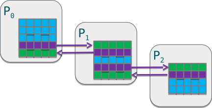

# Outline

- Non-blocking communication in MPI
- Overlapping communication with computation
- Checking for non-blocking messages

# Non-blocking communication in MPI {.section}

# Non-blocking communication

- Non-blocking communication operations return immediately and perform sending/receiving in the background
    - Communication needs to be separately finalized
- Enables some computing concurrently with communication
- Avoids many common deadlock situations
- Collective operations are also available as non-blocking versions

# Non-blocking send ("Implicit Send")

MPI_Isend(`buffer`{.input}, `count`{.input}, `datatype`{.input}, `dest`{.input}, `tag`{.input}, `comm`{.input}, `request`{.output})
: Starts a nonblocking send

* Parameters similar to `MPI_Send` but has an additional request parameter
  - Handle to `MPI_Request` object, used to keep track of the send operation
* **Send buffer must not be written to until one has checked that the operation is over**

# Non-blocking receive ("Implicit Receive")

MPI_Irecv(`buffer`{.output}, `count`{.input}, `datatype`{.input}, `source`{.input}, `tag`{.input}, `comm`{.input}, `request`{.output})
: Starts a nonblocking receive

* Parameters similar to `MPI_Recv` but has an additional request parameter and no status parameter
* Receive buffer guaranteed to contain the data only after one has checked that the operation is over

# Non-blocking communication

- Important: Send/receive operations have to be finalized
    - `MPI_Wait`, `MPI_Waitall`, ...
        - Blocking calls to wait for the communication started with `MPI_Isend` or `MPI_Irecv` to finish
    - `MPI_Test`, ...
        - Non-blocking calls testing if the communication has finished
    - Note: successfully finished send does not mean successful receive!
- You can mix non-blocking and blocking routines
    - A message sent by `MPI_Isend` can be received with `MPI_Recv`

# Wait for a non-blocking operation

MPI_Wait(`request`{.input}, `status`{.output})
: Waits for a communication to complete

- Status of the completed communication is similar to that of `MPI_Recv`

- Demo: `send_and_recv_nonblocking.c`

# Wait for many non-blocking operations

MPI_Waitall(`count`{.input}, `array_of_requests`{.input}, `array_of_statuses`{.output})
: Waits for all the given communications to complete

MPI_Waitany(`count`{.input}, `array_of_requests`{.input}, `index`{.output}, `status`{.output})
: Waits for any one of the given communication to complete

MPI_Waitsome(`count`{.input}, `array_of_requests`{.input}, `outcount`{.output}, `array_of_indices`{.output}, `array_of_statuses`{.output})
: Waits for some of the given communications to complete

# Example: Data on a distributed grid

Suppose `compute()` requires knowledge of neighboring data

- Processes must communicate border data to neighbor processes
- Common pattern in simulations with nearest-neighbor interactions

**`MPI_Irecv`(ghost_data)** 
**`MPI_Isend`(border_data)** 
**`compute`(ghost_independent_data)** 
**`MPI_Waitall()`** 
**`compute`(border_data)**

{.center width=100%}

# Overlapping communication with computation {.section}

# Overlapping communication with computation

- Use of non-blocking operations does not guarantee overlapping communication with computation
- In terms of code logic, non-blocking operations return immediately, but some CPU resources will be spent on communication
  - MPI handles this for us behind the scenes whenever possible
- Without dedicated resources for communication, the communication might progress only when needed for MPI calls, e.g., `MPI_Wait`

# Overlapping communication with computation

- There are two general mechanisms inside the MPI library to allow communication to proceed at the same time with computations
  - Progress thread within the library
  - Offloading part of the communication to network interface card (NIC)
- MPI implementations typically have settings and environment variables for configuring communication progression mechanisms
  - See demonstrations codes: <https://github.com/cschpc/mpi-overlap>

# Checking for non-blocking messages {.section}

# Message probing

MPI_Iprobe(`source`{.input}, `tag`{.input}, `comm`{.input}, `flag`{.output}, `status`{.output})
: Non-blocking test for a message without receiving it

- Flag is true if there is a message that matches the pattern and can be received
- A non-blocking version of `MPI_Probe`

- Demo: `send_and_recv_nonblocking_probing.c`

# Non-blocking test for non-blocking operations

MPI_Test(`request`{.input}, `flag`{.output}, `status`{.output})
: Tests for the completion of a specific communication

- A call to `MPI_Test` is non-blocking
  - Allows one to schedule alternative activities while periodically checking for completion
- Flag is true if the operation has completed
- Status of the completed communication is similar to that of `MPI_Recv`

- Demo: `send_and_recv_nonblocking_testing.c`

# Test for many non-blocking operations

MPI_Testall(`count`{.input}, `array_of_requests`{.input}, `flag`{.output}, `array_of_statuses`{.output})
: Tests for the completion of all the given communications

MPI_Testany(`count`{.input}, `array_of_requests`{.input}, `index`{.output}, `flag`{.output}, `status`{.output})
: Tests for the completion of any one of the given communications

MPI_Testsome(`count`{.input}, `array_of_requests`{.input}, `outcount`{.output}, `array_of_indices`{.output}, `array_of_statuses`{.output})
: Tests for the completion of some of the given communications

# Summary {.section}

# Summary

- Non-blocking MPI routines are useful for creating flexible and optimized communication logic
  - Programmer is responsible for not manipulating send/receive buffers until the communication completes
- Non-blocking point-to-point communication core features
  - Open receives with `MPI_Irecv`
  - Start sending with `MPI_Isend`
  - Possibly do something else while the communication takes place
  - Complete the communication with `MPI_Wait` or a variant
