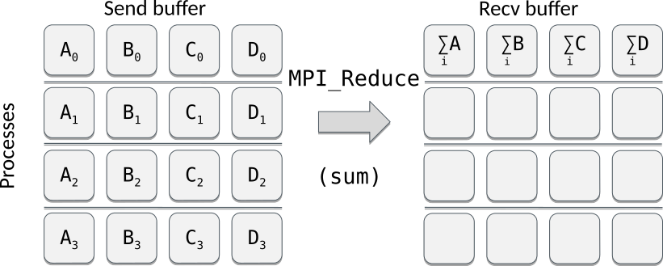

# Introduction

- Collective reduction operations allow performing computations on data distributed over all processes in a
  process group (communicator)


# Reduction operations

- Applies an operation to data scattered over processes and places the result in a single process

{.center width=80%}

# Available reduction operations

<div class=column>
| Operation    | Meaning              |
|--------------|----------------------|
| `MPI_MAX`    | Max value            |
| `MPI_MIN`    | Min value            |
| `MPI_SUM`    | Sum                  |
| `MPI_PROD`   | Product              |
| `MPI_MAXLOC` | Max value + location |
| `MPI_MINLOC` | Min value + location |
</div>
<div class=column>
| Operation  | Meaning      |
|------------|--------------|
| `MPI_LAND` | Logical AND  |
| `MPI_BAND` | Bitwise AND  |
| `MPI_LOR`  | Logical OR   |
| `MPI_BOR`  | Bitwise OR   |
| `MPI_LXOR` | Logical XOR  |
| `MPI_BXOR` | Bitwise XOR  |
</div>


# Reduce operation

MPI_Reduce(`sendbuf`{.input}, `recvbuf`{.output}, `count`{.input}, `datatype`{.input}, `op`{.input}, `root`{.input}, `comm`{.input})
  : Combines values to the root process from all processes of the group

<p>
- Demo: `reduce.c`


# Global reduction

MPI_Allreduce(`sendbuf`{.input}, `recvbuf`{.output}, `count`{.input}, `datatype`{.input}, `op`{.input}, `comm`{.input})
  :  Combines values from all processes and distributes the result back to all processes

<p>
- Similar to `MPI_Reduce` + `MPI_Bcast` but more efficient

<p>
- Demo: `reduce.c`


# Allreduce example: parallel dot product

<div class=column>
```fortranfree
real :: a(1024), aloc(128)
...
if (rank==0) then
    call random_number(a)
end if
call mpi_scatter(a, 128, MPI_INTEGER, &
                 aloc, 128, MPI_INTEGER, &
                 0, MPI_COMM_WORLD, rc)
rloc = dot_product(aloc, aloc)
call mpi_allreduce(rloc, r, 1, MPI_REAL, &
                   MPI_SUM, MPI_COMM_WORLD, &
                   rc)
```
</div>
<div class=column>
```
> srun -n 8 ./mpi_pdot
 id= 6 local= 39.68326  global= 338.8004
 id= 7 local= 39.34439  global= 338.8004
 id= 1 local= 42.86630  global= 338.8004
 id= 3 local= 44.16300  global= 338.8004
 id= 5 local= 39.76367  global= 338.8004
 id= 0 local= 42.85532  global= 338.8004
 id= 2 local= 40.67361  global= 338.8004
 id= 4 local= 49.45086  global= 338.8004
```
</div>


# In-place collective operations

- Using the input buffer as the output buffer<br>
`call mpi_allreduce(a, a, n, mpi_real,...`
    - One should employ `MPI_IN_PLACE` for this purpose
- Replacing the send buffer with the `MPI_IN_PLACE` clause informs MPI that the buffers are the same
<p>
- Demo: `reduce.c`


# Summary

- Collective reductions allow efficient collective computation
- The `MPI_IN_PLACE` clause can be useful when you want to overwrite your send buffer in certain collective operations

