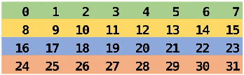
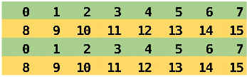

# User-defined communicators {.section}

# Communicators

- The communicator determines the "communication universe" 
    - The source and destination of a message is identified by process rank 
      *within* the communicator
- So far: `MPI_COMM_WORLD`
- Processes can be divided into subcommunicators
    - Task level parallelism with process groups performing separate tasks
    - Collective communication within a group of processes
    - Parallel I/O

# Communicators

<div class="column">
- Communicators are dynamic
- A task can belong simultaneously to several communicators
    - Unique rank in each communicator
</div>
<div class="column">
{.center width=80%}
</div>


# Creating new communicator {.split-definition}

* **`MPI_Comm_split`** creates new communicators based on 'colors' and 'keys'

MPI_Comm_split(`comm`{.input}, `color`{.input}, `key`{.input}, `newcomm`{.output})
  : `comm`{.input}
    : communicator

    `color`{.input}
    : processes with the same "color" belong to the same new communicator

    `key`{.input} 
    : control of rank assignment 

    `newcomm`{.output} 
    : new communicator handle

If color = `MPI_UNDEFINED`, a process does not belong to any of the
new communicators

# Creating new communicator

<div class=column>
```c
if (myid%2 == 0) {
    color = 1;
} else {
    color = 2;
}
MPI_Comm_split(MPI_COMM_WORLD, color,
    myid, &subcomm);

MPI_Comm_rank(subcomm, &mysubid);

printf ("I am rank %d in MPI_COMM_WORLD, but"
    "%d in Comm %d.\n", myid, mysubid, color);
```

</div>

<div class=column>
```
I am rank 2 in MPI_COMM_WORLD, but 1 in Comm 1.
I am rank 7 in MPI_COMM_WORLD, but 3 in Comm 2.
I am rank 0 in MPI_COMM_WORLD, but 0 in Comm 1.
I am rank 4 in MPI_COMM_WORLD, but 2 in Comm 1.
I am rank 6 in MPI_COMM_WORLD, but 3 in Comm 1.
I am rank 3 in MPI_COMM_WORLD, but 1 in Comm 2.
I am rank 5 in MPI_COMM_WORLD, but 2 in Comm 2.
I am rank 1 in MPI_COMM_WORLD, but 0 in Comm 2.
```

{.center width=50%}

</div>

# Using an own communicator

<div class=column>
<p>
```c
if (myid%2 == 0) {
  color = 1;
} else {
  color = 2;
}
MPI_Comm_split(MPI_COMM_WORLD, color, 
               myid, &subcomm);
MPI_Comm_rank(subcomm, &mysubid);
MPI_Bcast(sendbuf, 8, MPI_INT, 0, subcomm);
```
</div>
<div class=column>
Before broadcast:
{width=90%}
After broadcast:
{width=90%}
</div>

# Communicator manipulation

- **MPI_Comm_size**
    - Returns number of processes in communicator's group
- **MPI_Comm_rank**
    - Returns rank of calling process in communicator's group
- **MPI_Comm_compare**
    - Compares two communicators
- **MPI_Comm_dup**
    - Duplicates a communicator
- **MPI_Comm_free**
    - Marks a communicator for deallocation

# Summary 

- Defining new communicators usually required in real-world programs
    - Task parallelism, using libraries, I/O,...
- We introduced one way of creating new communicators via
  `MPI_Comm_split`
    - Tasks assigned with a "color", which can be `MPI_UNDEFINED` if
      the task is excluded in all resulting communicators
    - Other ways (via MPI groups) exist

# Process topologies {.section}

# Process topologies

- MPI topology mechanism adds additional information about the
  communication pattern to a communicator
- MPI topology can provide convenient naming scheme of processes
- MPI topology may assist the library and the runtime system in
  optimizations
    - In most implementations main advantage is, however, better programmability
- Topologies are defined by creating special user defined
  communicators
  
# Virtual topologies

- MPI topologies are virtual, *i.e.* they have necessarily no relation
  to the physical structure of the computer
    - The assignment of processes to physical CPU cores happens
      typically outside MPI (and before MPI is initialized)
	- The physical structure can in principle be taken account when
      creating topologies, however, MPI implementations may not
      implement that in practice
- A communication pattern can be represented by a graph: nodes present
  processes and edges connect processes that communicate with each other
- We discuss here only Cartesian topology which represents a regular
  multidimensional grid.

# Two dimensional Cartesian grid

<div class=column>
{width=90%}
</div>
<div class=column>
- Row major numbering
- Topology places no restrictions on communication
    - any process can communicate with any other process
- Any dimension can be finite or periodic
</div>

# Communicator in Cartesian grid: MPI_Cart_create {.split-definition}

MPI_Cart_create(`oldcomm`{.input}, `ndims`{.input}, `dims`{.input}, `periods`{.input}, `reorder`{.input}, `newcomm`{.output})
  : `oldcomm`{.input}
    : communicator

    `ndims`{.input}
    : number of dimensions

    `dims`{.input}
    : integer array (size ndims) that defines the number of processes in each
      dimension

    `periods`{.input}
    : array that defines the periodicity of each dimension

    `reorder`{.input}
    : is MPI allowed to renumber the ranks

    `newcomm`{.output}
    : new Cartesian communicator

# Determining division: MPI_Dims_create

- Decompose a given number of processes into balanced distribution

MPI_Dims_create(`ntasks`{.input}, `ndims`{.input}, `di`{.input}`ms`{.output})
  : `ntasks`{.input}
    : number of tasks in a grid
  : `ndims`{.input}
    : number of dimensions
  :  `di`{.input}`ms`{.output}
    : integer array (size ndims). A value of 0 means that MPI fills in
      suitable value


# Translating rank to coordinates

- Checking the Cartesian communication topology coordinates for a
  specific rank

`MPI_Cart_coords(comm, rank, maxdim, coords)`
  : `comm`{.input}
    : Cartesian communicator
  : `rank`{.input}
    : rank to convert
  : `maxdim`{.input}
    : length of the coords vector
  : `coords`{.output}
    : coordinates in Cartesian topology that corresponds to rank


# Translating coordinates to rank

- Checking the rank of the process at specific Cartesian communication
  topology coordinates

`MPI_Cart_rank(comm, coords, rank)`
  : `comm`{.input}
    : Cartesian communicator
  : `coords`{.input}
    : array of coordinates
  : `rank`{.output}
    : a rank corresponding to coords


# Creating a Cartesian communication topology

```fortran
dims = 0
period=(/ .true., .false. /)

call mpi_dims_create(ntasks, 2, dims, rc)
call mpi_cart_create(mpi_comm_world, 2, dims, period, .true., comm2d, rc)
call mpi_comm_rank(comm2d, my_id, rc)
call mpi_cart_coords(comm2d, my_id, 2, coords, rc)
```


# How to communicate in a Cartesian topology

`MPI_Cart_shift(comm, direction, displ, source, dest)`
  : `comm`{.input}
    : Cartesian communicator
  : `direction`{.input}
    : shift direction (0 or 1 in 2D)
  : `displ`{.input}
    : shift displacement (1 for next cell etc, < 0 for source from "down"/"right" directions)
  : `source`{.output}
    : rank of source process
  : `dest`{.output}
    : rank of destination process


# How to communicate in a Cartesian topology

- Note! *Both* `source` and `dest` are *output* parameters. The
  coordinates of the calling task is implicit input.
- `source` and `dest` are defined as for a shift like operation:
  receive from source, send to destination
    $$
	 \text{displ = 1}  \Longrightarrow 
	 \begin{cases}
	   \text{source = mycoord - 1} \\
	   \text{dest = mycoord + 1}
     \end{cases}
    $$
- With a non-periodic grid, source or dest can land outside of the grid
    - `MPI_PROC_NULL` is then returned


# Halo exchange

```fortran
call mpi_cart_shift(comm2d, 0, 1, nbr_up, nbr_down, rc)
call mpi_cart_shift(comm2d, 1, 1, nbr_left, nbr_right, rc)
...

! left boundaries: send to left, receive from right
call mpi_sendrecv(buf(1,1), 1, coltype, nbr_left, tag_left, &
                  buf(1,n+1), 1, coltype, nbr_right, tag_left, &
                  comm2d, mpi_status_ignore, rc)

! right boundaries: send to right, receive from left
...
! top boundaries: send to above, receive from below
call mpi_sendrecv(buf(1,1), 1, rowtype, nbr_up, tag_up, &
                  buf(n+1,1), 1, rowtype, nbr_down, tag_up, &
                  comm2d, mpi_status_ignore, rc)

! bottom boundaries: send to below, receive from above
...
```

# Summary

- Process topologies provide a convenient referencing scheme for grid-like
  decompositions
- Usage pattern
    - Define a process grid with `MPI_Cart_create`
    - Use the obtained new communicator as the comm argument in communication
      routines
        - For getting the ranks of the neighboring processes, use
          `MPI_Cart_shift` or wrangle with `MPI_Cart_coords` and
          `MPI_Cart_rank`
- MPI provides also more general graph topologies
