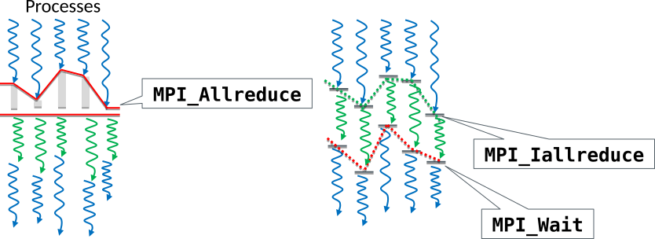

# Outline

- Non-blocking collective routines in MPI

# Non-blocking collectives {.section}

# Non-blocking collectives

- Non-blocking collectives (“``I``-collectives”) enable the overlapping of communication and computation together with the benefits of collective communication.

- Same syntax as for blocking collectives, besides
    - “``I``” at the front of the name (`MPI_Alltoall` -> `MPI_Ialltoall`)
    - Request parameter at the end of the list of arguments
    - Completion needs to be waited

# Example: Non-blocking broadcasting

MPI_Ibcast(`buf`{.input}`fer`{.output}, `count`{.input}, `datatype`{.input}, `root`{.input}, `comm`{.input}, `request`{.output})
: Broadcasts data from the root process to all other processes of the group

- Request parameter at the end of the list of arguments in comparison to `MPI_Bcast`

# Non-blocking collectives

- Restrictions
    - Have to be called in same order by all ranks in a communicator
    - Mixing of blocking and non-blocking collectives is not allowed

# Non-blocking collectives

{.center width=100%}

{width=1%} (Computation) work 1
 
{width=1%} (Computation) work 2, not
involving data in the `MPI_Allreduce` operation

# Non-blocking collectives

- Demo: `nonblocking_collectives.c`

# Summary {.section}

# Summary

- Collective operations can also be done in non-blocking mode
- Enables overlapping computation and communication
