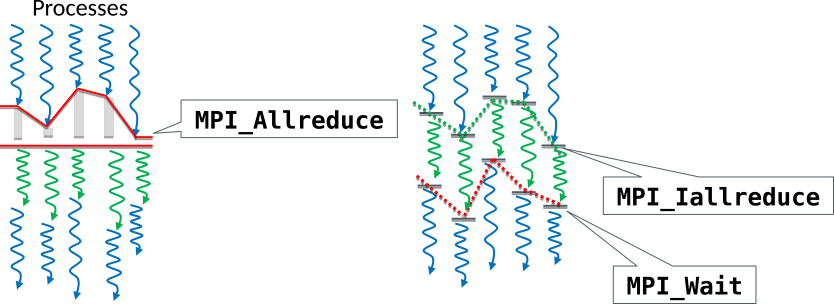

# Non-blocking communication {.section}

# Non-blocking communication

- Non-blocking communication operations return immediately and perform sending/receiving in the background
    - `MPI_Isend` & `MPI_Irecv` initilize the communication
    - Communication needs to be separately finalized (more about this later)
- Enables some computing concurrently with communication
- Avoids many common dead-lock situations
- Collective operations are also available as non-blocking versions

# Non-blocking send

Parameters similar to **`MPI_Send`** but has an additional request parameter.

MPI_Isend(`buffer`{.input}, `count`{.input}, `datatype`{.input}, `dest`{.input}, `tag`{.input}, `comm`{.input}, `request`{.output})
  : `buffer`{.input}
    : send buffer that must not be written to until one has checked
      that the operation is over
  : `request`{.output}
    : a handle that is used when checking if the operation has
      finished (`type(mpi_request)` in Fortran, `MPI_Request` in C)

# Non-blocking receive

Parameters similar to **`MPI_Recv`** but has no status parameter.

MPI_Irecv(`buffer`{.output}, `count`{.input}, `datatype`{.input}, `source`{.input}, `tag`{.input}, `comm`{.input}, `request`{.output})
  : `buffer`{.output}
    : receive buffer guaranteed to contain the data only after one has
      checked that the operation is over
  : `request`{.output}
    : a handle that is used when checking if the operation has
      finished

# Non-blocking communication

- Important: Send/receive operations have to be finalized
    - `MPI_Wait`, `MPI_Waitall`, ...
        - Waits for the communication started with `MPI_Isend` or
          `MPI_Irecv` to finish (blocking)
    - `MPI_Test`, ...
        - Tests if the communication has finished (non-blocking)
    - Remember: successfully finished send does not mean successful receive!
- You can mix non-blocking and blocking routines
    - e.g., receive a message sent by `MPI_Isend` with `MPI_Recv`

# Wait for non-blocking operation

MPI_Wait(`request`{.input}, `status`{.output})
  : `request`{.input}
    : handle of the non-blocking communication
  : `status`{.output}
    : status of the completed communication, see `MPI_Recv`

A call to `MPI_Wait` returns when the operation identified by request is complete

# Wait for non-blocking operations

MPI_Waitall(`count`{.input}, `requests`{.input}, `status`{.output})
  : `count`{.input}
    : number of requests
  : `requests`{.input}
    : array of requests
  : `status`{.output}
    : array of statuses for the operations that are waited for

A call to `MPI_Waitall` returns when all operations identified by the array of requests are complete.

# Non-blocking test for non-blocking operations

MPI_Test(`request`{.input}, `flag`{.output}, `status`{.output})
  : `request`{.input}
    : request
  : `flag`{.output}
    : True if the operation has completed
  : `status`{.output}
    : status for the completed operation

A call to `MPI_Test` is non-blocking. It allows one to schedule alternative activities while periodically checking for completion.

`MPI_Probe` is a similar kind of operation (see later slides).

# Typical usage pattern

**`MPI_Irecv`(ghost_data)**
**`MPI_Isend`(border_data)**
**`compute`(ghost_independent_data)**
**`MPI_Waitall`**
**`compute`(border_data)**

{.center width=100%}

# Additional completion operations

| Routine      | Meaning                                            |
|--------------|----------------------------------------------------|
| MPI_Waitany  | Waits until any one operation has completed        |
| MPI_Waitsome | Waits until at least one operation has completed   |
| MPI_Test     | Tests if an operation has completed (non-blocking) |
| MPI_Testall  | Tests whether a list of operations have completed  |
| MPI_Testany  | Like Waitany but non-blocking                      |
| MPI_Testsome | Like Waitsome but non-blocking                     |
| MPI_Probe    | Check for incoming messages without receiving them |

# Wait for non-blocking operations {.split-definition}

**`MPI_Waitany`(`count`{.input}, `requests`{.input}, `index`{.output}, `status`{.output})**
  : `count`{.input}
    : number of requests

    `requests`{.input}
    : array of requests

    `index`{.output}
    : index of request that completed

    `status`{.output}
    : status for the completed operations

A call to `MPI_Waitany` returns when one operation identified by the array of requests is complete.

# Wait for non-blocking operations {.split-definition}

MPI_Waitsome(`count`{.input}, `requests`{.input}, `done`{.output}, `index`{.output}, `status`{.output})
  : `count`{.input}
    : number of requests

    `requests`{.input}
    : array of requests

    `done`{.output}
    : number of completed requests

    `index`{.output}
    : array of indexes of completed requests

    `status`{.output}
    : array of statuses of completed requests

    `-`{.ghost}
    : `-`{.ghost}

Returns when one or more operations is/are complete.

# Message Probing {.split-definition}

MPI_Iprobe(`source`{.input}, `tag`{.input}, `comm`{.input}, `flag`{.output}, `status`{.output})
  : `source`{.input}
    : rank of sender (or `MPI_ANY_SOURCE`)

    `tag`{.input}
    : message of the tag (or `MPI_ANY_TAG`)

    `comm`{.input}
    : communicator

    `flag`{.output}
    : true if there is a message that matches the pattern and can be
      received

    `status`{.output}
    : status object

    `-`{.ghost}
    : `-`{.ghost}

Allows incoming messages to be checked, without actually receiving them.

`MPI_Probe` is a blocking version of the same operation.

# Background messaging -- what does it require

- Progressing communication requires some CPU resources

- Typically two communication protocols, depending on message size
    - **`eager`{.output}** sends the message without synchronization to the receiver
    - **`rendezvous`{.output}** delays the message until receive operation (can be pipelined)

- Three ways to handle message progression: manual, NIC or threads
    - **`manual`{.output}** progression (with `MPI_Test`) is not really an option
    - offloading communication to **`network interface card`{.output}** (NIC) and using (remote) direct memory access (DMA)
    - MPI implementation can use **`progress thread(s)`{.output}**, but it may slow down computations (new CPUs are capable of Simultaneous Multi-Threading)
    - SMT is viable for inter-node communication, but not for shared memory

# Non-blocking collectives

- Non-blocking collectives (“``I``-collectives”) enable the overlapping of communication and computation together with the benefits of collective communication.

- Same syntax as for blocking collectives, besides
    - “``I``” at the front of the name (`MPI_Alltoall` -> `MPI_Ialltoall`)
    - Request parameter at the end of the list of arguments
    - Completion needs to be waited

# Non-blocking collectives

- Restrictions
    - Have to be called in same order by all ranks in a communicator
    - Mixing of blocking and non-blocking collectives is not allowed

# Non-blocking collectives

{.center width=100%}

{width=1%} (Computation) work 1
{width=1%} (Computation) work 2, not
involving data in the ``Allreduce`` operation

# Example: Non-blocking broadcasting {.split-definition}

MPI_Ibcast(`buf`{.input}`fer`{.output}, `count`{.input}, `datatype`{.input}, `root`{.input}, `comm`{.input}, `request`{.output})
  : `buf`{.input}`fer`{.output}
    : data to be distributed

    `count`{.input}
    : number of entries in buffer

    `datatype`{.input}
    : data type of buffer

    `root`{.input}
    : rank of broadcast root

    `comm`{.input}
    : communicator

    `request`{.output}
    : a handle that is used when checking if the operation has finished

# Summary

- Non-blocking communication is often useful way to do point-to-point
  communication in MPI.
- Non-blocking communication core features
    - Open receives with `MPI_Irecv`
    - Start sending with `MPI_Isend`
    - Possibly do something else while the communication takes place
    - Complete the communication with `MPI_Wait` or a variant
- Collective operations can also be done in non-blocking mode
