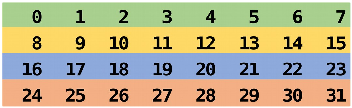
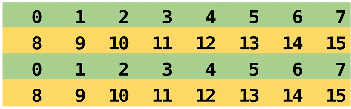

# Communicators

- The communicator determines the "communication universe"
    - The source and destination of a message are identified by the process ranks
      *within* the communicator
- So far: `MPI_COMM_WORLD` (all processes)
- Processes can be divided into subcommunicators
    - Task level parallelism with process groups performing separate tasks
    - Collective communication within a group of processes
    - Parallel I/O

# Communicators

<div class="column">
- Communicators are dynamic
- A task can belong simultaneously to several communicators
    - Unique rank in each communicator
</div>
<div class="column">
{.center width=80%}
</div>


# Creating new communicator {.split-definition}

MPI_Comm_split(`comm`{.input}, `color`{.input}, `key`{.input}, `newcomm`{.output})
: Creates new communicators based on colors and keys

<p>
- Processes with the same color belong to the same new communicator
  - If color is `MPI_UNDEFINED`, a process does not belong to any of the new communicators
- Key controls rank assignment

# Creating new communicator

<div class=column>
```c
if (rank%2 == 0) {
    color = 1;
} else {
    color = 2;
}
MPI_Comm_split(MPI_COMM_WORLD, color,
    rank, &subcomm);

MPI_Comm_rank(subcomm, &subrank);

printf ("I am rank %d in MPI_COMM_WORLD, but"
    "%d in Comm %d.\n", rank, subrank,
    color);
```

</div>

<div class=column>
<small>
```
I am rank 2 in MPI_COMM_WORLD, but 1 in Comm 1.
I am rank 7 in MPI_COMM_WORLD, but 3 in Comm 2.
I am rank 0 in MPI_COMM_WORLD, but 0 in Comm 1.
I am rank 4 in MPI_COMM_WORLD, but 2 in Comm 1.
I am rank 6 in MPI_COMM_WORLD, but 3 in Comm 1.
I am rank 3 in MPI_COMM_WORLD, but 1 in Comm 2.
I am rank 5 in MPI_COMM_WORLD, but 2 in Comm 2.
I am rank 1 in MPI_COMM_WORLD, but 0 in Comm 2.
```
</small>

{.center width=50%}

</div>

# Using an own communicator

<div class=column>
<p>
```c
if (rank%2 == 0) {
  color = 1;
} else {
  color = 2;
}
MPI_Comm_split(MPI_COMM_WORLD, color,
               rank, &subcomm);
MPI_Comm_rank(subcomm, &subrank);
MPI_Bcast(sendbuf, 8, MPI_INT, 0,
          subcomm);
```
</div>
<div class=column>
Before broadcast:
{width=90%}
After broadcast:
{width=90%}
</div>

# Communicator manipulation

- **`MPI_Comm_size`**
    - Returns number of processes in communicator's group
- **`MPI_Comm_rank`**
    - Returns rank of calling process in communicator's group
- **`MPI_Comm_compare`**
    - Compares two communicators
- **`MPI_Comm_dup`**
    - Duplicates a communicator
- **`MPI_Comm_free`**
    - Marks a communicator for deallocation

# Summary

- Defining new communicators usually required in real-world programs
    - Task parallelism, using libraries, I/O,...
- We introduced one way of creating new communicators via
  `MPI_Comm_split`
    - Tasks assigned with a "color", which can be `MPI_UNDEFINED` if
      the task is excluded in all resulting communicators
    - Other ways (via MPI groups) exist
