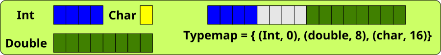
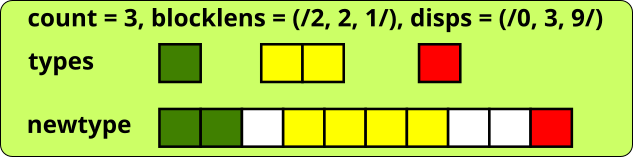
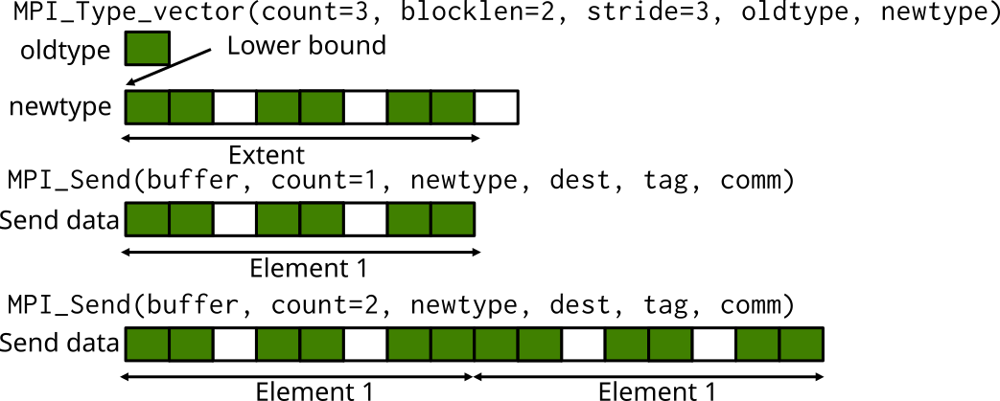
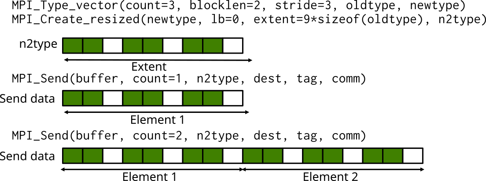

# User defined datatypes (part 2) {.section}


# Datatype constructor examples

<div class="column">

`MPI_Type_contiguous`
  : contiguous datatypes

`MPI_Type_vector`
  : regularly spaced datatype

`MPI_Type_indexed`
  : variably spaced datatype

`MPI_Type_create_subarray`
  : subarray within a multi-dimensional array

</div>

<div class="column">

`MPI_Type_create_hvector`
  : like vector, but uses bytes for spacings

`MPI_Type_create_hindexed`
  : like index, but uses bytes for spacings

`MPI_Type_create_struct`
  : fully general datatype

</div>


# Understanding datatypes: typemap

- A datatype is defined by a typemap
    - pairs of basic types and displacements (in bytes)
    - E.g. `MPI_INT={(int,0)}`




# Datatype constructors: MPI_TYPE_CREATE_STRUCT

- The most general type constructor; it creates a new type from
  heterogeneous blocks
    - e.g. Fortran types and C structures
    - input is used to generate a correct typemap




# Datatype constructors: MPI_TYPE_CREATE_STRUCT {.split-definition}

`MPI_Type_create_struct(count, blocklens, displs, types, newtype)`
  : `count`{.input}
    : number of blocks

    `blocklens`{.input}
    : lengths of blocks (array)

    `displs`{.input}
    : displacements of blocks in bytes (array)

    `types`{.input}
    : types of blocks (array)

    `newtype`{.output}
    : new datatype

    `-`{.ghost}
    : `-`{.ghost}


# Example: sending a C struct

```c
/* Structure for particles */
struct ParticleStruct {
    int charge;         /* particle charge */
    double coord[3];    /* particle coordinates */
    double velocity[3]; /* particle velocity vector */
};
struct ParticleStruct particle[1000];
MPI_Datatype Particletype;
MPI_Datatype type[3]={MPI_INT, MPI_DOUBLE, MPI_DOUBLE};
int blocklen[3]={1,3,3};
MPI_Aint disp[3]={0, sizeof(double), 4 * sizeof(double)};
...

MPI_Type_create_struct(3, blocklen, disp, type, &Particletype);
MPI_Type_commit(&Particletype);

MPI_Send(particle, 1000, Particletype, dest, tag, MPI_COMM_WORLD);

MPI_Type_free(&Particletype);
```

# Determining displacements

- The previous example defines and assumes a certain alignment for the
  data within the structure
- The displacements can (and should!) be determined by using the function

`MPI_Get_address(pointer, address)`
  : `pointer`{.input}
    : pointer to the variable of interest

    `address`{.output}
    : address of the variable, type is

        - `MPI_Aint` (C)
        - `integer(mpi_address_kind)` (Fortran)


# Determining displacements

```c
/* Structure for particles */
struct ParticleStruct {
    int charge;         /* particle charge */
    double coords[3];   /* particle coordinates */
    double velocity[3]; /* particle velocity vector */
};

struct ParticleStruct particle[1000];
...

MPI_Aint disp[3];
MPI_Get_address(&particle[0].charge, &disp[0]);
MPI_Get_address(&particle[0].coords, &disp[1]);
MPI_Get_address(&particle[0].velocity, &disp[2]);

/* Make displacements relative */
disp[2] -= disp[0];
disp[1] -= disp[0];
disp[0] = 0;
```

# Gaps between datatypes

- Sending of an array of the `ParticleStruct` structures may have a
  portability issue: it assumes that array elements are packed in memory
    - Implicit assumption: the **extent** of the datatype was the same as the
      size of the C struct
    - This is not necessarily the case
- If there are gaps in memory between the successive structures, sending
  does not work correctly


# Type extent {.section}


# Sending multiple elements: Extent

- When communicating multiple elements, MPI uses the concept of
  extent
     - next element is read or write *extent* bytes apart from the
       previous one in the buffer
- Extent is determined from the displacements and sizes of the basic
  types in the typemap
    - The lower bound (LB) = min(displacement)
    - Extent = max(displacement + size) - LB + padding
- Communicating multiple user-defined types at once may not behave as
  expected if there are gaps in the beginning or end of the derived type


# Multiple MPI_TYPE_VECTORs




# Getting extent and lower bound

`MPI_Type_get_extent(type, lb, extent)`
  : `type`{.input}
    : Datatype

    `lb`{.output}
    : Lower bound of type (in bytes)

    `extent`{.output}
    : Extent of type (in bytes)


# Setting extent and lower bound

`MPI_Type_create_resized(type, lb, extent, newtype)`
  : `type`{.input}
    : Old datatype

    `lb`{.input}
    : New lower bound (in bytes)

    `extent`{.input}
    : New extent (in bytes)

    `newtype`{.output}
    : New datatype, commit before use

# Multiple MPI_TYPE_VECTORs




# Example: sending an array of structs portably

```c
struct ParticleStruct particle[1000];
MPI_Datatype particletype, oldtype;
MPI_Aint lb, extent;

...

/* Check that the extent is correct */
MPI_Type_get_extent(particletype, &lb, &extent);
if ( extent != sizeof(particle[0] ) {
    oldtype = particletype;
    MPI_Type_create_resized(oldtype, 0, sizeof(particle[0]), &particletype);
    MPI_Type_commit(&particletype);
    MPI_Type_free(&oldtype);
}

...
```


# Other ways of communicating non-uniform data

```c
struct ParticleStruct particle[1000];
int psize;

psize = sizeof(particle[0]);
MPI_Send(particle, 1000*psize, MPI_BYTE, ...);
```

- Non-contiguous data by manual packing
    - Copy data into or out from temporary buffer
- Use MPI_Pack and MPI_Unpack functions
    - Performance will likely be an issue
- Structures and types as continuous stream of bytes: Communicate
  everything using MPI_BYTE
    - Portability can be an issue - be careful

# Summary

- User-defined types enable communication of non-contiguous or
  heterogeneous data with single MPI communication operations
    - Improves code readability & portability
    - Allows optimizations by the MPI runtime
- This time we focused on the most general type specification:
  `MPI_Type_create_struct`
- Introduced the concepts of extent and typemap
