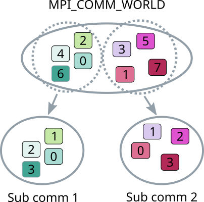
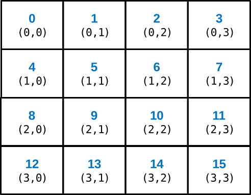
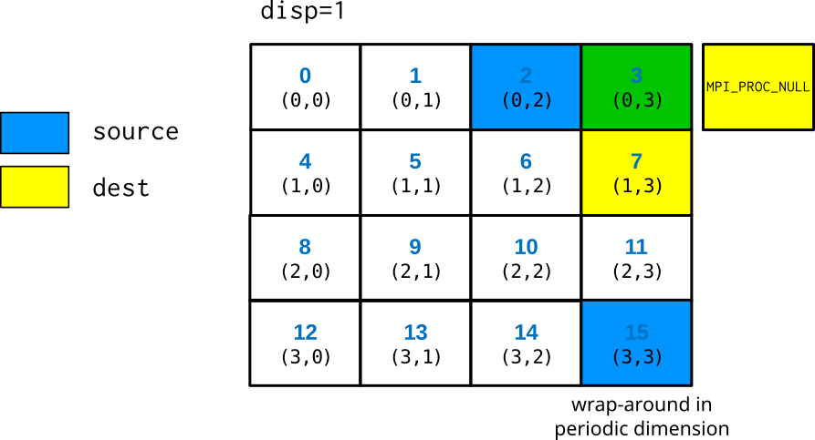
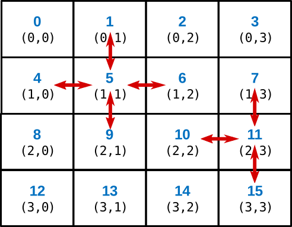

# Process topologies {.section}

# Communicators

<div class="column">
- Communicators are dynamic
- A task can belong simultaneously to several communicators
    - Unique rank in each communicator
</div>
<div class="column">
{.center width=80%}
</div>

# Process topologies

- MPI topology mechanism adds additional information about the
  communication pattern to a communicator
- MPI topology can provide convenient naming scheme of processes
- MPI topology may assist the library and the runtime system in
  optimizations
    - In most implementations main advantage is, however, better programmability
- Topologies are defined by creating special user defined
  communicators

# Virtual topologies

- MPI topologies are virtual, *i.e.* they do not have have necessarily relation
  to the physical structure of the supercomputer
- The assignment of processes to physical CPU cores happens
  typically outside MPI (and before MPI is initialized)
- The physical structure can in principle be taken account when
  creating topologies, however, MPI implementations may not
  implement that in practice

# Virtual topologies

- A communication pattern can be represented by a graph: nodes present
  processes and edges connect processes that communicate with each other
- We discuss here only Cartesian topology which represents a regular
  multidimensional grid.

# Two dimensional Cartesian grid

<div class=column>
{width=90%}
</div>
<div class=column>
- Row major numbering
- Topology places no restrictions on communication
    - any process can communicate with any other process
- Any dimension can be finite or periodic
</div>

# Communicator in Cartesian grid: MPI_Cart_create {.split-definition}

MPI_Cart_create(`oldcomm`{.input}, `ndims`{.input}, `dims`{.input}, `periods`{.input}, `reorder`{.input}, `newcomm`{.output})
  : `oldcomm`{.input}
    : communicator

    `ndims`{.input}
    : number of dimensions

    `dims`{.input}
    : integer array (size ndims) that defines the number of processes in each
      dimension

    `periods`{.input}
    : array that defines the periodicity of each dimension

    `reorder`{.input}
    : is MPI allowed to renumber the ranks

    `newcomm`{.output}
    : new Cartesian communicator

# Determining division: MPI_Dims_create

- Decompose a given number of processes into balanced distribution

MPI_Dims_create(`ntasks`{.input}, `ndims`{.input}, `di`{.input}`ms`{.output})
  : `ntasks`{.input}
    : number of tasks in a grid
  : `ndims`{.input}
    : number of dimensions
  :  `di`{.input}`ms`{.output}
    : integer array (size ndims). A value of 0 means that MPI fills in
      suitable value


# Translating rank to coordinates

- Checking the Cartesian communication topology coordinates for a
  specific rank

`MPI_Cart_coords(comm, rank, maxdim, coords)`
  : `comm`{.input}
    : Cartesian communicator
  : `rank`{.input}
    : rank to convert
  : `maxdim`{.input}
    : length of the coords vector
  : `coords`{.output}
    : coordinates in Cartesian topology that corresponds to rank


# Translating coordinates to rank

- Checking the rank of the process at specific Cartesian communication
  topology coordinates

`MPI_Cart_rank(comm, coords, rank)`
  : `comm`{.input}
    : Cartesian communicator
  : `coords`{.input}
    : array of coordinates
  : `rank`{.output}
    : a rank corresponding to coords


# Creating a Cartesian communication topology

```fortranfree
dims = 0
period=(/ .true., .false. /)

call mpi_dims_create(ntasks, 2, dims, rc)
call mpi_cart_create(mpi_comm_world, 2, dims, period, .true., comm2d, rc)
call mpi_comm_rank(comm2d, rank, rc)
call mpi_cart_coords(comm2d, rank, 2, coords, rc)
```


# How to communicate in a Cartesian topology

`MPI_Cart_shift(comm, direction, displ, source, dest)`
  : `comm`{.input}
    : Cartesian communicator
  : `direction`{.input}
    : shift direction (0 or 1 in 2D)
  : `displ`{.input}
    : shift displacement (1 for next cell etc, < 0 for source from "down"/"right" directions)
  : `source`{.output}
    : rank of source process
  : `dest`{.output}
    : rank of destination process

# How to communicate in a Cartesian topology

- Note! *Both* `source` and `dest` are *output* parameters. The
  coordinates of the calling task is implicit input.
- `source` and `dest` are defined as for a shift like operation:
  receive from source, send to destination
    $$
     \text{displ = 1}  \Longrightarrow
     \begin{cases}
       \text{source = mycoord - 1} \\
       \text{dest = mycoord + 1}
     \end{cases}
    $$
- With a non-periodic grid, source or dest can land outside of the grid
    - `MPI_PROC_NULL` is then returned

# How to communicate in a Cartesian topology

{.center width=60%}


# Halo exchange

<small>
```fortranfree
call mpi_cart_shift(comm2d, 0, 1, nbr_up, nbr_down, rc)
call mpi_cart_shift(comm2d, 1, 1, nbr_left, nbr_right, rc)
...

! left boundaries: send to left, receive from right
call mpi_sendrecv(buf(1,1), 1, coltype, nbr_left, tag_left, &
                  buf(1,n+1), 1, coltype, nbr_right, tag_left, &
                  comm2d, mpi_status_ignore, rc)

! right boundaries: send to right, receive from left
...
! top boundaries: send to above, receive from below
call mpi_sendrecv(buf(1,1), 1, rowtype, nbr_up, tag_up, &
                  buf(n+1,1), 1, rowtype, nbr_down, tag_up, &
                  comm2d, mpi_status_ignore, rc)

! bottom boundaries: send to below, receive from above
...
```
</small>

# Summary

- Process topologies provide a convenient referencing scheme for grid-like
  decompositions
- Usage pattern
    - Define a process grid with `MPI_Cart_create`
    - Use the obtained new communicator as the `comm` argument in communication
      routines
    - For getting the ranks of the neighboring processes, use `MPI_Cart_shift`
      or wrangle with `MPI_Cart_coords` and `MPI_Cart_rank`
- MPI provides also more general graph topologies


# Neighborhood collectives {.section}

# Neighborhood collectives

- Neighborhood collectives build on top of process topologies
- Provide optimization possibilities for MPI library for communication
  patterns involving neighbours
    - Nearest neighbors in cartesian topology
        - Processes connected by a edge in a general graph
- Similar to ordinary collectives, all tasks within a communicator
  need to call the routine
- Possible to have multidimensional halo-exchange with a single MPI call

# Neighborhood collectives in cartesian grid

<div class=column>
- Only nearest neighbors, *i.e.* those corresponding to
  `MPI_Cart_shift` with displacement=1.
- Boundaries in finite dimensions treated as like with `MPI_PROC_NULL`
</div>

<div class=column>
{width=90%}
</div>

# Neighborhood collectives

- Two main neighborhood operations
    - `MPI_Neighbor_allgather` : send same data to all neighbors, receive different
      data from neighbors
        - `MPI_Neighbor_alltoall` : send and receive different data
      between all the neighbors
- Also variants where different number or type of elements is
  communicated
- Non-blocking versions with similar semantics than non-blocking
  collectives
    - Request parameter at the end of the list of arguments

# Summary

- Neighborhood collectives enable communication between neighbours in process topology
  with a single MPI call
- Neighborhood communication provides optimization opportunities for MPI library
