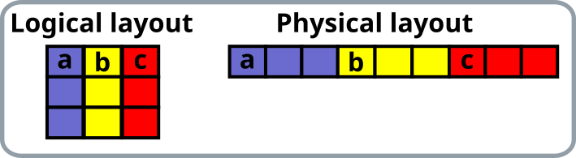

# Outline

- Process topologies
  - Cartesian communicator
  - Neighborhood collectives
- User-defined datatypes
- Additional communication modes
  - Persistent communication
  - One-sided communication

# Process topologies {.section}

# Process topologies

- MPI topology mechanism adds additional information about the communication pattern to a communicator
- MPI topologies are virtual, *i.e.* they do not have necessarily relation to the physical structure of the supercomputer
- MPI topology may assist the library and the runtime system in optimizations
  - In most implementations main advantage is, however, better programmability
- Topologies are defined by creating special user defined communicators

# Example: Cartesian communicator

- Cartesian topology represents a regular multidimensional grid
- TODO: add information relevant for heat equation

# User-defined datatypes {.section}

# User-defined datatypes

- User-defined datatypes enable communication of non-contiguous or heterogeneous data with single MPI communication operations
  - Improves code readability and portability
  - Allows optimizations by MPI at runtime
- MPI provides constructors for several specific types

# Example: Sending rows of matrix in Fortran

```fortranfree
integer, parameter :: n=2, m=3
real, dimension(n,m) :: a
type(mpi_datatype) :: rowtype
! create a derived type
call mpi_type_vector(m, 1, n, mpi_real, rowtype, ierr)
call mpi_type_commit(rowtype, ierr)
! send a row
call mpi_send(a, 1, rowtype, dest, tag, comm, ierr)
! free the type after it is not needed
call mpi_type_free(rowtype, ierr)
```

<p>
{.center width=50%}


# Additional communication modes {.section}

# Persistent communication

- Often a communication with same argument list is repeatedly executed
- Persistent communication enables opening a "communication port" for the repeated communication pattern
- This can provide optimization opportunities for MPI library

# One-sided communication

- In one-sided communication only a single process calls data movement functions - remote memory access (RMA)
  - Compare to "regular" communication where sends and receives of different processes need to match
- Always non-blocking
- Certain algorithms can be easier to implement with one-sided communication
- Can potentiall reduce synchronization overheads and provide better performance especially on recent hardware

# Summary {.section}

# Summary

- MPI is large standard and it has hundreds of procedures for different purposes
- See the extra material
