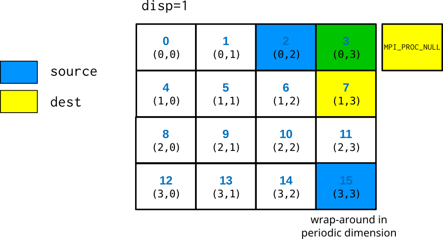
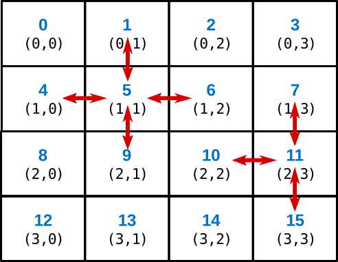
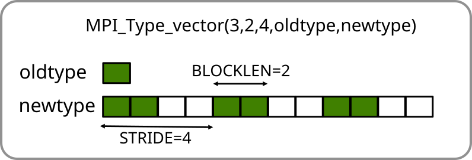
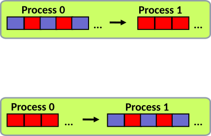
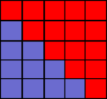

# Persistent communication {.section}

# Persistent communication

- Often a communication with same argument list is repeatedly executed
- It may be possible to optimize such pattern by persistent communication requests
    - Can be thought as a ”communication port”
- Three separate phases:
    1. Initiation of communication
    2. Starting of communication
    3. Completing communication
- Recently published MPI 4.0 includes also persistent collectives
    - Not supported by all implementations yet

# Persistent communication

- Initiate communication by creating requests
    - `MPI_Send_init` and `MPI_Recv_init`
    - Same arguments as in `MPI_Isend` and `MPI_Irecv`
- Start communication
    - `MPI_Start` / `MPI_Startall`
    - Request or array of requests as argument
- Complete communication
    - `MPI_Wait` / `MPI_Waitall`
    - Same as in standard non-blocking communication

# Persistent point-to-point communication

```c
MPI_Request recv_req, send_req;
...
// Initialize send/request objects
MPI_Recv_init(buf1, cnt, MPI_DOUBLE, src, tag, MPI_COMM_WORLD, &recv_req);
MPI_Send_init(buf2, cnt, MPI_DOUBLE, dst, tag, MPI_COMM_WORLD, &send_req);
for (int i=1; i<BIGNUM; i++){
// Start communication described by recv_obj and send_obj
    MPI_Start(&recv_req);
    MPI_Start(&send_req);
    // Do work, e.g. update the interior domains
    ...
    // Wait for send and receive to complete
    MPI_Wait(&send_req, MPI_STATUS_IGNORE);
    MPI_Wait(&recv_req, MPI_STATUS_IGNORE);
}
//Clean up the requests
MPI_Request_free (&recv_req); MPI_Request_free (&send_req);
```

# Summary

- In persistent communication the communication pattern remains constant
- All the parameters for the communication are set up in the initialization phase
    - Communication is started and finalized in separate steps
- Persistent communication provides optimization opportunities for MPI library

# One-sided communication {.section}


# One-sided communication

- Two components of message-passing: sending and receiving
    - Sends and receives need to match
- One-sided communication:
    - Only single process calls data movement functions - remote memory
      access (RMA)
    - Communication patterns specified by only a single process
    - Always non-blocking


# Why one-sided communication?

- Certain algorithms featuring irregular and/or dynamic communication
  patterns easier to implement
    - A priori information of sends and receives is not needed
- Potentially reduced overhead and improved scalability
- Hardware support for remote memory access has been restored in most
  current-generation architectures


# Origin and target

- Key terms of one-sided communication:

    Origin
      : a process which calls data movement function

    Target
      : a process whose memory is accessed


# Remote memory access window

- Window is a region in process's memory which is made available
  for remote operations
- Windows are created by collective calls
- Windows may be different in different processes

{.center}


# Data movement operations

- PUT data to the memory in target process
    - From local buffer in origin to the window in target
- GET data from the memory of target process
    - From the window in target to the local buffer in origin
- ACCUMULATE data in target process
    - Use local buffer in origin and update the data (e.g. add the data
      from origin) in the window of the target
    - One-sided reduction


# Synchronization

- Communication takes place within *epoch*s
    - Synchronization calls start and end an *epoch*
    - There can be multiple data movement calls within epoch
    - An epoch is specific to particular window
- Active synchronization:
    - Both origin and target perform synchronization calls
- Passive synchronization:
    - No MPI calls at target process


# One-sided communication in a nutshell

<div class="column">
- Define memory window
- Start an epoch
    - Target: exposure epoch
    - Origin: access epoch
- GET, PUT, and/or ACCUMULATE data
- Complete the communications by ending the epoch
</div>

<div class="column">

</div>

# Simple example: Put

```c
int data;
MPI_Win window;
...
data = rank;

MPI_Win_create(&data, sizeof(int), sizeof(int), MPI_INFO_NULL,
               MPI_COMM_WORLD, &window);

...
MPI_Win_fence(0, window);
if (rank == 0)
    /* transfer data to rank 8 */
    MPI_Put(&data, 1, MPI_INT, 8, 0, 1, MPI_INT, window);
MPI_Win_fence(0, window);
...

MPI_Win_free(&window);
```


# Limitations for data access

- Compatibility of local and remote operations when multiple processes
  access a window during an epoch


# Advanced synchronization:

- Assert argument in `MPI_Win_fence`:

    `MPI_MODE_NOSTORE`
    : The local window was not updated by local stores (or local get or
      receive calls) since last synchronization

    `MPI_MODE_NOPUT`
    : The local window will not be updated by put or accumulate calls after
      the fence call, until the ensuing (fence) synchronization

    `MPI_MODE_NOPRECEDE`
    : The fence does not complete any sequence of locally issued RMA calls

    `MPI_MODE_NOSUCCEED`
    : The fence does not start any sequence of locally issued RMA calls


# Advanced synchronization

- More control on epochs can be obtained by starting and ending the
  exposure and access epochs separately
- Target: Exposure epoch
    - Start: `MPI_Win_post`
    - End: `MPI_Win_wait`
- Origin: Access epoch
    - Start: `MPI_Win_start`
    - End: `MPI_Win_complete`


# Enhancements in MPI-3

- New window creation function: `MPI_Win_allocate`
    - Allocate memory and create window at the same time
- Dynamic windows: `MPI_Win_create_dynamic`, `MPI_Win_attach`,
  `MPI_Win_detach`
  - Non-collective exposure of memory


# Enhancements in MPI-3

- New data movement operations: `MPI_Get_accumulate`, `MPI_Fetch_and_op`,
  `MPI_Compare_and_swap`
- New memory model `MPI_Win_allocate_shared`
    - Allocate memory which is shared between MPI tasks
- Enhancements for passive target synchronization


# Performance considerations

- Performance of the one-sided approach is highly implementation-dependent
- Maximize the amount of operations within an epoch
- Provide the assert parameters for `MPI_Win_fence`

# OSU benchmark example


# Summary

- One-sided communication allows communication patterns to be specified
  from a single process
- Can reduce synchronization overheads and provide better performance
  especially on recent hardware
- Basic concepts:
    - Origin and target process
    - Creation of the memory window
    - Communication epoch
    - Data movement operations


# Process topologies {.section}

# Communicators

<div class="column">
- Communicators are dynamic
- A task can belong simultaneously to several communicators
    - Unique rank in each communicator
</div>
<div class="column">
{.center width=80%}
</div>

# Process topologies

- MPI topology mechanism adds additional information about the
  communication pattern to a communicator
- MPI topology can provide convenient naming scheme of processes
- MPI topology may assist the library and the runtime system in
  optimizations
    - In most implementations main advantage is, however, better programmability
- Topologies are defined by creating special user defined
  communicators

# Virtual topologies

- MPI topologies are virtual, *i.e.* they do not have have necessarily relation
  to the physical structure of the supercomputer
- The assignment of processes to physical CPU cores happens
  typically outside MPI (and before MPI is initialized)
- The physical structure can in principle be taken account when
  creating topologies, however, MPI implementations may not
  implement that in practice

# Virtual topologies

- A communication pattern can be represented by a graph: nodes present
  processes and edges connect processes that communicate with each other
- We discuss here only Cartesian topology which represents a regular
  multidimensional grid.

# Two dimensional Cartesian grid

<div class=column>
{width=90%}
</div>
<div class=column>
- Row major numbering
- Topology places no restrictions on communication
    - any process can communicate with any other process
- Any dimension can be finite or periodic
</div>

# Communicator in Cartesian grid: MPI_Cart_create {.split-definition}

MPI_Cart_create(`oldcomm`{.input}, `ndims`{.input}, `dims`{.input}, `periods`{.input}, `reorder`{.input}, `newcomm`{.output})
  : `oldcomm`{.input}
    : communicator

    `ndims`{.input}
    : number of dimensions

    `dims`{.input}
    : integer array (size ndims) that defines the number of processes in each
      dimension

    `periods`{.input}
    : array that defines the periodicity of each dimension

    `reorder`{.input}
    : is MPI allowed to renumber the ranks

    `newcomm`{.output}
    : new Cartesian communicator

# Determining division: MPI_Dims_create

- Decompose a given number of processes into balanced distribution

MPI_Dims_create(`ntasks`{.input}, `ndims`{.input}, `di`{.input}`ms`{.output})
  : `ntasks`{.input}
    : number of tasks in a grid
  : `ndims`{.input}
    : number of dimensions
  :  `di`{.input}`ms`{.output}
    : integer array (size ndims). A value of 0 means that MPI fills in
      suitable value


# Translating rank to coordinates

- Checking the Cartesian communication topology coordinates for a
  specific rank

`MPI_Cart_coords(comm, rank, maxdim, coords)`
  : `comm`{.input}
    : Cartesian communicator
  : `rank`{.input}
    : rank to convert
  : `maxdim`{.input}
    : length of the coords vector
  : `coords`{.output}
    : coordinates in Cartesian topology that corresponds to rank


# Translating coordinates to rank

- Checking the rank of the process at specific Cartesian communication
  topology coordinates

`MPI_Cart_rank(comm, coords, rank)`
  : `comm`{.input}
    : Cartesian communicator
  : `coords`{.input}
    : array of coordinates
  : `rank`{.output}
    : a rank corresponding to coords


# Creating a Cartesian communication topology

```fortranfree
dims = 0
period=(/ .true., .false. /)

call mpi_dims_create(ntasks, 2, dims, rc)
call mpi_cart_create(mpi_comm_world, 2, dims, period, .true., comm2d, rc)
call mpi_comm_rank(comm2d, rank, rc)
call mpi_cart_coords(comm2d, rank, 2, coords, rc)
```


# How to communicate in a Cartesian topology

`MPI_Cart_shift(comm, direction, displ, source, dest)`
  : `comm`{.input}
    : Cartesian communicator
  : `direction`{.input}
    : shift direction (0 or 1 in 2D)
  : `displ`{.input}
    : shift displacement (1 for next cell etc, < 0 for source from "down"/"right" directions)
  : `source`{.output}
    : rank of source process
  : `dest`{.output}
    : rank of destination process

# How to communicate in a Cartesian topology

- Note! *Both* `source` and `dest` are *output* parameters. The
  coordinates of the calling task is implicit input.
- `source` and `dest` are defined as for a shift like operation:
  receive from source, send to destination
    $$
     \text{displ = 1}  \Longrightarrow
     \begin{cases}
       \text{source = mycoord - 1} \\
       \text{dest = mycoord + 1}
     \end{cases}
    $$
- With a non-periodic grid, source or dest can land outside of the grid
    - `MPI_PROC_NULL` is then returned

# How to communicate in a Cartesian topology

{.center width=60%}


# Halo exchange

<small>
```fortranfree
call mpi_cart_shift(comm2d, 0, 1, nbr_up, nbr_down, rc)
call mpi_cart_shift(comm2d, 1, 1, nbr_left, nbr_right, rc)
...

! left boundaries: send to left, receive from right
call mpi_sendrecv(buf(1,1), 1, coltype, nbr_left, tag_left, &
                  buf(1,n+1), 1, coltype, nbr_right, tag_left, &
                  comm2d, mpi_status_ignore, rc)

! right boundaries: send to right, receive from left
...
! top boundaries: send to above, receive from below
call mpi_sendrecv(buf(1,1), 1, rowtype, nbr_up, tag_up, &
                  buf(n+1,1), 1, rowtype, nbr_down, tag_up, &
                  comm2d, mpi_status_ignore, rc)

! bottom boundaries: send to below, receive from above
...
```
</small>

# Summary

- Process topologies provide a convenient referencing scheme for grid-like
  decompositions
- Usage pattern
    - Define a process grid with `MPI_Cart_create`
    - Use the obtained new communicator as the `comm` argument in communication
      routines
    - For getting the ranks of the neighboring processes, use `MPI_Cart_shift`
      or wrangle with `MPI_Cart_coords` and `MPI_Cart_rank`
- MPI provides also more general graph topologies


# Neighborhood collectives {.section}

# Neighborhood collectives

- Neighborhood collectives build on top of process topologies
- Provide optimization possibilities for MPI library for communication
  patterns involving neighbours
    - Nearest neighbors in cartesian topology
        - Processes connected by a edge in a general graph
- Similar to ordinary collectives, all tasks within a communicator
  need to call the routine
- Possible to have multidimensional halo-exchange with a single MPI call

# Neighborhood collectives in cartesian grid

<div class=column>
- Only nearest neighbors, *i.e.* those corresponding to
  `MPI_Cart_shift` with displacement=1.
- Boundaries in finite dimensions treated as like with `MPI_PROC_NULL`
</div>

<div class=column>
{width=90%}
</div>

# Neighborhood collectives

- Two main neighborhood operations
    - `MPI_Neighbor_allgather` : send same data to all neighbors, receive different
      data from neighbors
        - `MPI_Neighbor_alltoall` : send and receive different data
      between all the neighbors
- Also variants where different number or type of elements is
  communicated
- Non-blocking versions with similar semantics than non-blocking
  collectives
    - Request parameter at the end of the list of arguments

# Summary

- Neighborhood collectives enable communication between neighbours in process topology
  with a single MPI call
- Neighborhood communication provides optimization opportunities for MPI library

# User-defined datatypes  {.section}

# MPI datatypes

- MPI datatypes are used for communication purposes
    - Datatype tells MPI where to take the data when sending or where
      to put data when receiving
- Elementary datatypes (`MPI_INT`, `MPI_REAL`, ...)
    - Different types in Fortran and C, correspond to languages basic
      types
    - Enable communication using contiguous memory sequence of
      identical elements (e.g. vector or matrix)

# Sending a matrix row (Fortran)

- Row of a matrix is not contiguous in memory in Fortran

<p>

{.center width=50%}

<p>

- Several options for sending a row:
    - Use several send commands for each element of a row
    - Copy data to temporary buffer and send that with one send
      command
    - Create a matching datatype and send all data with one send
      command

# User-defined datatypes

- Use elementary datatypes as building blocks
- Enable communication of
    - Non-contiguous data with a single MPI call, e.g. rows or columns
      of a matrix
    - Heterogeneous data (structs in C, types in Fortran)
    - Larger messages, count is `int` (32 bits) in C
- Provide higher level of programming
    - Code is more compact and maintainable
- Needed for getting the most out of MPI I/O

# User-defined datatypes

- User-defined datatypes can be used both in point-to-point
  communication and collective communication
- The datatype instructs where to take the data when sending or where
  to put data when receiving
    - Non-contiguous data in sending process can be received as
      contiguous or vice versa

# Using user-defined datatypes

- A new datatype is created from existing ones with a datatype constructor
    - Several routines for different special cases
- A new datatype must be committed before using it in communication
    - **`MPI_Type_commit`(`newtype`{.input})**
- A type should be freed after it is no longer needed
    - **`MPI_Type_free`(`newtype`{.input})**

# Datatype constructors

| Datatype                   | Usage                                     |
|----------------------------|-------------------------------------------|
| `MPI_Type_contiguous`      | contiguous datatypes                      |
| `MPI_Type_vector`          | regularly spaced datatype                 |
| `MPI_Type_indexed`         | variably spaced datatype                  |
| `MPI_Type_create_subarray` | subarray within a multi-dimensional array |
| `MPI_Type_create_hvector`  | like vector, but uses bytes for spacings  |
| `MPI_Type_create_hindexed` | like index, but uses bytes for spacings   |
| `MPI_Type_create_struct`   | fully general datatype                    |


#  User-defined datatypes: regularly spaced data (vector) {.section}

# MPI_TYPE_VECTOR

- Creates a new type from equally spaced identical blocks

<div class=column>
MPI_Type_vector(`count`{.input}, `blocklen`{.input}, `stride`{.input}, `oldtype`{.input}, `newtype`{.output})
  : `count`{.input}
    : number of blocks
  : `blocklen`{.input}
    : number of elements in each block
  : `stride`{.input}
    : displacement between the blocks
</div>
<div class=column>
<p>
{.center width=100%}
</div>

# Example: sending rows of matrix in Fortran

```fortranfree
integer, parameter :: n=2, m=3
real, dimension(n,m) :: a
type(mpi_datatype) :: rowtype
! create a derived type
call mpi_type_vector(m, 1, n, mpi_real, rowtype, ierr)
call mpi_type_commit(rowtype, ierr)
! send a row
call mpi_send(a, 1, rowtype, dest, tag, comm, ierr)
! free the type after it is not needed
call mpi_type_free(rowtype, ierr)
```

<p>
{.center width=50%}


# Sending multiple elements: Extent

- When communicating multiple elements, MPI uses the concept of
  extent
     - next element is read or write *extent* bytes apart from the
       previous one in the buffer
- Extent is determined from the displacements and sizes of the basic
  types
    - The lower bound (LB) = min(displacement)
    - Extent = max(displacement + size) - LB + padding
- Communicating multiple user-defined types at once may not behave as
  expected if there are gaps in the beginning or end of the derived type


# Multiple MPI_TYPE_VECTORs


# Getting extent and lower bound

`MPI_Type_get_extent(type, lb, extent)`
  : `type`{.input}
    : Datatype

    `lb`{.output}
    : Lower bound of type (in bytes)

    `extent`{.output}
    : Extent of type (in bytes)


# Setting extent and lower bound

`MPI_Type_create_resized(type, lb, extent, newtype)`
  : `type`{.input}
    : Old datatype

    `lb`{.input}
    : New lower bound (in bytes)

    `extent`{.input}
    : New extent (in bytes)

    `newtype`{.output}
    : New datatype, commit before use

# Multiple MPI_TYPE_VECTORs


# From non-contiguous to contiguous data

<div class=column>
{.center width=100%}
</div>
<div class=column>
```c
if (rank == 0)
  MPI_Type_vector(n, 1, 2, MPI_FLOAT,
                  &newtype)
  ...
  MPI_Send(A, 1, newtype, 1, ...)
else
  MPI_Recv(B, n, MPI_FLOAT, 0, ...)

```

```c
if (rank == 0)
  MPI_Send(A, n, MPI_FLOAT, 1, ...)
else
  MPI_Type_vector(n, 1, 2, MPI_FLOAT,
                  &newtype)
  ...
  MPI_Recv(B, 1, newtype, 0, ...)

```
</div>


# User-defined datatypes: heterogeneous data (struct) {.section}


# Example: sending an array of structs

```c
struct ParticleStruct {
    int charge;         /* particle charge */
    double coords[3];   /* particle coordinates */
    double velocity[3]; /* particle velocity vector */
};

struct ParticleStruct particle[1000];

/* How to define a new Particletype? */
...

MPI_Send(particle, 1000, Particletype, dest, tag, MPI_COMM_WORLD);
```


# MPI_TYPE_CREATE_STRUCT {.split-definition}

- Creates a new type from heterogeneous blocks
    - e.g. Fortran types and C structures

`MPI_Type_create_struct(count, blocklens, displs, types, newtype)`
  : `count`{.input}
    : number of blocks

    `blocklens`{.input}
    : lengths of blocks (array)

    `displs`{.input}
    : displacements of blocks in bytes (array)

    `types`{.input}
    : types of blocks (array)

    `newtype`{.output}
    : new datatype

    `-`{.ghost}
    : `-`{.ghost}


# Determining displacements

- The displacements of blocks should be determined by using the function

`MPI_Get_address(pointer, address)`
  : `pointer`{.input}
    : pointer to the variable of interest

    `address`{.output}
    : address of the variable, type is

        - `MPI_Aint` (C)
        - `integer(mpi_address_kind)` (Fortran)


# Gaps between structs: Extent

- When sending an array of the structures, the extent needs to be checked as for other user-defined datatypes
    - It's implicit assumed that the **extent** of the datatype would be the same as the
      size of the C struct
    - This is not necessarily the case, and if there are gaps in memory between the successive structures, sending
      does not work correctly with the default extent


# Example: sending an array of structs

```c
struct ParticleStruct {
    int charge;         /* particle charge */
    double coords[3];   /* particle coordinates */
    double velocity[3]; /* particle velocity vector */
};

struct ParticleStruct particle[1000];

/* Define a new type */
MPI_Datatype Particletype;
MPI_Datatype type[3] = {MPI_INT, MPI_DOUBLE, MPI_DOUBLE};
int blocklen[3] = {1, 3, 3};

...
```

# Example: sending an array of structs

```c
...
/* Determine displacements */
MPI_Aint disp[3];
MPI_Get_address(&particle[0].charge, &disp[0]);
MPI_Get_address(&particle[0].coords, &disp[1]);
MPI_Get_address(&particle[0].velocity, &disp[2]);

/* Make displacements relative */
disp[2] -= disp[0];
disp[1] -= disp[0];
disp[0] = 0;

/* Create the new type */
MPI_Type_create_struct(3, blocklen, disp, type, &Particletype);
MPI_Type_commit(&Particletype);

...
```

# Example: sending an array of structs

```c
...
/* Check extent */
MPI_Datatype oldtype;
MPI_Aint lb, extent;
MPI_Type_get_extent(Particletype, &lb, &extent);
if ( extent != sizeof(particle[0]) ) {
    oldtype = Particletype;
    MPI_Type_create_resized(oldtype, 0, sizeof(particle[0]), &Particletype);
    MPI_Type_commit(&Particletype);
    MPI_Type_free(&oldtype);
}

/* Now we are ready to use the new type */
MPI_Send(particle, 1000, Particletype, dest, tag, MPI_COMM_WORLD);

/* Free the type after not needed anymore */
MPI_Type_free(&Particletype);
```


# Other ways of communicating non-uniform data

- Structures and types as continuous stream of bytes: Communicate
  everything using `MPI_BYTE`
    - Portability can be an issue - be careful (*cf.* extent)

```c
struct ParticleStruct particle[1000];

MPI_Send(particle, 1000*sizeof(particle[0]), MPI_BYTE, ...);
```


# Other ways of communicating non-uniform data

- Non-contiguous data by manual packing
    - Copy data into or out from temporary buffer
- Use `MPI_Pack` and `MPI_Unpack` functions
    - Performance will likely be an issue


# User-defined datatypes: general remarks {.section}

# Performance

- Main motivation for using datatypes is not necessarily performance – manual
  packing can be faster
- Performance depends on the datatype – more general datatypes are
  often slower
- Overhead is potentially reduced by:
    - Sending one long message instead of many small messages
    - Avoiding the need to pack data in temporary buffers
- Performance should be tested on target platforms
  - Performance is currently poor with GPU-aware MPI


# Summary

- User-defined types enable communication of non-contiguous or
  heterogeneous data with single MPI communication operations
    - Improves code readability & portability
    - Allows optimizations by the MPI runtime
- Life cycle of derived type: create, commit, free
- Ensuring the correct extent of the derived data type is important
- MPI provides constructors for several specific types


#  User-defined datatypes: other datatype constructors {.section}

# MPI_TYPE_CONTIGUOUS

MPI_Type_contiguous(`count`{.input}, `oldtype`{.input}, `newtype`{.output})
  : `count`{.input}
    : number of oldtypes
  : `oldtype`{.input}
    : old type
  : `newtype`{.output}
    : new datatype

- Usage mainly for programming convenience
    - derived types in all communication calls

<small>
<div class=column>
```fortranfree
! Using derived type
call mpi_send(buf, 1, conttype, ...)
```
</div>
<div class=column>
```fortranfree
! Equivalent call with count and basic type
call mpi_send(buf, count, MPI_REAL, ...)
```
</div>
</small>


# MPI_TYPE_INDEXED {.split-def-3}

- Creates a new type from blocks comprising identical elements
    - The size and displacements of the blocks may vary

MPI_Type_indexed(`count`{.input}, `blocklens`{.input}, `displs`{.input}, `oldtype`{.input}, `newtype`{.output})
  :    `count`{.input}
    : number of blocks

    `blocklens`{.input}
    : lengths of the blocks (array)

    `displs`{.input}
    : displacements (array) in extent of oldtypes

    `oldtype`{.input}
    : original type

    `newtype`{.output}
    : new type

    `-`{.ghost}
    : `-`{.ghost}

<p>
{.center width=100%}

# Example: an upper triangular matrix

<div class="column">
```c
/* Upper triangular matrix */
double a[100][100];
int disp[100], blocklen[100], int i;
MPI_Datatype upper;
/* compute start and size of rows */
for (i=0; i<100; i++) {
    disp[i] = 100*i+i;
    blocklen[i] = 100-­i;
}
/* create a datatype for upper tr matrix */
MPI_Type_indexed(100,blocklen,disp,
    MPI_DOUBLE,&upper);
MPI_Type_commit(&upper);
/* ... send it ... */
MPI_Send(a,1,upper,dest, tag, MPI_COMM_WORLD);
MPI_Type_free(&upper);
```
</div>

<div class="column">
{.center width=65%}
</div>

# Subarray

<div class=column>
- Subarray datatype describes a N-dimensional subarray within a
N-dimensional array
- Array can have either C (row major) or Fortran (column major)
ordering in memory
</div>

<div class="column">
{.center width=60%}
</div>


# MPI_TYPE_CREATE_SUBARRAY {.split-def-3}

<!--- Creates a type describing an N-dimensional subarray within an N-dimensional array
-->
MPI_Type_create_subarray(`ndims`{.input}, `sizes`{.input}, `subsizes`{.input}, `offsets`{.input}, `order`{.input}, `oldtype`{.input}, `newtype`{.output})
  : `ndims`{.input}
    : number of array dimensions

    `sizes`{.input}
    : number of array elements in each dimension (array)

    `subsizes`{.input}
    : number of subarray elements in each dimension (array)

    `offsets`{.input}
    : starting point of subarray in each dimension (array)

    `order`{.input}
    : storage order of the array. Either `MPI_ORDER_C` or
      `MPI_ORDER_FORTRAN`

    `oldtype`{.input}
    : oldtype

    `newtype`{.output}
    : resulting type

    `-`{.ghost}
    : `-`{.ghost}

# Example: subarray

<div class=column>
<small>
```c
int a_size[2]    = {5,5};
int sub_size[2]  = {2,3};
int sub_start[2] = {1,2};
MPI_Datatype sub_type;
double array[5][5];

for(i = 0; i < a_size[0]; i++)
  for(j = 0; j < a_size[1]; j++)
    array[i][j] = rank;

MPI_Type_create_subarray(2, a_size, sub_size,
       sub_start, MPI_ORDER_C, MPI_DOUBLE, &sub_type);

MPI_Type_commit(&sub_type);

if (rank==0)
  MPI_Recv(array[0], 1, sub_type, 1, 123,
    MPI_COMM_WORLD, MPI_STATUS_IGNORE);
if (rank==1)
  MPI_Send(array[0], 1, sub_type, 0, 123,
  MPI_COMM_WORLD);

MPI_Type_free(&sub_type);

```
</small>
</div>
<div class=column>
{.center width=100%}
</div>
