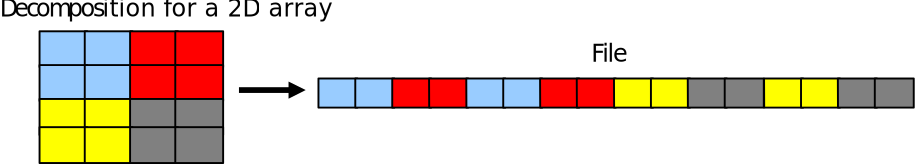

# Collective operations

* I/O can be performed _collectively_ by all processes in a communicator
	- `MPI_File_read_all`    
	- `MPI_File_write_all`
	- `MPI_File_read_at_all`    
	- `MPI_File_write_at_all`
* Same parameters as in independent I/O functions (`MPI_File_read` etc)


# Collective operations

* All processes in communicator that opened file must call function
	- Collective operation
* If all processes write or read, you should always use the collective reads and writes. 
	- Performance much better than for individual functions
	- Even if each processor reads a non-contiguous segment, in total the read may be contiguous 
	- Lots of optimizations implemented in the MPI libraries

# Non-blocking MPI-IO

* Non-blocking independent I/O is similar to non-blocking send/recv routines
- `MPI_File_iread`(`_at`)(`_all`) / `MPI_File_iwrite`(`_at`)(`_all`)
* Wait for completion using MPI_Test, MPI_Wait, etc.
* Can be used to overlap I/O with computation:

{.center width=70%}


# Non-contiguous data access with MPI-IO{.section }

# File view

* By default, file is treated as consisting of bytes, and process can access (read or write) any byte in the file
* The file view defines which portion of a file is visible to a process
* A file view consists of three components
- displacement: number of bytes to skip from the beginning of file
- etype: type of data accessed, defines unit for offsets
- filetype: portion of file visible to a process

# File view 

**`MPI_File_set_view`(`fhandle`{.input}, `disp`{.input}, `etype`{.input}, `filetype`{.input}, `datarep`{.input}, `info`{.input})**   

`disp`{.input}		Offset from beginning of file. Always in bytes  
`etype`{.input}		Basic MPI type or user defined type. Basic unit of data access   
`filetype`{.input} 	Same type as etype or user defined type constructed of etype  
`datarep`{.input} 	Data representation (can be adjusted for portability)  “native”: store in same format as in memory  
`info`{.input} 		Hints for implementation that can improve performance `MPI_INFO_NULL`: No hints  

<small>
_The values for datarep 
and the extents of etype 
must be identical on all 
processes in the group; 
values for disp, filetype, 
and info may vary. 
The datatypes passed in 
must be committed._
</small>

# File view for non-contiguous data

{.center width=80%}  

* Each process has to access small pieces of data scattered throughout a file
* Very expensive if implemented with separate reads/writes
* Use file type to implement the non-contiguous access

# File view for non-contiguous data
{.center width=80%}

```fortran
 ...
 integer, dimension(2,2) :: array
 ...
 call mpi_type_create_subarray(2, sizes, subsizes, starts, mpi_integer,& 
	 mpi_order_c, filetype, err)
 call mpi_type_commit(filetype)
	 disp = 0 
 call mpi_file_set_view(file, disp, mpi_integer, filetype, ‘native’,  mpi_info_null, err) 
 call mpi_file_write_all(file, buffer, count, mpi_integer, status, err)
```

# Common mistakes with MPI I/O

* Not defining file offsets as `MPI_Offset` in C and integer (`kind=MPI_OFFSET_KIND`) in Fortran
* In Fortran, passing the offset or displacement directly as a constant (e.g., “0”)
	- It has to be stored and passed as a variable of type integer(`MPI_OFFSET_KIND`)

# Performance do’s and don’ts

* Use collective I/O routines
* Remember to use the correct striping for each file size
	- Striping can also be set in the MPI_Info parameter using `MPI_Info_set` function:
	- `MPI_Info_set(info, ”striping_factor”, ”20”)`
	- Optimal value system dependent, may be beneficial to benchmark
* Minimize metadata operations

# Summary

* MPI-IO: MPI library automatically handles all communication needed for parallel I/O access
* File views enable non-contiguous access patterns
* Collective I/O can enable the actual disk access to remain contiguous

