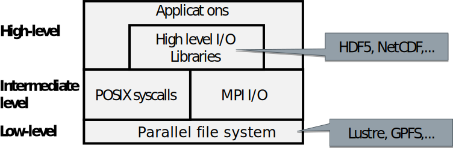

# Parallel I/O
* How to convert internal data structures and domains to files that are essentially streams of bytes?
* How to get the data efficiently from thousands of nodes of a supercomputer to physical disks?
* Good I/O is non-trivial
	- Performance, scalability, reliability
	- Ease of use of output (number of files, format)
	- Portability
* One cannot achieve all of the above - one needs to prioritize

# Parallel I/O

* Challenges
	- Number of tasks is rising rapidly
	- Size of the data is also rapidly increasing
	- Disparity of computing power vs. I/O performance is getting worse and worse
* The need for I/O tuning is algorithm & problem specific
* Without parallelization, I/O will become scalability bottleneck for practically every application!

# I/O layers

{.center width=90%}

# I/O library choice

* First, POSIX and MPI I/O libraries will be discussed
	- Provides methods for writing raw data into files
	- Do not provide a schema or methods for writing metadata
	- The user has to develop a file format specification, or implement a given format
* Additionally there are also higher level libraries that
	- Give tools for writing data + metadata, e.g., HDF5
	- Provide an application or domain-specific schema for what data + metadata to describe some particular kind of information

# Parallel I/O with posix{.section}

# Parallel POSIX I/O 

<div class=column>
* Spokesman strategy
	- One process takes care of all I/O using normal (POSIX) routines
	- Requires a lot of communication
	- Writing/reading slow, single writer not able to fully utilize filesystem
	- Does not scale, single writer is a bottleneck
	- Can be good option when the amount of data is small (e.g. input files)
</div>

<div class=column>
{.center width=70%}
</div>

# Example: spokesperson strategy

```fortran
if (my_id == 0) then
  do i = 1, ntasks-1
    call mpi_recv(full_data(i*n), n, &
        MPI_REAL, i, tag, &
        MPI_COMM_WORLD, status, rc)
  end do
  open(funit, file=fname, access=”stream”)
  write(funit) full_data
  close(funit)
else 
  call mpi_send(data, n, &
      MPI_REAL, 0, tag, &
      MPI_COMM_WORLD, rc)
end if
```

# Special case: stdout and stderr

* Standard Output and Error streams are effectively serial I/O and will be a severe bottleneck for application scaling
* Disable debugging messages when running in production mode
	- “Hello, I’m task 32,000!”
* Ensure only the very minimum is written to the stdout/err!
	- Interim results, timings,…

# Parallel POSIX I/O 

<div class=column>
* Every man for himself
	- Each process writes its local results to a separate file
	- Good bandwidth
	- Difficult to handle a huge number of files in later analysis
	- Can overwhelm filesystem (for example Lustre metadata)
</div>
<div class=column>
{.center width=70%}
</div>


# MPI I/O {.section}

# MPI-I/O 

* MPI defines operations for reading and writing files
	- I/O to only one file and/or to many files
	- Contiguous and non-contiguous I/O
	- Individual and collective I/O
	- Asynchronous I/O
* Potentially good performance, easy to use (compared to implementing the same patterns on your own)
* Portable programming _interface_
	- By default, binary files are not portable

# Basic concepts in MPI-I/O

* File _handle_
	- data structure which is used for accessing the file
* File _pointer_
	- position in the file where to read or write
	- can be individual for all processes or shared between the processes
	- accessed through file handle or provided as an explicit offset from the beginning of the file
	- Here we do not use shared file pointers – performance is poor

# Opening & closing files

* All processes in a communicator open a file using  

**`MPI_File_open`(`comm`{.input}, `filename`{.input}, `mode`{.input}, `info`{.input}, `fhandle`{.output})**  
`comm`{.input} 		communicator that performs parallel I/O  
`mode`{.input}  	`MPI_MODE_RDONLY`, `MPI_MODE_WRONLY`, `MPI_MODE_CREATE`, `MPI_MODE_RDWR`, …   
`info`{.input}		Hints to implementation for optimal performance (No hints: `MPI_INFO_NULL`)  
`fhandle`{.output} 	parallel file handle  

* File is closed using `MPI_File_close`(`fhandle`)
* The `mode`{.input} parameters can be combined with `+` in Fortran and `|` in C/C++

# File writing

* Write file at explicitly defined offsets
	- Thread-safe
	- The file pointer is neither used or incremented  

**`MPI_File_write_at`(`fhandle`{.input}, `disp`{.input}, `buffer`{.input}, `count`{.input}, `datatype`{.input}, `status`{.output})**  
`disp`{.input}		displacement in bytes (with the default file view) from the beginning of file  
`buffer`{.input}	buffer in memory to be written  
`count`{.input} 	number of elements to write  
`datatype`{.input} 	datatype of elements to write  
`status`{.output} 	similar to status in `MPI_Recv`, amount of data can be determined by `MPI_Get_count`  

# Example: parallel write

<div class=column>	
```fortran
program output 
 use mpi 
 implicit none 
 integer :: err, i, myid, file, intsize 
 integer :: status(mpi_status_size) 
 integer, parameter :: count=100 
 integer, dimension(count) :: buf 
 integer(kind=mpi_offset_kind) :: disp 
 call mpi_init(err)
 call mpi_comm_rank(mpi_comm_world, myid,&  
   err) 
 do i = 1, count 
  buf(i) = myid * count + i 
 end do 
...

```
</div>
<div class=column>
Multiple processes write  to a binary file ‘test’. 
First process writes integers 1-100 to the beginning of the file, etc. 
</div>

# Example: parallel write

```fortran
...
 call mpi_file_open(mpi_comm_world, 'test', & 
      mpi_mode_create + mpi_mode_wronly, &
      mpi_info_null, file, err) 
 intsize = sizeof(count)
 disp = myid * count * intsize // File offset determined explicitly
 call mpi_file_write_at(file, disp, buf, & 
      count, mpi_integer, status, err) 
 call mpi_file_close(file, err) 
 call mpi_finalize(err) 
end program output 
```
# File reading

* Read file at explicitly defined offsets
	- Thread-safe
	- The file pointer is neither referred or incremented  

**`MPI_File_read_at`(`fhandle`{.input}, `disp`{.input}, `buffer`{.output}, `count`{.input}, `datatype`{.input}, `status`{.output})**  
`disp`{.input}		displacement in bytes (with the default file view) from the beginning of file  
`buffer`{.output}	buffer in memory where to read the data  
`count`{.input}		number of elements to read  
`datatype`{.input} 	datatype of elements to read  
`status`{.output} 	similar to status in `MPI_Recv`, amount of data read can be determined by `MPI_Get_count`  

# Interim summary

* Primitive parallel I/O can be achieved using just normal Posix calls (+ MPI communication)
	- Spokesman strategy
	- Every man for himself
* MPI I/O: MPI library automatically handles all communication needed for parallel I/O access
	* File opening within a communicator
	* File writing / reading with explicit offsets
