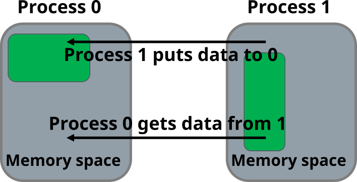
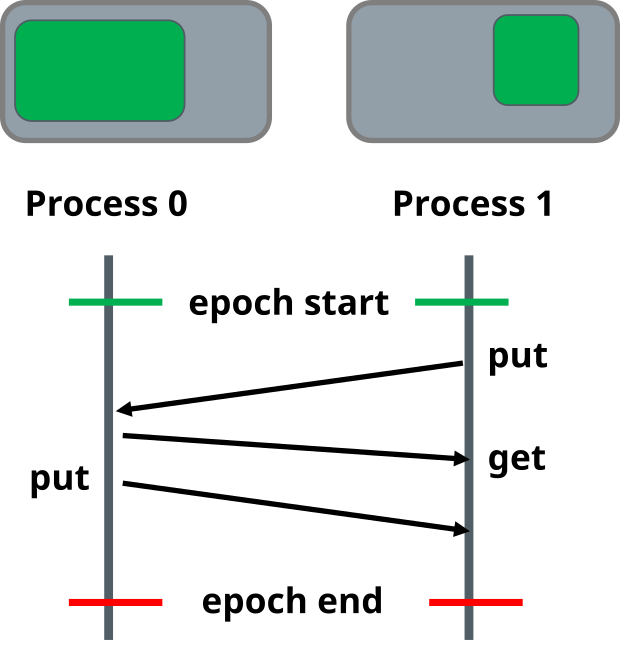

# One-sided communication

- Two components of message-passing: sending and receiving
    - Sends and receives need to match
- One-sided communication:
    - Only single process calls data movement functions - remote memory
      access (RMA)
    - Communication patterns specified by only a single process
    - Always non-blocking


# Why one-sided communication?

- Certain algorithms featuring irregular and/or dynamic communication
  patterns easier to implement
    - A priori information of sends and receives is not needed
- Potentially reduced overhead and improved scalability
- Hardware support for remote memory access has been restored in most
  current-generation architectures


# Origin and target

- Key terms of one-sided communication:

    Origin
      : a process which calls data movement function

    Target
      : a process whose memory is accessed


# Remote memory access window

- Window is a region in process's memory which is made available
  for remote operations
- Windows are created by collective calls
- Windows may be different in different processes

{.center}


# Data movement operations

- PUT data to the memory in target process
    - From local buffer in origin to the window in target
- GET data from the memory of target process
    - From the window in target to the local buffer in origin
- ACCUMULATE data in target process
    - Use local buffer in origin and update the data (e.g. add the data
      from origin) in the window of the target
    - One-sided reduction


# Synchronization

- Communication takes place within *epoch*s
    - Synchronization calls start and end an *epoch*
    - There can be multiple data movement calls within epoch
    - An epoch is specific to particular window
- Active synchronization:
    - Both origin and target perform synchronization calls
- Passive synchronization:
    - No MPI calls at target process


# One-sided communication in a nutshell

<div class="column">
- Define memory window
- Start an epoch
    - Target: exposure epoch
    - Origin: access epoch
- GET, PUT, and/or ACCUMULATE data
- Complete the communications by ending the epoch
</div>

<div class="column">

</div>

# Simple example: Put

```c
int data;
MPI_Win window;
...
data = rank;

MPI_Win_create(&data, sizeof(int), sizeof(int), MPI_INFO_NULL,
               MPI_COMM_WORLD, &window);

...
MPI_Win_fence(0, window);
if (rank == 0)
    /* transfer data to rank 8 */
    MPI_Put(&data, 1, MPI_INT, 8, 0, 1, MPI_INT, window);
MPI_Win_fence(0, window);
...

MPI_Win_free(&window);
```


# Performance considerations

- Performance of the one-sided approach is highly implementation-dependent
- Maximize the amount of operations within an epoch
- Provide the assert parameters for `MPI_Win_fence`

# Summary

- One-sided communication allows communication patterns to be specified
  from a single process
- Can reduce synchronization overheads and provide better performance
  especially on recent hardware
- Basic concepts:
    - Origin and target process
    - Creation of the memory window
    - Communication epoch
    - Data movement operations
