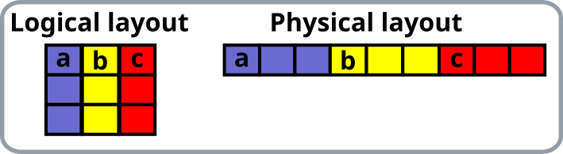
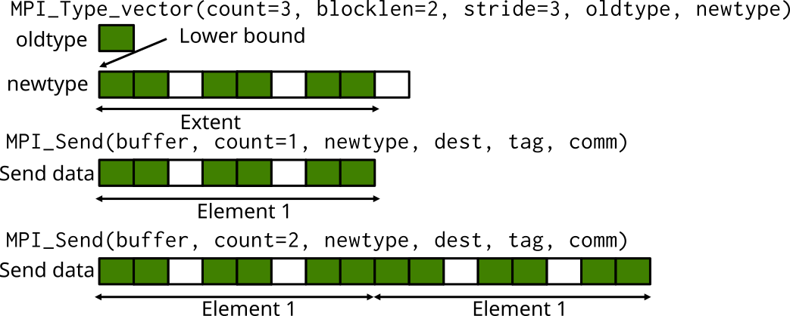
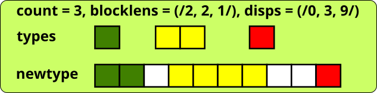
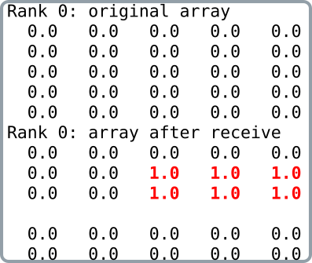

# User-defined datatypes  {.section}

# MPI datatypes

- MPI datatypes are used for communication purposes
    - Datatype tells MPI where to take the data when sending or where
      to put data when receiving
- Elementary datatypes (`MPI_INT`, `MPI_REAL`, ...)
    - Different types in Fortran and C, correspond to languages basic
      types
    - Enable communication using contiguous memory sequence of
      identical elements (e.g. vector or matrix)

# Sending a matrix row (Fortran)

- Row of a matrix is not contiguous in memory in Fortran

<p>

{.center width=50%}

<p>

- Several options for sending a row:
    - Use several send commands for each element of a row
    - Copy data to temporary buffer and send that with one send
      command
    - Create a matching datatype and send all data with one send
      command

# User-defined datatypes

- Use elementary datatypes as building blocks
- Enable communication of
    - Non-contiguous data with a single MPI call, e.g. rows or columns
      of a matrix
    - Heterogeneous data (structs in C, types in Fortran)
    - Larger messages, count is `int` (32 bits) in C
- Provide higher level of programming
    - Code is more compact and maintainable
- Needed for getting the most out of MPI I/O

# User-defined datatypes

- User-defined datatypes can be used both in point-to-point
  communication and collective communication
- The datatype instructs where to take the data when sending or where
  to put data when receiving
    - Non-contiguous data in sending process can be received as
      contiguous or vice versa

# Using user-defined datatypes

- A new datatype is created from existing ones with a datatype constructor
    - Several routines for different special cases
- A new datatype must be committed before using it in communication
    - **`MPI_Type_commit`(`newtype`{.input})**
- A type should be freed after it is no longer needed
    - **`MPI_Type_free`(`newtype`{.input})**

# Datatype constructors

| Datatype                   | Usage                                     |
|----------------------------|-------------------------------------------|
| `MPI_Type_contiguous`      | contiguous datatypes                      |
| `MPI_Type_vector`          | regularly spaced datatype                 |
| `MPI_Type_indexed`         | variably spaced datatype                  |
| `MPI_Type_create_subarray` | subarray within a multi-dimensional array |
| `MPI_Type_create_hvector`  | like vector, but uses bytes for spacings  |
| `MPI_Type_create_hindexed` | like index, but uses bytes for spacings   |
| `MPI_Type_create_struct`   | fully general datatype                    |


#  User-defined datatypes: regularly spaced data (vector) {.section}

# MPI_TYPE_VECTOR

- Creates a new type from equally spaced identical blocks

<div class=column>
MPI_Type_vector(`count`{.input}, `blocklen`{.input}, `stride`{.input}, `oldtype`{.input}, `newtype`{.output})
  : `count`{.input}
    : number of blocks
  : `blocklen`{.input}
    : number of elements in each block
  : `stride`{.input}
    : displacement between the blocks
</div>
<div class=column>
<p>
{.center width=100%}
</div>

# Example: sending rows of matrix in Fortran

```fortranfree
integer, parameter :: n=2, m=3
real, dimension(n,m) :: a
type(mpi_datatype) :: rowtype
! create a derived type
call mpi_type_vector(m, 1, n, mpi_real, rowtype, ierr)
call mpi_type_commit(rowtype, ierr)
! send a row
call mpi_send(a, 1, rowtype, dest, tag, comm, ierr)
! free the type after it is not needed
call mpi_type_free(rowtype, ierr)
```

<p>
{.center width=50%}


# Sending multiple elements: Extent

- When communicating multiple elements, MPI uses the concept of
  extent
     - next element is read or write *extent* bytes apart from the
       previous one in the buffer
- Extent is determined from the displacements and sizes of the basic
  types
    - The lower bound (LB) = min(displacement)
    - Extent = max(displacement + size) - LB + padding
- Communicating multiple user-defined types at once may not behave as
  expected if there are gaps in the beginning or end of the derived type


# Multiple MPI_TYPE_VECTORs




# Getting extent and lower bound

`MPI_Type_get_extent(type, lb, extent)`
  : `type`{.input}
    : Datatype

    `lb`{.output}
    : Lower bound of type (in bytes)

    `extent`{.output}
    : Extent of type (in bytes)


# Setting extent and lower bound

`MPI_Type_create_resized(type, lb, extent, newtype)`
  : `type`{.input}
    : Old datatype

    `lb`{.input}
    : New lower bound (in bytes)

    `extent`{.input}
    : New extent (in bytes)

    `newtype`{.output}
    : New datatype, commit before use

# Multiple MPI_TYPE_VECTORs


# From non-contiguous to contiguous data

<div class=column>
{.center width=100%}
</div>
<div class=column>
```c
if (rank == 0)
  MPI_Type_vector(n, 1, 2, MPI_FLOAT,
                  &newtype)
  ...
  MPI_Send(A, 1, newtype, 1, ...)
else
  MPI_Recv(B, n, MPI_FLOAT, 0, ...)

```

```c
if (rank == 0)
  MPI_Send(A, n, MPI_FLOAT, 1, ...)
else
  MPI_Type_vector(n, 1, 2, MPI_FLOAT,
                  &newtype)
  ...
  MPI_Recv(B, 1, newtype, 0, ...)

```
</div>


# User-defined datatypes: heterogeneous data (struct) {.section}


# Example: sending an array of structs

```c
struct ParticleStruct {
    int charge;         /* particle charge */
    double coords[3];   /* particle coordinates */
    double velocity[3]; /* particle velocity vector */
};

struct ParticleStruct particle[1000];

/* How to define a new Particletype? */
...

MPI_Send(particle, 1000, Particletype, dest, tag, MPI_COMM_WORLD);
```


# MPI_TYPE_CREATE_STRUCT {.split-definition}

- Creates a new type from heterogeneous blocks
    - e.g. Fortran types and C structures

`MPI_Type_create_struct(count, blocklens, displs, types, newtype)`
  : `count`{.input}
    : number of blocks

    `blocklens`{.input}
    : lengths of blocks (array)

    `displs`{.input}
    : displacements of blocks in bytes (array)

    `types`{.input}
    : types of blocks (array)

    `newtype`{.output}
    : new datatype

    `-`{.ghost}
    : `-`{.ghost}




# Determining displacements

- The displacements of blocks should be determined by using the function

`MPI_Get_address(pointer, address)`
  : `pointer`{.input}
    : pointer to the variable of interest

    `address`{.output}
    : address of the variable, type is

        - `MPI_Aint` (C)
        - `integer(mpi_address_kind)` (Fortran)


# Gaps between structs: Extent

- When sending an array of the structures, the extent needs to be checked as for other user-defined datatypes
    - It's implicit assumed that the **extent** of the datatype would be the same as the
      size of the C struct
    - This is not necessarily the case, and if there are gaps in memory between the successive structures, sending
      does not work correctly with the default extent


# Example: sending an array of structs

```c
struct ParticleStruct {
    int charge;         /* particle charge */
    double coords[3];   /* particle coordinates */
    double velocity[3]; /* particle velocity vector */
};

struct ParticleStruct particle[1000];

/* Define a new type */
MPI_Datatype Particletype;
MPI_Datatype type[3] = {MPI_INT, MPI_DOUBLE, MPI_DOUBLE};
int blocklen[3] = {1, 3, 3};

...
```

# Example: sending an array of structs

```c
...
/* Determine displacements */
MPI_Aint disp[3];
MPI_Get_address(&particle[0].charge, &disp[0]);
MPI_Get_address(&particle[0].coords, &disp[1]);
MPI_Get_address(&particle[0].velocity, &disp[2]);

/* Make displacements relative */
disp[2] -= disp[0];
disp[1] -= disp[0];
disp[0] = 0;

/* Create the new type */
MPI_Type_create_struct(3, blocklen, disp, type, &Particletype);
MPI_Type_commit(&Particletype);

...
```

# Example: sending an array of structs

```c
...
/* Check extent */
MPI_Datatype oldtype;
MPI_Aint lb, extent;
MPI_Type_get_extent(Particletype, &lb, &extent);
if ( extent != sizeof(particle[0]) ) {
    oldtype = Particletype;
    MPI_Type_create_resized(oldtype, 0, sizeof(particle[0]), &Particletype);
    MPI_Type_commit(&Particletype);
    MPI_Type_free(&oldtype);
}

/* Now we are ready to use the new type */
MPI_Send(particle, 1000, Particletype, dest, tag, MPI_COMM_WORLD);

/* Free the type after not needed anymore */
MPI_Type_free(&Particletype);
```


# Other ways of communicating non-uniform data

- Structures and types as continuous stream of bytes: Communicate
  everything using `MPI_BYTE`
    - Portability can be an issue - be careful (*cf.* extent)

```c
struct ParticleStruct particle[1000];

MPI_Send(particle, 1000*sizeof(particle[0]), MPI_BYTE, ...);
```


# Other ways of communicating non-uniform data

- Non-contiguous data by manual packing
    - Copy data into or out from temporary buffer
- Use `MPI_Pack` and `MPI_Unpack` functions
    - Performance will likely be an issue


# User-defined datatypes: general remarks {.section}

# Performance

- Main motivation for using datatypes is not necessarily performance – manual
  packing can be faster
- Performance depends on the datatype – more general datatypes are
  often slower
- Overhead is potentially reduced by:
    - Sending one long message instead of many small messages
    - Avoiding the need to pack data in temporary buffers
- Performance should be tested on target platforms
  - Performance is currently poor with GPU-aware MPI


# Summary

- User-defined types enable communication of non-contiguous or
  heterogeneous data with single MPI communication operations
    - Improves code readability & portability
    - Allows optimizations by the MPI runtime
- Life cycle of derived type: create, commit, free
- Ensuring the correct extent of the derived data type is important
- MPI provides constructors for several specific types


#  User-defined datatypes: other datatype constructors {.section}

# MPI_TYPE_CONTIGUOUS

MPI_Type_contiguous(`count`{.input}, `oldtype`{.input}, `newtype`{.output})
  : `count`{.input}
    : number of oldtypes
  : `oldtype`{.input}
    : old type
  : `newtype`{.output}
    : new datatype

- Usage mainly for programming convenience
    - derived types in all communication calls

<small>
<div class=column>
```fortranfree
! Using derived type
call mpi_send(buf, 1, conttype, ...)
```
</div>
<div class=column>
```fortranfree
! Equivalent call with count and basic type
call mpi_send(buf, count, MPI_REAL, ...)
```
</div>
</small>


# MPI_TYPE_INDEXED {.split-def-3}

- Creates a new type from blocks comprising identical elements
    - The size and displacements of the blocks may vary

MPI_Type_indexed(`count`{.input}, `blocklens`{.input}, `displs`{.input}, `oldtype`{.input}, `newtype`{.output})
  :    `count`{.input}
    : number of blocks

    `blocklens`{.input}
    : lengths of the blocks (array)

    `displs`{.input}
    : displacements (array) in extent of oldtypes

    `oldtype`{.input}
    : original type

    `newtype`{.output}
    : new type

    `-`{.ghost}
    : `-`{.ghost}

<p>
{.center width=100%}

# Example: an upper triangular matrix

<div class="column">
```c
/* Upper triangular matrix */
double a[100][100];
int disp[100], blocklen[100], int i;
MPI_Datatype upper;
/* compute start and size of rows */
for (i=0; i<100; i++) {
    disp[i] = 100*i+i;
    blocklen[i] = 100-­i;
}
/* create a datatype for upper tr matrix */
MPI_Type_indexed(100,blocklen,disp,
    MPI_DOUBLE,&upper);
MPI_Type_commit(&upper);
/* ... send it ... */
MPI_Send(a,1,upper,dest, tag, MPI_COMM_WORLD);
MPI_Type_free(&upper);
```
</div>

<div class="column">
{.center width=65%}
</div>

# Subarray

<div class=column>
- Subarray datatype describes a N-dimensional subarray within a
N-dimensional array
- Array can have either C (row major) or Fortran (column major)
ordering in memory
</div>

<div class="column">
{.center width=60%}
</div>


# MPI_TYPE_CREATE_SUBARRAY {.split-def-3}

<!--- Creates a type describing an N-dimensional subarray within an N-dimensional array
-->
MPI_Type_create_subarray(`ndims`{.input}, `sizes`{.input}, `subsizes`{.input}, `offsets`{.input}, `order`{.input}, `oldtype`{.input}, `newtype`{.output})
  : `ndims`{.input}
    : number of array dimensions

    `sizes`{.input}
    : number of array elements in each dimension (array)

    `subsizes`{.input}
    : number of subarray elements in each dimension (array)

    `offsets`{.input}
    : starting point of subarray in each dimension (array)

    `order`{.input}
    : storage order of the array. Either `MPI_ORDER_C` or
      `MPI_ORDER_FORTRAN`

    `oldtype`{.input}
    : oldtype

    `newtype`{.output}
    : resulting type

    `-`{.ghost}
    : `-`{.ghost}

# Example: subarray

<div class=column>
<small>
```c
int a_size[2]    = {5,5};
int sub_size[2]  = {2,3};
int sub_start[2] = {1,2};
MPI_Datatype sub_type;
double array[5][5];

for(i = 0; i < a_size[0]; i++)
  for(j = 0; j < a_size[1]; j++)
    array[i][j] = rank;

MPI_Type_create_subarray(2, a_size, sub_size,
       sub_start, MPI_ORDER_C, MPI_DOUBLE, &sub_type);

MPI_Type_commit(&sub_type);

if (rank==0)
  MPI_Recv(array[0], 1, sub_type, 1, 123,
    MPI_COMM_WORLD, MPI_STATUS_IGNORE);
if (rank==1)
  MPI_Send(array[0], 1, sub_type, 0, 123,
  MPI_COMM_WORLD);

MPI_Type_free(&sub_type);

```
</small>
</div>
<div class=column>
{.center width=100%}
</div>
