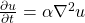

## Heat equation in 2D

### Theory

Heat (or diffusion) equation is a partial differential equation that
describes the variation of temperature in a given region over time

<!-- Equation
\frac{\partial u}{\partial t} = \alpha \nabla^2 u
-->

where *u*(*x*, *y*, *t*) is the temperature field that varies in space and
time, and α is the thermal diffusivity constant.

We limit ourselvels to two dimensions (a plane) where Laplacian can be
discretized in a grid with finite differences as

<!-- Equation
\begin{align*}
\nabla^2 u  &= \frac{u(i-1,j)-2u(i,j)+u(i+1,j)}{(\Delta x)^2} \\
 &+ \frac{u(i,j-1)-2u(i,j)+u(i,j+1)}{(\Delta y)^2}
\end{align*}
-->

where ∆x and ∆y are the grid spacing of the temperature grid *u*.

Given an initial condition (*u*(t=0) = u0) one can follow the time dependence
of the temperature field with explicit time evolution method:

<!-- Equation
u^{m+1}(i,j) = u^m(i,j) + \Delta t \alpha \nabla^2 u^m(i,j)
-->

Note: The algorithm is stable only when

<!-- Equation
\Delta t < \frac{1}{2 \alpha} \frac{(\Delta x \Delta y)^2}{(\Delta x)^2 (\Delta y)^2}
-->

### Code

A parallel solver for the two-dimensional heat equation has been implemented
in [C](c/) and [Fortran](fortran/). It is almost complete, only MPI routines
are missing. :)

To finish off the parallelisation of the code, one needs to implement a halo
exchange between the domains in the decomposition. An example model solution
is also available in [C](c/solution/) and [Fortran](fortran/solution/).
To build the code, please use the provided `Makefile` (by giving the command
`make` in the directory).

The solver carries out the time development of the 2D heat equation over the
number of time steps provided by the user. The default geometry is a flat
rectangle (with grid size provided by the user), but other shapes may be used
via input files -- a bottle is given as an example in
[common/bottle.dat](common/bottle.dat).

Examples on how to run the binary:
- `./heat`  (no arguments - the program will run with the default arguments:
             2000x2000 grid and 500 time steps)
- `./heat bottle.dat` (one argument - start from a temperature grid provided
                       in the file `bottle.dat` for the default number of time
                       steps)
- `./heat bottle.dat 1000` (two arguments - will run the program starting from
                            a temperature grid provided in the file
                            `bottle.dat` for 1000 time steps)
- `./heat 4000 8000 1000` (three arguments - will run the program in a
                           1024x2048 grid for 1000 time steps)

The program will produce an image (PNG) of the temperature field after every
500 iterations. You can change the frequency by modifying the parameter
`image_interval` in [main.c](c/main.c) (or [main.F90](fortran/main.F90)).
You can also visualize the images e.g. with the following command:
`animate heat_*.png`.
