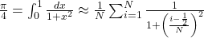

<!-- Adapted from material by EPCC https://github.com/EPCCed/archer2-MPI-2020-05-14 -->

# Parallel calculation of π

An approximation to the value of π can be calculated from the following
expression

<!--
\frac{\pi}{4} = \int_0^1 \frac{dx}{1+x^2} \approx \frac{1}{N} \sum_{i=1}^N \frac{1}{1+\left( \frac{i-\frac{1}{2}}{N}\right)^2}
-->

where the answer becomes more accurate with increasing N. As each term is independent,
the summation over i can be parallelized nearly trivially.

Starting from the serial code [pi.cpp](pi.cpp) (or [pi.F90}(pi.F90) for Fortran), make a version
that performs the calculation in parallel.

1. Divide the range over N in `ntasks`, so that rank 0 does i=1, 2, ..., N / ntasks, rank 1 does
   i=N / ntasks + 1, N / ntasks + 2, ... , *etc.*. You
   may assume that N is evenly divisible by the number of processes.

2. All tasks calculate their own partial sums

3. Once finished with the calculation, all ranks expect rank 0 send their partial sum to rank 0,
   which then calculates the final result and prints it out.

4. Run the code with different number of processes, do you get **exactly** the same
   result? If not, can you explain why?

5. Make a version where rank 0 receives the partial sums with `MPI_ANY_SOURCE`. When running
  multiple times with the same number of processes, do you get always **exactly** the same result?
  If not, can you explain why?

6. (Bonus) Make a version that works with arbitrary number of processes. Now,
  if N cannot be divided evenly by `ntasks`, some processes
  calculate more terms than others.

