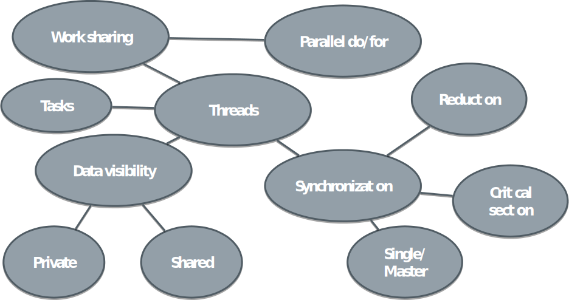

# Limitations of work sharing so far

* Number of iterations in a loop must be constant
	- No while loops or early exits in for/do loops
* All the threads have to participate in workshare
* OpenMP provides also dynamic tasking in addition to static sections
* Irregular and dynamical parallel patterns via tasking
	- While loops
	- Recursion

# What is a task in OpenMP?

* A task has
	- Code to execute
	- Data environment
	- Internal control variables
* Tasks are added to a task queue, and executed then by single thread
	- Can be same or different thread that created the task
	- OpenMP runtime takes care of distributing tasks to threads

# OpenMP task construct

* Create a new task and add it to task queue
	- Memorize data and code to be executed
	- Task constructs can arbitrarily nested
* Syntax (C/C++)  
**`#pragma omp task [clause[[,] clause],…]`**  
**`structured-block`**  
* Syntax (Fortran)  
**`!$omp task[clause[[,] clause],…]`**   
**`block`**  
**`!$omp end task`**


# OpenMP task construct

* All threads that encounter the construct create a task
* Typical usage pattern is thus that single thread creates the tasks

```c
#pragma omp parallel
#pragma omp single 
{
  int i=0;
  while (i < 12 ) {
    #pragma omp task
    printf("Task %d by thread %d \n", i, omp_get_thread_num());
  
    i++;
  }
}
```

# OpenMP task construct
 

How many tasks does the following code create when executed with 4 threads?

```c
#pragma omp parallel
{
  int i=0;
  while (i < 6 ) {
    #pragma omp task
    do_some_heavy_work();
  
    i++;
  }
}

```

**`a) 6,	     b) 4,      c) 24`**


# Task execution model

* Tasks are executed by an arbitrary thread
	- Can be same or different thread that created the task
	- By default, tasks are executed in arbitrary order
	- Each task is executed only once
* Synchronization points
	- Implicit or explicit barriers
	- `#pragma omp taskwait  / !$omp taskwait`
		* Encountering task suspends until child tasks complete

# Data environment of a task

* Tasks are created at one time, and executed at another
	- What data does the task see when executing?
* Variables that are _shared_ in the enclosing construct contain the data at the time of execution
* Variables that are _private_ in the enclosing construct are made _firstprivate_ and contain the data at the time of creation
* Data scoping clauses (_shared_, _private_, _firstprivate_, _default_) can change the default behaviour

# Data environment of a task

What is the value of i that is printed out?  **a) i=0, b) i=6, c) i=100**
```c
#pragma omp parallel
{
  int i=0;
  #pragma omp master
  {    
    while (i < 6 ) {
      #pragma omp task
      if (omp_get_thread_num() != 0) i=100;
  
      i++;
    }
  }
  #pragma omp barrier
  if (omp_get_thread_num() == 0) printf("i is %d\n", i);
}
```


# Data environment of a task

What is the value of i that is printed out? **a) i=0, b) i=6, c) >= 100**

```c
#pragma omp parallel
{
  int i=0;
  #pragma omp master
  {    
    while (i < 6 ) {
      #pragma omp task shared(i)
      if (omp_get_thread_num() == 1) i=100;
  
      i++;
    }
  }
  #pragma omp barrier
  if (omp_get_thread_num() == 0) printf("i is %d\n", i);
}
```


# Recursive algorithms with tasks

* A task can itself generate new tasks
	- Useful when parallelising recursive algorithms
* Recursive algorithm for Fibonacci numbers:  **Fn=Fn-1+Fn-2	F0=0, F1=1**

<div class=column>
```c
#pragma omp parallel
{
  fibonacci(10);
}
```
</div>
<div class=column>
<small>
```c
int fibonacci(int n) {
  int fn, fnm;
  if (n<2)
    return n;
#pragma omp task shared(fn)
  fn = fibonacci(n-1);  
 
#pragma omp task shared(fnm)    
  fnm = fibonacci(n-2);  
   
/* Wait for child tasks to finish */
#pragma omp taskwait  
  return fn+fnm;
}
```
</small>
</div>

# OpenMP programming best practices

* Maximize parallel regions
	- Reduce fork-join overhead, e.g. combine multiple parallel loops into one large parallel region
	- Potential for better cache re-usage
* Parallelize outermost loops if possible
	- Move PARALLEL DO construct outside of inner loops
* Reduce access to shared data
	- Possibly make small arrays private
* Use more tasks than threads
	- Too large number of tasks leads to performance loss

# OpenMP summary

* OpenMP is an API for thread-based parallelization
	- Compiler directives, runtime API, environment variables
	- Relatively easy to get started but specially efficient and/or real-world parallelization non-trivial
* Features touched in this intro
	- Parallel regions, data-sharing attributes
	- Work-sharing and scheduling directives
	- Task based parallelization

# OpenMP summary

{.center width=85%}

# Things that we did not cover

* Other work-sharing clauses
	- `workshare`, `sections`, `simd`
	- `teams`, `distribute`
* More advanced ways to reduce synchronization overhead with `nowait` and `flush`
* `threadprivate`, `copyin`, `cancel` 
* A user can define dependencies between tasks with the `depend` clause
* Support for attached devices with `target` 

# Web resources

* OpenMP homepage  
<http://openmp.org/>
* Good online tutorial:  
<https://computing.llnl.gov/tutorials/openMP/>
* More online tutorials:   
<http://openmp.org/wp/resources/#Tutorials>
