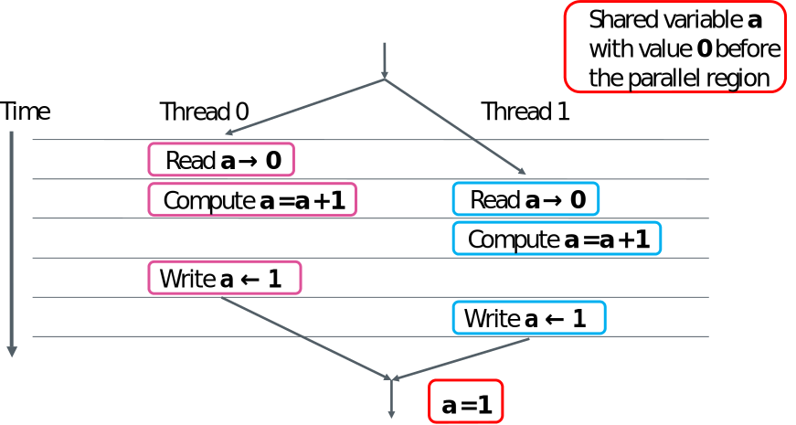

# Work Sharing

* Parallel region creates an “Single Program Multiple Data” instance where each thread executes the same code
* How can one split the work between the threads in a parallel region?
	- Loop construct
	- Single/Master construct
	- Sections construct
	- Task construct
	- Workshare construct (Fortran only)

# Loop construct

* Directive instructing compiler to share the work of a loop  
C/C++	:  `#pragma omp for [clauses]`   
Fortran	: `!$omp do [clauses]`
	- The construct must be followed by a loop construct
		* in C/C++ limited only to for-loops
	- It must reside inside a parallel region
		* Combined construct with omp parallel:   
		`#pragma omp parallel for / !$omp parallel do`
* The loop index is private by default
* Work sharing can be adjusted with the  schedule clause

# Loop construct
```fortran 
!$omp parallel shared(x,y,z) private(i)
!$omp do
  do i = 1, n
    z(i) = x(i) + y(i)
  end do
!$omp end do
!$omp end parallel
```
```c
#pragma omp parallel shared(x,y,z) private(i)
{
#pragma omp for
  for (i = 0; i < n ; i++)
     z[i] = x[i] + y[i]
}
/*Only for-loops with a “canonical” form can be used in C/C++. 
Iterator base loops are also possible in C++*/
```

# Loop scheduling clause

<div class=column>
* **schedule(static[,chunk])**
	- Blocks of iterations of size chunk for each thread
* **schedule(dynamic[,chunk])**
	- Chunk iterations off a queue until everything is done

</div>

<div class=column>
* **schedule(guided[,chunk])**
	- Threads grab blocks of iterations, size of blocks starts from larger size and shrinks down to chunk
* **schedule(runtime)**
	- Schedule and chunk size are taken from environment variable `OMP_SCHEDULE`

</div>

# Loop scheduling clause


```c
int kernel(int w, int h, complex dc, int x, int y) {
  float fx = (float)x / w; float fy = (float)y / h;
  complex c = cmin + fx * creal(dc) + fy * cimag(dc) * I;
  int iteration = 0; complex z = c;
  while(iteration < MAX_ITER_COUNT && abs2(z) < 2 * 2) {
      z = z * z + c;
      iteration++;
  }
  return iteration;
}
#pragma omp parallel for schedule(guided)
  for (int i = 0; i < Nx; i++) {
    for (int j = y0; j < Ny; j++) {
      iter_counts[j * w + i] = kernel(w, h, cmax - cmin, i, j);
    }
  }
}
```

# Lastprivate data-sharing clause

* **lastprivate(list)**
	- Private variable where the original  variable is updated with the value from the “last” parallel _iteration step_ or _section_
	- Variable can be both firstprivate and lastprivate
```c
int n = 10;
int a, b, i; 
#pragma omp parallel for private(i,a) lastprivate(b)
for (i = 0; i < n; i++) {
   a = i;
   b = i;}
printf("private int is %d, lastprivate int is %d\n", a, b);
```
```bash
>./test 
>private int is 32765, lastprivate int is 9
```

# Workshare directive (Fortran only) 

* The workshare directive divides the execution of the enclosed structured block into separate units of work, each of which is executed only once
	- Array assignments, forall and where statements etc.

```fortran
real :: a(n,n), b(n,n), c(n,n) d(n,n)
...
!$omp parallel shared(a,b,c,d)
!$omp workshare
      c = a * b
      d = a + b
!$omp end workshare
!$omp end parallel
```
_Note that performance may be bad in some compilers, in particular with Intel_

# Race condition

* Race conditions take place when multiple threads read and write a variable simultaneously, for example
```fortran
 asum = 0.0d0
!$omp parallel do shared(x,y,n,asum) private(i)
  do i = 1, n
    asum = asum + x(i)*y(i)
  end do
!$omp end parallel do
```
* Random results depending on the order the
threads access **asum**

* We need some mechanism to control the access

# Race condition: example
{.center width=80%}

# Reductions


* Summing elements of array is an example of reduction operation

{.center width=70%}

* OpenMP provides support for common reductions within parallel regions and loops with the reduction clause

# Reduction clause

* **reduction(operator:list)**
	- Performs reduction on the (scalar) variables in list
	- Private reduction variable is created for each thread’s partial result
	- Private reduction variable is initialized to operator’s initial value
	- After parallel region the reduction operation is applied to private variables and result is aggregated to the shared variable

# Reduction operators

{.center width=60%}

# Race condition avoided with reduction

```fortran
!$OMP PARALLEL DO SHARED(x,y,n) PRIVATE(i) REDUCTION(+:asum)
  do i = 1, n
    asum = asum + x(i)*y(i)
  end do
!$OMP END PARALLEL DO
```
```c
#pragma omp parallel for shared(x,y,n) private(i) reduction(+:asum)
for(i = 0; i < n; i++) {
  asum = asum + x[i] * y[i];
}
```

# Summary

* Work sharing construct distribute work between threads
* Parallel do/for loops
	- Remember the restrictions on loop construct (C/C++)
	- Scheduling can be adjusted
	- Race condition when accessing shared variables
		* Reduction clause


