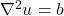

## Execution controls

Jacobi method is iterative scheme for solving linear system of equations. As discretization
of partial differential results typically in such a system, Jacobi method can be used for
numerical solution of partial differential equations.

The code [jacobi.cpp](jacobi.cpp) / [jacobi.F90](jacobi.F90) solves two dimensional
Poisson equation

<!-- Equation
\nabla^2 u = b
-->

The source term *b* is read from a file [input.dat](input.dat), and the two dimensional array
*u* is then solved using the Jacobi method.

The computations are already parallelized with OpenMP. However, the `parallel` region misses
some critical execution control constructs (`barrier`, `master`, `critical`) and does not 
work correctly when run with more than a single thread.

Add appropriate execution controls within the `parallel` region in the main routine so that 
the code works with arbitrary number of threads, and gives same results both in parallel and
in serial.
