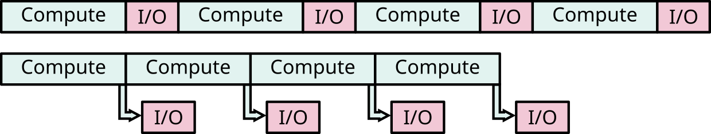

# MPI-IO

- Defines parallel operations for reading and writing files
    - I/O to only one file and/or to many files
    - Contiguous and non-contiguous I/O
    - Individual and collective I/O
    - Asynchronous I/O
- Potentially good performance, easy to use (compared to implementing the
  same patterns on your own)
- Portable programming *interface*
    - By default, binary *files* are not portable


# Basic concepts in MPI-IO

- File *handle*
    - data structure which is used for accessing the file
- File *pointer*
    - *position* in the file where to read or write
    - can be individual for all processes or shared between the processes
    - accessed through file handle or provided as an explicit offset from
      the beginning of the file
    - Here we do not use shared file pointers – performance is poor


# Basic concepts in MPI-IO

- File *view*
    - part of a parallel file which is visible to process
    - enables efficient noncontiguous access to file
- *Collective* and *independent* I/O
    - Collective = MPI coordinates the reads and writes of processes
    - Independent = no coordination by MPI, every man for himself


# Opening & Closing files

- All processes in a communicator open a file using

MPI_File_open(`comm`{.input}, `filename`{.input}, `mode`{.input}, `info`{.input}, `fhandle`{.output})
  : `comm`{.input}
    : communicator that performs parallel I/O

    `mode`{.input}
    : `MPI_MODE_RDONLY`, `MPI_MODE_WRONLY`, `MPI_MODE_CREATE`,
      `MPI_MODE_RDWR`, ...

        - Mode parameters can be combined with + in Fortran and | in C/C++

    `info`{.input}
    : Hints to implementation for optimal performance
      (No hints: `MPI_INFO_NULL`)

    `fhandle`{.output}
    : parallel file handle

- File is closed using `MPI_File_close(fhandle)`


# File writing at explicit location

MPI_File_write_at(`fhandle`{.input}, `disp`{.input}, `buffer`{.input}, `count`{.input}, `datatype`{.input}, `status`{.output})
  : `disp`{.input}
    : displacement in bytes (with the default file view) from the
      beginning of file

    `buffer`{.input}
    : buffer in memory from where to write the data

    `count`{.input}
    : number of elements in the buffer

    `datatype`{.input}
    : datatype of elements to write

    `status`{.output}
    : similar to status in `MPI_Recv`, stores number of elements actually
      written


# Example: parallel write

```fortran
program output
use mpi_f08
implicit none
type(mpi_file) :: file
integer :: err, i, myid, intsize
integer :: status(mpi_status_size)
integer, parameter :: count=100
integer, dimension(count) :: buf
integer(kind=mpi_offset_kind) :: disp

call mpi_init(err)
call mpi_comm_rank(mpi_comm_world, myid, err)

do i = 1, count
    buf(i) = myid * count + i
end do
```

- First process writes integers 1-100 to the beginning of the file, etc.


# Example: parallel write

```fortran
...

call mpi_file_open(mpi_comm_world, 'test', &
                   mpi_mode_create + mpi_mode_wronly, &
                   mpi_info_null, file, err)

intsize = sizeof(count)
disp = myid * count * intsize

call mpi_file_write_at(file, disp, buf, count, mpi_integer, status, err)

call mpi_file_close(file, err)
call mpi_finalize(err)

end program output
```


# File reading at explicit location

MPI_File_read_at(`fhandle`{.input}, `disp`{.input}, `buffer`{.output}, `count`{.input}, `datatype`{.input}, `status`{.output})
  : `disp`{.input}
    : displacement in bytes (with the default file view) from the
      beginning of file

    `buffer`{.output}
    : buffer in memory where to read the data

    `count`{.input}
    : number of elements in the buffer

    `datatype`{.input}
    : datatype of elements to read

    `status`{.output}
    : similar to status in `MPI_Recv`, stores number of elements actually read


# Setting file pointer

- In previous examples the location for writing or reading was provided
  explicitly in the `write` / `read` calls.
- It is also possible to set the location of file pointer separately
  with

MPI_File_seek(`fhandle`{.input}, `disp`{.input}, `whence`{.input})
  : `disp`{.input}
    : displacement in bytes (with the default file view)

    `whence`{.input}
    : `MPI_SEEK_SET`: the pointer is set to `disp`
    : `MPI_SEEK_CUR`: the pointer is set to the current pointer position
       plus `disp`
    : `MPI_SEEK_END`: the pointer is set to the end of file plus `disp`
       (can be negative)

# File writing at file pointer

MPI_File_write(`fhandle`{.input}, `buffer`{.input}, `count`{.input}, `datatype`{.input}, `status`{.output})
  : `buffer`{.input}
    : buffer in memory which holds the data

    `count`{.input}
    : number of elements to write

    `datatype`{.input}
    : datatype of elements to write

    `status`{.output}
    : status object

- Updates position of individual file pointer after writing
    - Not thread safe


# File reading at file pointer

MPI_File_read(`fhandle`{.input}, `buffer`{.output}, `count`{.input}, `datatype`{.input}, `status`{.output})
  : `buffer`{.output}
    : buffer in memory where to store the data

    `count`{.input}
    : number of elements to read

    `datatype`{.input}
    : datatype of elements to read

    `status`{.output}
    : similar to status in `MPI_Recv`, amount of data read can be
      determined by `MPI_Get_count`

- Updates position of individual file pointer after reading
    - Not thread safe


# Collective operations

- I/O can be performed *collectively* by all processes in a communicator
    - `MPI_File_read_all`
    - `MPI_File_write_all`
    - `MPI_File_read_at_all`
    - `MPI_File_write_at_all`
- Same parameters as in independent I/O functions (`MPI_File_read` etc.)


# Collective operations

- All processes in communicator that opened file must call function
    - Collective operation
- If all processes write or read, you should always use the collective
  reads and writes.
    - Performance much better than for individual functions
    - Even if each processor reads a non-contiguous segment, in total the
      read may be contiguous
    - Lots of optimizations implemented in the MPI libraries


# Non-blocking MPI-IO

- Non-blocking independent I/O is similar to non-blocking send/recv
  routines
    - `MPI_File_iread(_at)(_all)` /
      `MPI_File_iwrite(_at)(_all)`
- Wait for completion using `MPI_Test`, `MPI_Wait`, etc.
- Can be used to overlap I/O with computation:

{.center}


# Non-contiguous data access with MPI-IO {.section}


# File view

- By default, file is treated as consisting of bytes, and process can
  access (read or write) any byte in the file
- The *file view* defines which portion of a file is visible to a process
- A file view consists of three components
    - displacement: number of bytes to skip from the beginning of file
    - etype: type of data accessed, defines unit for offsets
    - filetype: portion of file visible to a process


# File view

MPI_File_set_view(`fhandle`{.input}, `disp`{.input}, `etype`{.input}, `filetype`{.input}, `datarep`{.input}, `info`{.input})
  : `disp`{.input}
    : Offset from beginning of file. Always in bytes

    `etype`{.input}
    : Basic MPI type or user defined type. Specifies the unit of data access

    `filetype`{.input}
    : Same type as etype or user defined type constructed of etype

    `datarep`{.input}
    : Data representation (can be adjusted for portability)
    : `"native"`: store in same format as in memory

    `info`{.input}
    : Hints for implementation that can improve performance
      (`MPI_INFO_NULL`: no hints)


# File view

- The values for `datarep` and the extents of `etype` must be identical on
  all processes in the communicator.
    - values for `disp`, `filetype`, and `info` may vary.
- The datatypes passed in must be committed.


# File view for non-contiguous data


- Each process has to access small pieces of data scattered throughout
  a file
- Very expensive if implemented with separate reads/writes
- Use file type to implement the non-contiguous access


# File view for non-contiguous data


```fortran
integer, dimension(2,2) :: array
...
call mpi_type_create_subarray(2, sizes, subsizes, starts, mpi_integer, &
                              mpi_order_c, filetype, err)
call mpi_type_commit(filetype)

disp = 0
call mpi_file_set_view(file, disp, mpi_integer, filetype, 'native', &
                       mpi_info_null, err)

call mpi_file_write_all(file, buffer, count, mpi_integer, status, err)
```

# Common mistakes with MPI-IO

- Not defining file offsets as `MPI_Offset` in C and integer
  (`kind=MPI_OFFSET_KIND`) in Fortran
- In Fortran, passing the offset or displacement directly as a constant
  (e.g. "0")
    - It has to be stored and passed as a variable of type
      `integer(MPI_OFFSET_KIND)`


# Performance do's and don'ts

- Use collective I/O routines
    - Collective write can be over hundred times faster than the individual
      for large arrays!

- Remember to use the correct striping for each file size
    - Striping can also be set in the `MPI_Info` parameter using the
      `MPI_Info_set` function:
      `MPI_Info_set(info, "striping_factor", "20")`
    - Optimal value system dependent, may be beneficial to benchmark
- Minimize metadata operations


# Summary

- MPI-IO: MPI library automatically handles all communication needed
  for parallel I/O access
- File views enable non-contiguous access patterns
- Collective I/O can enable the actual disk access to remain contiguous
