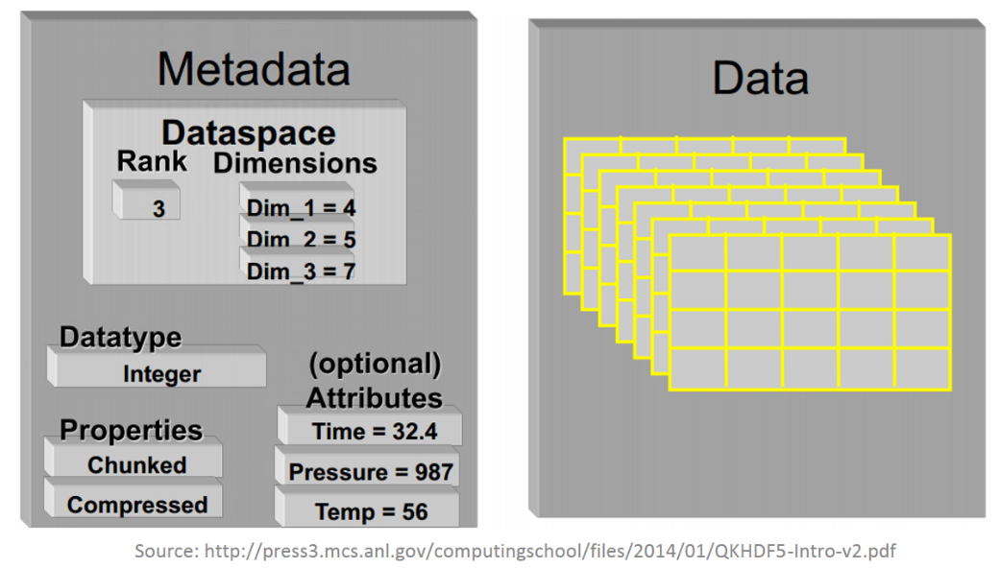

# Common I/O use cases in HPC

- Write simulation results on disk
- Write full state of the simulation, eg. for visualization or as a checkpoint for continuing later
- Read configuration files, input parameters, earlier checkpoint files...

**Heavy I/O can become a bottleneck if not properly planned for!**

- Example: Run of the climate simulation code `ICON` produces 700 TB of data, at rate of 100 MB/s (30-year model)
- Mahti peak I/O has been measured at 1.5 GB/s per compute node

<!-- ICON numbers obtained from JE. They correspond to a "recent" (2025) simulation for `ClimateDT` using 5km resolution.
Mahti numbers are from https://docs.csc.fi/computing/lustre/ -->


# What is covered on these slides

- Common strategies for parallel I/O and their pitfalls
- Using file I/O routines included in MPI
- Controlling file striping for better I/O performance in Lustre
- Short introduction to the HDF5 file format


# A comment on POSIX I/O


TODO: FIX THIS


# A comment on terminology...

You are probably familiar with so-called "standard library" I/O routines

- **C**: `fread`, `fwrite` etc. from `stdio.h`
- **fortran**: TODO

These are usually implemented through operating system `syscalls`;\
`POSIX`-routines in most Linux distros.

- Most programs should ***never*** need to call POSIX directly! Use standard libs or dedicated I/O libs instead
- HPC texts sometimes use the term "POSIX I/O" analogously with any non-parallel I/O library. Try not to get confused :)


# Common I/O strategies in HPC {.section}

# Approaches to I/O in a parallel program

Small programs _can_ manage with standard I/O routines:

- Do all I/O from one process, using MPI to gather/scatter the data (**"spokesperson"**)
- Use separate I/O file(s) for each process (**"file-per-process"**)
- Coordinated I/O to one file from many processes, eg. `fseek` based on MPI rank
    - **Do not** do this; see slides on MPI-IO instead

In practice, consider using libraries designed for parallel I/O

- **MPI-IO**, **HDF5**, **NetCDF**, ...


# Spokesperson strategy: One I/O process

<div class="column">
- One process takes care of all I/O using standard, serial routines (`fprintf`, `fwrite`, ...)
- Usually requires a lot of MPI communication
- Can be a good option for small files (eg. input
    files)
- Does not scale, single writer is a bottleneck!
</div>
<div class="column">

</div>

Exercise: `spokesperson`

# File-per-process I/O

<div class="column">
- Each process writes its local results to a separate file
- Good bandwidth, easy to implement
- Having many files makes data post process cumbersome
- **Can overwhelm the filesystem!**

  - Recall discussion of Lustre metadata servers
</div>

<div class="column">

</div>

# Programs with dedicated I/O processes ("I/O servers")

Variation of "spokesperson": One or more MPI processes that *only* do I/O.

- Can be great for I/O-heavy programs. Used eg. by the climate simulation code `ICON`
- Pseudocode example:

<div class="column">
**Compute processes**
```python
while simulation_is_running:
    evolve_system()
    if checkpoint:
        # Wait until our previous send
        # has been processed by the server
        MPI_WAIT(send_req)
        send_buffer = data
        MPI_ISend(IO_SERVER, send_buffer)
```
</div>

<div class="column">
**I/O server**
```python
while simulation_is_running:
    for rank in compute_processes:
        MPI_Recv(rank, recv_buffer)
        write(buffer)
```
</div>


# Comments on standard I/O streams

The "standard" I/O streams `stdout`, `stdin`, `stderr` are effectively **serial** in `mpirun`/`srun` context!

- Ex: Default `srun` will redirect `stdout` of all processes to `stdout` of `srun`
- Avoid excessive debug prints in production runs
    - Separate "Debug" and "Release" builds if needed
- **Do not** rely on standard streams for heavy I/O operations. Code for direct file I/O instead
    - *Eg*: `fprintf` instead of "`printf`

# Parallel I/O with MPI-IO {.section}

# MPI parallel I/O interface (MPI-IO)

MPI-IO = part of the MPI specification that deals with I/O

- Simplifies simultaneous I/O from many MPI processes to one or more files, solving most common I/O complications
- **Portable**: Specifics about the filesystem are abstracted away
    - Can bypass POSIX restrictions for better parallel performance

- Implementation used by `OpenMPI` and `MPICH` is called `ROMIO`
    - Advanced users can configure the internals via "hints"

API is rather similar to standard I/O programming. Consult MPI docs for details

# MPI-IO example: collective write

```c
// Remember to "#include <mpi.h>"

MPI_File file;
// Creates file called "stuff.out" and opens it in write-only mode
MPI_File_open(MPI_COMM_WORLD, "stuff.out",
    MPI_MODE_CREATE | MPI_MODE_WRONLY, MPI_INFO_NULL, &file);

// Write N integers from each rank from pointer 'data_ptr',
// to different parts of the file (specified by 'offset').
// MPI_File_write_at_all() is a collective routine that let's MPI optimize.
// It may eg. combine the writes into one operation, but this is up to the implementation.

MPI_Offset offset = (MPI_Offset) (rank * N * sizeof(int));
MPI_File_write_at_all(file, offset, data_ptr, N, MPI_INT, MPI_STATUS_IGNORE);

// Don't ignore the status and MPI return codes in a real program :)

MPI_File_close(&file);
```

# Lustre I/O considerations {.section}


TODO: Brief recap of Lustre architecture

- We've introduced MPI-IO, so can talk about striping and how it can improve performance when using parallel I/O
- After Lustre, we start considering file formats for storing data efficiently and conveniently. Since MPI-IO doesn't have anything to say about this, we get a natural link to HDF5

# Lustre file striping


# Lustre file striping

- Striping pattern of a file/directory can be queried or set with the
  `lfs` command
- `lfs getstripe` <*dir*|*file*>
- `lfs setstripe` -c *count* *dir*
    - Set the default stripe count for directory *dir* to *count*
    - All the new files within the directory will have the specified
    striping
    - Also stripe size can be specified, see *man lfs* for details
- Proper striping can enhance I/O performance a lot

# Lustre file striping in C codes

TODO working example with MPI-IO + lustre API

- The striping policy for files within an application

```c
...
#include <lustre/lustreapi.h>
int main(int argc, char **argv){
 int fd;
 char fname[]="lfile";
 unsigned long long stripe_size;
 int stripe_count, stripe_pattern=0, stripe_offset=-1;
 // Try to create file
 stripe_size=1048576; stripe_count=4;
 fd=llapi_file_open(fname,O_CREAT|O_RDWR,S_IRWXU,stripe_size,stripe_offset,stripe_count,stripe_pattern);
```

# Performance with Lustre striping

{.center width=60%}


# Common I/O libraries and file formats {.section}

# High-level I/O libraries

Most popular high-level I/O libraries in HPC are **`HDF5`** and **`netCDF`**.

- Both define hierarchical file formats for storing large binary data
- Format is very versatile. Mental model: "Database in a single file"
- Both can be compiled with parallel support, using MPI-IO under the hood
- Modern `netCDF` is actually a layer built upon `HDF5`

# File format of HDF5 (Hierarchical Data Format)

- HDF5 files consist of *datasets* (multidimensional arrays) organized into *groups*, and their associated *metadata*.

<div class="column">

</div>

<div class="column">

</div>


# Using HDF5

- Official programming API for `C`, `C++`, `f90`
    - Quite verbose! Consult the docs: <https://support.hdfgroup.org/documentation/hdf5/latest/_r_m.html>
    - Python package: `h5py`. File read example:
    ```python
    import h5py
    file = h5py.File("somefile.hdf5", 'r') # Behaves like a Python dict
    dataset_names = list(file.keys())
    dataset = file['somename'] # Behaves like a NumPy array
    ```

- HDF5 I/O is supported by many scientific software (`Paraview`, `Matlab`, ...)
- Command line tools for investigating HDF5 files (`h5ls`, `h5dump`)

<small>
Exercises: `hdf5-write-read` and `hdf5-writerank`
</small>

# Why use I/O libraries?

- File format is portable and standardized. No need to cook up your own ad-hoc format

- Built-in metadata support: data and its description stored in same file
    - You are still responsible for writing useful metadata :)

- Probably a better choice over direct MPI-IO for programs with demanding I/O needs

High-level libraries always aim to make development easier by abstracting out low-level design choices. **The same applies here!**
