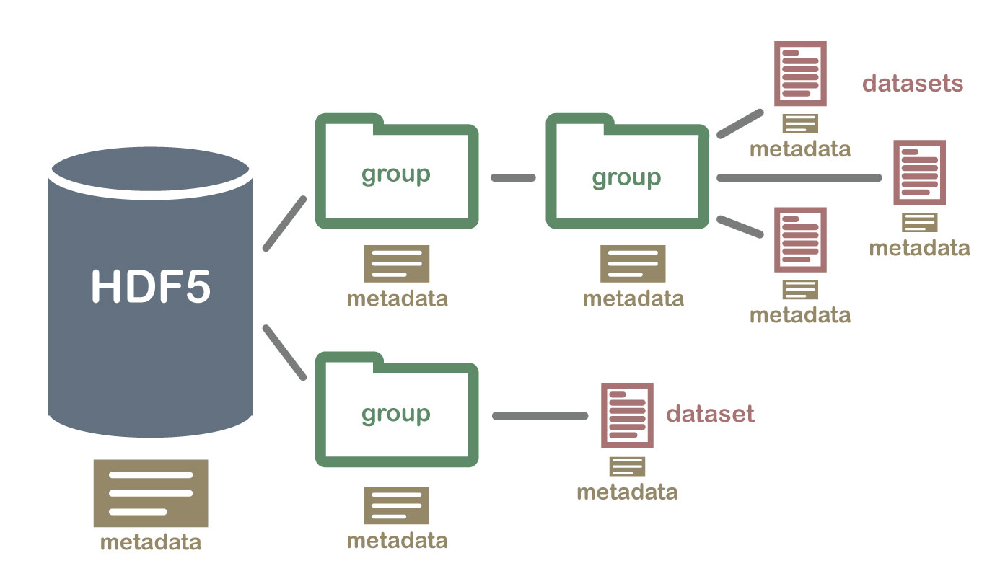
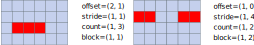

# Self study material on HDF5

HDF5 is a file format (suffix `.h5` or `.hdf5`) that has become popular in scientific and industrial computing due to
its flexibility, I/O performance and portability. HDF5 files are designed for storing large multidimensional arrays in a
compact binary format and work well in parallel filesystems such as Lustre, making HDF5 a good fit for many I/O tasks in
HPC.

These notes give an introduction to the HDF5 file format and its C/Fortran API.
"API" (Application Programming Interface) refers to the set of functions and objects exposed by the HDF5 programming
library that we can use from our code.

We will cover the following:
- Creating and writing HDF5 datasets into a file, and reading them
- Investigating HDF5 file contents with command line tools
- Writing user-specified metadata for the datasets using HDF5 attributes
- Using HDF5 hyperslabs to selectively operate on parts of a dataset
- Using MPI parallel I/O with HDF5 files

You can find the official HDF5 documentation [here](https://support.hdfgroup.org/documentation/hdf5/latest/index.html).
Especially useful are the User Guide and Reference Manual tabs.

There are a few coding exercises associates with these notes. They will be pointed out as you progress through the notes.

## The HDF5 programming interface (= API)

The HDF5 API provides functions for creating and manipulating HDF5 files and datasets within them.
The API is very flexible, giving the programmer full control over how datasets should be created or accessed.
The price to pay for this flexibility is that the programming interface is rather verbose and abstract.
For example, many API calls require the programmer to configure their behavior by passing **HDF5 Property List** objects
as function argument, but in many cases the default behavior is sufficient in which case we instead pass `H5P_DEFAULT`.

Throughout these notes we will use the "standard" C-style API, accessible in C/C++ by including the header `hdf5.h`.
Most API functions that create HDF5 objects (eg. file or dataset creation) return an integer identifier of type `hid_t`
to the created resource, instead of returning a direct pointer to it. Likewise, functions that operate on HDF5 objects
take in these IDs, or **handles**, as arguments. This is a somewhat common way of hiding implementation details of
library objects or structs from the programmer. Some routines return an error code (integer of `herr_t` type) that can
be used for manual error checking. Error checking is not always necessary because many HDF5 routines have a built-in
validation layer that complains about incorrect use of the API.

In addition to the C-style API used here, you should be aware of the following alternatives when implementing HDF5 in
your own codes:
- [Official "high-level" HDF5 APIs](https://docs.hdfgroup.org/archive/support/HDF5/doc/HL/index.html).
These are simplified APIs that are considerably less verbose than the "full" API. In practice they are wrappers around
the full API and aim to streamline common operations such as dataset read/write. The main downside is that some advanced
features such as parallel I/O are not available.
- For C++ users, the header `H5Cpp.h` provides C++ style bindings to the full API.
Concepts from the C-style API carry over. It is of course valid to use the C-API also in C++ if you prefer.
- The Python package [`h5py`](https://pypi.org/project/h5py/) has both a high-level API for common HDF5 tasks, and also
a Python wrapper around the low-level C-API.

### HDF5 Fortran API

The [Fortran API](https://docs.hdfgroup.org/archive/support/HDF5/doc/fortran/index.html) is rather similar to the
C-style API, but has the following differences:
- Function names in Fortran are suffixed by `_f`. Eg: `H5Dcreate` in C becomes `h5dcreate_f` in Fortran.
- Some functions have the error code as an additional output argument
- Order of arguments may sometimes vary relative to the C version. Input arguments come first, then output parameters
(including the error code), then optional input parameters.
- Due to different array indexing conventions between C and Fortran, some examples in these notes may require that you
interchange array rows and columns if converting the examples to Fortran. Internally, HDF5 uses C-style conventions for
multidimensional array storage, ie. last dimension is the fastest-changing dimension. More details are available in the
[docs](https://support.hdfgroup.org/documentation/hdf5/latest/_h5_s__u_g.html).

**Please note that we currently do not have HDF5 exercises for the Fortran API.**

## HDF5 file structure, datasets and dataspaces

HDF5 files are binary files intended for storing arbitrary N-dimensional **datasets**, where each element in the dataset
may itself be a complex object ("heterogeneous data").
There is no limit on how big the datasets can be; HDF5 can hold arbitrarily large amounts of data.
HDF5 has a complex, filesystem-like structure that allows one file to hold many datasets in an organized fashion.


*HDF5 file structure. "Groups" are analogous to directories on a Unix-like filesystem, and "datasets" then correspond to files.*

As is appropriate for multidimensional arrays, HDF5 also stores **shape** information for each dataset.
In practice, HDF5 associates each dataset with a **dataspace** object, which is the HDF5 abstraction of a
multidimensional grid. A dataspace defines just the number and layout of grid points, but does not say anything about
what object may or may not occupy these grid points. For example, a 2D dataspace is defined by specifying the number of
its rows and columns. In the API, dataspaces are used whenever shape or grid information is required:
- Creating a dataset requires that we have already created a valid dataspace object for specifying dataset shape.
- Dataspace objects are used to specify memory buffer layouts for dataset I/O operations ("memory space").
- Likewise, I/O routines require a dataspace object for specifying the layout of accessed data *in* the file ("file space").
The last two requirements make it possible to perform I/O operations only to parts of a larger dataset.


*Example HDF5 dataset and its metadata. Image taken from https://portal.hdfgroup.org/documentation/hdf5/latest/_intro_h_d_f5.html.*

In addition to dataset shape (its dataspace), HDF5 associates datasets with metadata such as type information of
the data elements (integer, floating point, etc). It is also possible to write user-specified **attributes**
to act as arbitrary metadata. We will discuss attributes in more detail shortly.

### Case study: HDF5 file with many datasets

Let's investigate the sample HDF5 file [`example_datasets.h5`](example_datasets.h5) using command line tools.
See [`hdf5-exercise-instructions.md`](hdf5-exercise-instructions.md) for instructions on how to enable these tools.

Running `h5ls example_datasets.h5` lists all datasets in the file:
```
MyDataset1D              Dataset {16}
MyDataset2D              Dataset {4, 4}
MyDataset3D              Dataset {2, 2, 4}
```
The file contains three datasets of shapes `{16}`, `{4, 4}`, `{2, 2, 4}`; their names are on the first column.
Each dataset thus contains 16 data elements but in different layouts.

Next run `h5dump example_datasets.h5`. This command gives a full dump of HDF5 file contents. For each dataset, the
`DATASPACE` field gives the type and shape of the dataspace associated with that dataset ("simple dataspace" is HDF5
jargon for a multidimensional dataspace). The actual stored data is shown in the `DATA` field, in this case the integers
in range `[0, 15]`. Try to understand what these datasets would look like as multidimensional arrays in C or Fortran
(or Numpy).

- The line `DATATYPE_H5T_STD_I32LE` means that each data element is stored as "standard" 32-bit integer type. This
information is important for portability between platforms.

## Writing data to a HDF5 file

The pipeline for creating a fresh HDF5 file and writing a dataset proceeds roughly as follows:
1. Create the file using [`H5Fcreate()`](https://docs.hdfgroup.org/archive/support/HDF5/doc/RM/RM_H5F.html#File-Create),
with appropriate creation flags and configuration options (eg. access permissions).
2. Create a [**dataspace**](https://support.hdfgroup.org/documentation/hdf5/latest/group___h5_s.html#ga8e35eea5738b4805856eac7d595254ae)
to represent shape of the data. Usually we are interested in writing N-dimensional arrays; dataspaces corresponding to
these are called "simple" in HDF5. A simple dataspace can be created with [`H5Screate_simple()`](https://support.hdfgroup.org/documentation/hdf5/latest/group___h5_s.html#ga8e35eea5738b4805856eac7d595254ae).
3. Create a [**dataset**](https://support.hdfgroup.org/documentation/hdf5/latest/_h5_d__u_g.html) by calling
[`H5Dcreate()`](https://docs.hdfgroup.org/archive/support/HDF5/doc/RM/RM_H5D.html#Dataset-Create). In this function call
we specify which file this dataset is to be created in, type of data that we are storing (eg. integers of floats), and a
valid dataspace for defining dataspace shape.
4. Call [`H5Dwrite()`](https://docs.hdfgroup.org/archive/support/HDF5/doc/RM/RM_H5D.html#Dataset-Write) to write data to
into the file.

The last step, `H5Dwrite()`, is a rather complex operation.
Quoting from the [docs](https://portal.hdfgroup.org/documentation/hdf5/latest/_l_b_dset_r_w.html):
> During a dataset I/O operation, the library transfers raw data between memory and the file. The data in memory can have a datatype different from that of the file and can also be of a different size (i.e., the data in memory is a subset of the dataset elements, or vice versa).

The inputs required for writing are:
- Handle to the dataset.
- The dataset's datatype in memory.
- The memory layout of the source data buffer that we wish to write (**memory space** or **memspace**).
This is specified using a dataspace object.
- Destination data layout, ie. how the data is aligned *within* the file's dataset (**file space** argument).
This is again specifed using a dataspace.
- The dataset transfer property list. This can be used to configure various aspects of the I/O operation, eg. make the
write a collective operation (more on this later). Can pass `H5P_DEFAULT` to use default transfer properties.
- The source data buffer, ie. what data to write.

The memspace and file space arguments are useful for doing partial I/O operations on a dataset, eg. write or read only
a small part of a large dataset. HDF5 provides a special keyword `H5S_ALL`, which when passed as *both* the memspace and
file space arguments means that the entire dataset will be written to or read from. More specifically, dimensions of a
dataset are fixed by the dataspace object that we used when creating the dataset `H5Dcreate()`. When `H5S_ALL` is used,
HDF5 uses this full dataspace for accessing both the source and destination data during I/O. For simple array writes
this is often the desired behavior if we already created the dataset to match our array layout.

You can read more about the semantics of `H5S_ALL` in the documentation linked above.
We will later have examples of using the memspace and file space arguments for more complicated writes.

Here is a minimal code snippet using the C-API to write a 2D dataset.
Note that this example does NOT support parallel I/O.
```c
// Data array that we wish to write. In a real program this would be filled with some relevant data
int myMatrix[4][5];

// HDF5 object creation routines return integer IDs (handles) to the created objects
hid_t fileId = H5Fcreate(
    "my_matrix.h5", // file name
    H5F_ACC_TRUNC,  // "truncate mode", ie. overwrite existing file. Read-write access is always implied
    H5P_DEFAULT,    // Default file creation options
    H5P_DEFAULT     // Default file access options (we explore this more when discussing parallel I/O)
);

// Create 2D dataspace. We need a 2-element array for specifying the dimensions (rows and columns)
hsize_t dims[2] = { 4, 5 };

hid_t dataspaceId = H5Screate_simple(
    2,      // 2D dataspace
    dims,   // Dimensions
    NULL    // Could limit maximum row/column count here. NULL means unlimited
);

// Create the dataset, no actual I/O here yet.
hid_t datasetId = H5Dcreate(
    fileId,           // Which file this dataset will reside in
    "VeryCoolMatrix", // Name of the dataset
    H5T_NATIVE_INT,   // Specify that the data consists of 'int' types
    dataspaceId,      // Dataspace to use for this dataset, ie. data shape.
    H5P_DEFAULT,      // Default link creation options. Advanced feature: "links" in HDF5 behave like symlinks in UNIX
    H5P_DEFAULT,      // Default creation options
    H5P_DEFAULT       // Default access options
);

// Perform the actual write. Passing H5S_ALL to memspace and file space arguments is OK here since the dataset has
// the same dimensions as our array, and we want to write the entire array
// The return value is an error code (< 0 if something went wrong). We skip manual error checking here.
herr_t status = H5Dwrite(
    datasetId,      // Dataset to write to
    H5T_NATIVE_INT, // Type of the data
    H5S_ALL,        // Memspace
    H5S_ALL,        // File space
    H5P_DEFAULT,    // Default data transfer options
    myMatrix        // Pointer to source data
);

// Cleanup by closing (deallocating) all HDF5 objects that we created. Safest to do this in reverse order
H5Dclose(datasetId);
H5Sclose(dataspaceId);
H5Fclose(fileId);
```

This may seem like a lot of programming overhead just for outputting data to a file! For simple writes most of this machinery is
indeed unnecessarily complicated, but becomes very useful when working with complex or parallel data.

### Dataset exercise

Part 1 of [`hdf5-write-dataset`](hdf5-write-dataset). This exercise produces the HDF5 file that we previously
inspected with `h5dump`.

## Reading HDF5 files

So far we have only discussed writing to HDF5 files. The API for file reading is rather similar, but we use `H5Dopen`
to open an existing dataset by name, instead of `H5Dcreate` which creates a new dataset.

Below is an example read of a 2D dataset using the C-API.
```c
// 2D array for holding the read data
int data[rows][columns];

// Open HDF5 file
hid_t fileId = H5Fopen(
    "someFile.h5",  // File name
    H5F_ACC_RDONLY, // Read-only access
    H5P_DEFAULT     // Default access properties
);

// Open a dataset in the file
datasetId = H5Dopen(
    fileId,         // File to read from
    "someDataset",  // Name of the dataset
    H5P_DEFAULT     // Default access properties
);

H5Dread(
    datasetId,      // Dataset to read from
    H5T_NATIVE_INT, // Type of data to read, here `int` type
    H5S_ALL,        // Memspace
    H5S_ALL,        // File space. H5S_ALL for this and memspace means we read the full dataset
    H5P_DEFAULT,    // Default transfer properties
    data            // Pointer to the array to which the data will be stored
);

// Cleanup
H5Dclose(datasetId);
H5Fclose(fileId);
```

If the types/names/shapes of stored data are unknown, we should query them from the file or dataset using the API.
See eg. [`H5Dget_type`](https://docs.hdfgroup.org/archive/support/HDF5/doc/RM/RM_H5D.html#Dataset-GetType).
The command line tools `h5ls` and `h5dump` can also be useful.


## Writing custom metadata via HDF5 attributes

HDF5 [**attributes**](https://portal.hdfgroup.org/documentation/hdf5/latest/_h5_a__u_g.html) are a special data
structure intended for storing arbitrary user-specified metadata. Usually the purpose of attributes is to describe
what a dataset represents and how it was produced (eg. what simulation parameters were used).
Such metadata *could* be stored as standard HDF5 datasets, however this can be inefficient because metadata is usually
small compared the actual data. HDF5 attributes are similar to datasets, but optimized for small metadata that can be
*attached* to datasets.

Attributes can be created using the [`H5Acreate function`](https://docs.hdfgroup.org/archive/support/HDF5/doc/RM/RM_H5A.html#Annot-Create).
This requires the following arguments:
- A valid dataset ID to which the attribute will be attached to.
- A name for the attribute (string).
- Type of the attribute (built-in HDF5 type identifier). For example, `H5T_NATIVE_DOUBLE` for a `double` valued attribute.
- Dataspace ID that specifies shape/layout of the metadata. Attributes are allowed to be multidimensional (like datasets),
but scalar-valued attribute fields are quite common. For example, to write a single number as an attribute we can
use a dataspace created with the `H5S_SCALAR` flag.
- Creation/access configuration options (`H5P_DEFAULT` gives default behavior).

Once created, the attribute can be written to file with [`H5Awrite`](https://docs.hdfgroup.org/archive/support/HDF5/doc/RM/RM_H5A.html#Annot-Write).
The syntax is considerably simpler than the write function for datasets. Below is a minimal example that writes a
`double`-valued attribute to an existing dataset.
```c
double dummyAttribute = 42.0;

// Create dataspace for defining the layout of the attribute. Our metadata is a single number, so use scalar layout
hid_t attributeSpaceId = H5Screate(H5S_SCALAR);

// Create the attribute and associate it with our dataset. This assumes that the dataset is already open
hid_t attributeId = H5Acreate(
    datasetId,                // Handle to the dataset to which the attribute will be attached to
    "DummyAttribute",         // Name of the attribute
    H5T_NATIVE_DOUBLE,        // Datatype of the attribute
    attributeSpaceId,         // Handle to the Attribute Space
    H5P_DEFAULT,              // Default creation options
    H5P_DEFAULT               // Default access options
);

// Write the attribute to the attached dataset (skip error checking for simplicity)
herr_t status = H5Awrite(attributeId, H5T_NATIVE_DOUBLE, &dummyMetadata);

// Cleanup
H5Aclose(attributeId);
H5Sclose(attributeSpaceId);
```

### Exercise: writing attributes

Part 2 of [`hdf5-write-dataset`](hdf5-write-dataset).


## Partial dataset I/O

So far we have used the `H5S_ALL` keyword for the data layout arguments in `H5Dwrite()` and `H5Dread()`. This keyword
instructs HDF5 to write or read the entire dataset. We next consider partial dataset operations, ie. reading or writing
subsets of a large dataset.

### Hyperslab selections

HDF5 **hyperslabs** are used to *select* subregions of dataspaces for data manipulation or I/O, hence the name: they are
slices of N-dimensional spaces. Hyperslabs are useful for doing I/O or data manipulation only to specific parts of a
dataset.

Hyperslab selection is organized in terms of **blocks** of dataspace elements (or grid points, if you prefer that analogy).
Eg: for a 2D dataspace, block size of `(2, 2)` means we would select one or more subspaces, each containing 2x2 elements.
Block size of `(1, 1)` would mean we'd just select individual elements (default behavior). We can select hyperslabs (one
or more) from a dataspace using [H5Sselect_hyperslab()](https://docs.hdfgroup.org/archive/support/HDF5/doc/RM/RM_H5S.html#Dataspace-SelectHyperslab).
It takes in the following arguments:
- Dataspace ID
- A "selection operation code", ie. what kind of selection are we performing. For example, `H5S_SELECT_SET` will replace
any existing selection with the new selection, `H5S_SELECT_OR` will add any new hyperslabs to an existing selection,
and so on.
- The following four `hsize_t` arrays, each containing $N$ elements if the dataspace is $N$-dimensional:
    - Starting offset: How many elements to skip in each direction before starting selection.
    - Stride: Specifies how the dataspace is traversed when selecting elements. `stride[i]` is the number of elements to
    move in direction `i`, ie. elements to be selected are `offset[i]`, `offset[i] + stride[i]`, `offset[i] + 2*stride[i]`
    etc. Passing `NULL` stride defaults to 1 in all directions, meaning a contiguous selection.
    - Block count: How many blocks to select in each direction.
    - Block size: How many elements to include in one block, as discussed above. `NULL` means 1 in each direction
    (single-element blocks).

See the following figure for a demonstration of hyperslab parameters. More hyperslab visualizations can be found on the
[HDF5 homepage](https://portal.hdfgroup.org/documentation/hdf5/latest/_l_b_dset_sub_r_w.html).


*Hyperslab selection example. Note that in Fortran API the rows and columns should be interchanged.*

HDF5 "remembers" which hyperslab of the dataspace is currently selected and allows dataspace operations only in the
active selection.  This is particularly useful for parallel I/O as we will see below: each MPI process can select a
unique hyperslab based on its MPI rank, and use `H5Dwrite/H5Dread` to perform I/O only in its own hyperslab.

### Partial write using memory space and file space arguments

The code below does a non-contiguous hyperslab selection as in the right-hand figure above and writes data only to the
selected elements. We will have to create a separate "memspace" dataspace for specifying memory layout of the source
data. Note that memspace and file space *dimensions* don't necessarily have to match, as is the case here. Important is
that the number of elements in memspace and file space are equal. `H5Dwrite()` will error out if this is not the case.

```c
// Dataspace and dataset creation. We're using double-valued dataset this time for variety
hsize_t dims[2] = { 4, 6 };
hid_t dataspace = H5Screate_simple(2, dims, NULL);
// Assume 'fileId' is a valid handle to an HDF5 file
hid_t dataset = H5Dcreate(fileId, "SomeDataset", H5T_NATIVE_DOUBLE, dataspace, H5P_DEFAULT, H5P_DEFAULT, H5P_DEFAULT);

// Data to be written
double data[4] = { 1.0, 2.0, 3.0, 4.0 };

// Define memory space (memspace) for writing, ie. shape of the source data. Just 1D array of length 4 in this case
hsize_t memspaceDims[1] = { 4 };
hid_t memspace = H5Screate_simple(1, memspaceDims, NULL);

// Perform a non-contiguous hyperslab selection as in the right-hand side of the image above
hsize_t offset[2] = { 1, 0 };
hsize_t stride[2] = { 1, 4 };
hsize_t count[2] = { 1, 2 };
hsize_t block[2] = { 1, 2 };

herr_t status = H5Sselect_hyperslab(
    dataspace,          // Dataspace to operate on
    H5S_SELECT_SET,     // New selection, ie. discard any previously selected dataspace elements
    offset,
    stride,
    count,
    block
);

// Perform the write with appropriate memspace/file space arguments.
// 'dataspace' has an active selection of 4 elements, so we pass it as the "file space" argument.
// Memspace is also 4 elements in total, so this write is OK.
status = H5Dwrite( dataset, H5T_NATIVE_DOUBLE, memspace, dataspace, H5P_DEFAULT, data);
```
The resulting dataset:
```c
DATASET "SomeDataset" {
    DATATYPE  H5T_IEEE_F64LE
    DATASPACE  SIMPLE { ( 4, 6 ) / ( 4, 6 ) }
    DATA {
    (0,0): 0, 0, 0, 0, 0, 0,
    (1,0): 1, 2, 0, 0, 3, 4,
    (2,0): 0, 0, 0, 0, 0, 0,
    (3,0): 0, 0, 0, 0, 0, 0
    }
}
```
All elements that we did not explicitly write are set to 0, which is the default fill value in HDF5 when creating a
dataset.

### Exercise: Partial write

Do the exercise at [`hdf5-partial-write`](hdf5-partial-write). This practices the methodology and concepts introduced
here.

## Parallel I/O with HDF5 and MPI

The HDF5 development library can be compiled with MPI support to allow many MPI processes to operate on shared HDF5
files. In the API, parallel access to HDF5 files is configured at the time of file creation or opening (`H5Fcreate()` or
`H5Fopen()`) using the "file access property" argument to the function call. So far we have bypassed this argument by
setting it to `H5P_DEFAULT`; in many cases the default behavior is indeed sufficient, but for parallel I/O we must
configure the file access manually.

The HDF5 API uses objects called [**Property Lists**](https://portal.hdfgroup.org/documentation/hdf5/latest/_h5_p__u_g.html)
for configuring API calls. These are collections of configurable **properties** specified by the HDF5 standard.
Property Lists are created using the `H5Pcreate` function. When creating one, we must also specify a class/type of the
Property List that tells HDF5 know what the Property List will be used for. Ie: does it configure file creation, file
access, or something else.
- *Side note*: Notice how similar this design is to Object Oriented Programming (OOP), despite OOP not being a built-in
feature in neither C nor Fortran.

In the case of parallel I/O, we want to give many processes simultaneous access to a file, so we need  a Property List
for configuring file access specifically. We can create one as follows:
```c
hid_t plist = H5Pcreate(H5P_FILE_ACCESS);
```
Next we tell the Property List about our MPI setup. In HDF5 this is done by setting a specific **property** within the
Property List. The HDF5 API provides dedicated functions for setting properties. In this case property setting involves
passing info about our MPI communicator, and the relevant function is called
[H5Pset_fapl_mpio](https://support.hdfgroup.org/documentation/hdf5/latest/group___f_a_p_l.html#ga7519d659a83ef5717d7a5d95baf0e9b1):
```c
// Note the abbreviation: fapl = File Access Property List
herr_t status = H5Pset_fapl_mpio(plist, MPI_COMM_WORLD, MPI_INFO_NULL);
```
The last argument is of `MPI_Info` type and could be used for advanced MPI-IO configuration.
The return value is an error code (negative value means failure).

With this, the following call creates a new HDF5 file and opens it for parallel access in all MPI ranks:
```c
hid_t file = H5Fcreate(
    "parallelFile.h5",  // file name
    H5F_ACC_TRUNC,      // Truncate if file exists. Read/write access is implied
    H5P_DEFAULT,        // Default creation behavior
    plist               // Non-default File Access behavior to allow MPI-IO
);
```
This should be called from all MPI processes: it is a *collective* operation. Same for `H5Fclose()` when cleaning up.

How do we write data to the file while ensuring that parallel writes from different processes do not mess with each
other? Recall that in MPI-IO we could calculate a different `MPI_Offset` for each rank and pass this to I/O operations
to read/write different sections of the file stream.

The HDF5 way to achieve the same effect is via hyperslab selections. We already discussed hyperslabs above.
For parallel dataset operations, the common strategy is to have each MPI process select a non-overlapping hyperslab
based on their rank, and do their dataset operations using appropriate memspace and file space arguments.
This approach is demonstrated by the following example.

### Case study: parallel write

Read through the example code [`hdf5-parallel-example`](./hdf5-parallel-example/).
The program demonstrates parallel HDF5 I/O by writing one integer from each MPI process.

**Tasks:**
1. Ensure you understand the steps for creating and opening an HDF5 file for parallel access.
2. Compile and run the program with 4 MPI processes. Inspect the output file `parallel_out.h5` using `h5dump`.
Try to understand the relevant hyperslab selection logic used in the example code.
3. Run the program again with a different number of MPI processes and verify that the dataset shape and contents have
changed.

### Collective I/O HDF5

Recall that collective operations must be called from all MPI processes (for example, `MPI_Bcast()` or
`MPI_File_write_at_all()`). Collective operations give the MPI implementation more opportunities for optimizations.

In parallel HDF5, some of the API calls can be made collective with Property List configurations, and some are defined
to always be collective. For example, dataset creation with `H5Dcreate()` is always collective, whereas dataset write
with `H5Dwrite()` is non-collective by default. You can read more about collectiveness requirements of the HDF5 API
calls in [the docs](https://support.hdfgroup.org/documentation/hdf5/latest/collective_calls.html).

Dataset read and write operations can be made collective by configuring their Transfer Property List argument
accordingly. As before with parallel file access, we create a new Property List and use a dedicated property setter call:
```c
// Common abbreviation: xfer_plist = Transfer Property List
hid_t xfer_plist = H5Pcreate(H5P_DATASET_XFER);
herr_t status = H5Pset_dxpl_mpio(xfer_plist, H5FD_MPIO_COLLECTIVE);
// Pass this to H5Dwrite()/H5Dread(). Example:
H5Dwrite(dataset, H5T_NATIVE_INT, memspace, filespace, xfer_plist, data_pointer);
```

### Exercise: parallel write with different array sizes

Write a modified version of the [`hdf5-parallel-example`](./hdf5-parallel-example/) program as instructed in
[`hdf5-parallel-exercise`](./hdf5-parallel-exercise/README.md).
