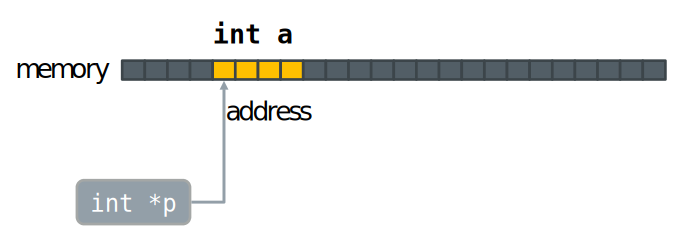

# What is C?

- C is a *general-purpose* programming language initially developed by
Dennis Ritchie between 1969 and 1973 at AT\&T Bell Labs

- It is an imperative procedural language intended for system software
  * Strong ties with UNIX operating system
- It has influenced many other programming languages
  * C++, C\#, ObjC, Java, JavaScript, Go, csh, ...

# Why C?

 - It’s popular and widely used

  * Available on almost all platforms
  * Lots of libraries for different tasks

- Provides a relatively low-level (or mid-level) access to the operating
 system and hardware

  * System-level programming, embedded systems
  * Can lead to better performance

# Standards

- First standard by ANSI in 1989, known as “ANSI C” or C89
    - Still the best choice when portability is important\!
    - ISO adopted the same standard in 1990 (C90)
- Next revision in 1999, C99
    - New datatypes, complex numbers, variable length arrays,...
- Current standard is C11
    - Improved Unicode support, atomic operations, multi-threading, bounds-checked functions, ...

**On this course we will use mainly ANSI C/C90 or C99**

# Getting started{.section}

# Look and feel

```c
/* Computing the factorial of an specified (by the user) number */
#include <stdio.h>

int fact(int n);

int main(void){
	int current;
	printf("Enter some POSITIVE integer (non-positive to finish): ");
	scanf("%d", &current);
	while (current > 0) {
		printf("Factorial of %d is %d\n", current, fact(current));
		printf("Enter a POSITIVE integer (non-positive to finish): ");
		scanf("%d", &current);
	}
}
/* This function returns the factorial of the specified integer (n)*/
int fact(int n) {
...
```


# Basic syntax

<div class="column">
  - Code is case sensitive
  - Statements terminate with ;
  - {} enclose blocks
  - There are two ways to comment :

```c
/* 
This is a very long and 
complicated comment,
which contains a lot of 
useful information 
*/

// This is a short comment
```
</div>

<div class="column">
```c
/* example function */
float foo(int bar) {
	int i, c=0;
	float x;
	x = 0.1;
	for (i=0; i<bar; i++) {
		x += i\*3.14 + c;
		c = i + 2;
	}
	return x;
}
```
</div>

# Basic syntax

Free format

  - whitespace, newlines, layout etc. do not matter …
**To the computer!!**

<div class="column">
```c
/* example function */
float foo(int 
bar) {int i,c=0;float x;x = 0.1;for
(i     =0;i<bar;
i++) {
x += i*3.14       + c;
c = i + 2;}return x;}
```
</div>
<div class="column">
```c
/* same example function? */
float foo(int bar) {
	int i, c=0;
	float x;
	x = 0.1;
	for (i=0; i< bar; i++) {
		x += i * 3.14 + c;
		c = i + 2;
	}
	return x;
}
```
</div>
# Simple Input / Output (I/O)

  - stdio-library is almost always needed. To include it use:  
	`#include <stdio.h>`
  - For printing a text on the screen use `printf()`

printf(`template`{.input} `{,variables}`{.input})
  : `template`{.input}
    : arbitrary string with optional placeholders for data from variables
  :  `{,variables}`{.input}
    : (optional) a list of variables 	
	

# Basic I/O

- Special characters that can be used in the template string:  
**\\n** newline	      
**\\t** horizontal tab  
**\\”** double quote	 
**\\\\** literal backlash  
- Placeholders are marked with **%** followed by formatting and type
information

  * For now, we will just use the following formattings:   
  **%d** integer value  
  **%f** float value  
  **%s** string

# Basic I/O example
```c
#include <stdio.h>
int main(int argc, char *argv[]) {
	printf("The answer is %d.\n", 42);
	printf("Pi equals to %.2f", 3.14159265);
	printf(" ...at least to the %dnd decimal.\n", 2);
	return 0;

}

//output:
// The answer is 42.
// Pi equals to 3.14 ...at least to the 2nd decimal.
```
# **The transition from Code to program**

<div class="column">
- Compiling:
    - Transforming the C source code to machine language
- Linker:
    - Combines object files generated by the compiler into a single executable program

- The result is an executable binary file
</div>
<div class="column">
```c
/*file.c*/
#include <stdio.h>

void main() {
    int i,j=0;
    float f=1.0;

    for (i=0; i<8; i++) {
	j += i;
	f *= j+i;
}
```

</div>


# Let's try it out\!
  
- Write the classic first program in C:

```c
#include<stdio.h>
void main(){
    printf("Hello World!\n");
}
```
  
- Compile the code:
  
```bash
$ gcc -o hello hello.c
```
- Test your program:
  
```bash
$ ./hello
Hello World!
```

# Datatypes, variables, assignment and operators{.section}

# Basic data types

  - Basic datatypes in C are: 
  	* **char** character 
  	* **int** integer number
  	* **long** long integer number 
  	* **float** floating point number
  	* **double** double precision float
  - C has also *pointer* types
  - There is also a special type **void**

# Variables
<div class="column">
  - Data types of the variables are static
  - Declare variables before using them
  - Valid variable names in C:  
  	`[a-z][A-Z][0-9]_`
  - Scope of a variable is always local unless otherwise declared
</div>

<div class="column">
```c
// variable declaration
int i;
float f, g;
double total=1.9;
// valid names
int i3, myINT, I_o;
float o3Gf_ry9;
// invalid names
int 33, 9a, i-o;
float o3.Gf;
// data type matters
char c;
float f;

f = 1.234;
c = f; // ERROR!, wrong data type
```
</div>
# Variable assignment
<div class="column">
- Assign a value to a variable: **variable = value;**  

- Both should have the same data type

  * implicit conversion between compatible types
  * explicit conversion (typecast) syntax: **(type) var**
</div>
<div class="column">
```c
// examples of assignment
count = 10;
i = j = 0;
k = i*j + 1;

// assign at declaration
int i = 4;

// typecast from int to float
int i;
float f;
i = 5 * 21;
f = (float) i;

// watch out for operator order
(float) i/5 != (float) (i/5)
```
</div>


# Arithmetics

- Operators:
    - `+` addition 
    - `-` subtraction
    - `*`  multiplication 
    -  `/` division
    -  `%` modulus

- Operator precedence
    1. `% * /`
    2. `+ -`
- Parentheses `()` group operations and change evaluation order


# **Compound assignment**

<div class="column">
- C has a short-hand notation for combined arithmetic operation and assignment  
    `a += b <--> a = a + b`   
    `a -= b <--> a = a - b`   
    `a *= b <--> a = a * b`  
    `a /= b <--> a = a / b`  
    `a++    <--> a = a + 1`   
    `a--    <--> a = a - 1`   

</div>
<div class="column">
```c
// example of compound assignment
int count = 10;

count += 5; // now count is 15

count /= 3; // and now count is 5

// Adding one to count 
count++;

// This is also valid (prefix)!
++count;
```
</div>

# Arithmetics and assignment examples
<div class=column>
```c
// addition, substraction
 i = 5 + 2;
 i = 5 – 2;
 i += 1; // i = i + 1
 f -= 3.4;
 i++; // i = i + 1
 i--;

 // multiplication, division
 i = 5 * 2;
 i = 5 / 2; // integer division
 f *= 3.0 / 4.2;

 // modulus
 m = 25 % 3; 
```
</div>
<div class=column>
```c
// grouping with ()s
b = a * (1.3 + (25%3));

// watch out!
f = 1 + q / (1 - q);
f = (1 + q) / (1 - q);

// also functions use ()
f = r * sin(theta);
f = (r + p)*sin(theta);

```
</div>

# Pointers

  - A variable is actually a reference to a memory location
  - The contents of the memory block determine the value of a variable
  - Memory addresses can be stored (and manipulated) in pointers
  - Pointers are one of the key features (and one of the most difficult) of the C language!

# Pointers
  - Pointers have a type (**int, char** etc.)
  - Stores a memory address containing data of corresponding type
  {.center width=100%}  

# Pointers

  - The address of a variable is obtained with `&`
  - The value pointed at by a pointer (the contents of the address) can 
  be accessed by de-referencing the pointer with `*`

```c
int *p, a;
a = 5;

// get address of a
p = &a;

// assign to a the value pointed at by *p plus 2
a = (*p) + 2; // a=7
```

# Summary

  - Short history and different standards
  - Basic syntax
  - Variables and their type, assignment of values
  - Arithmetic operations
