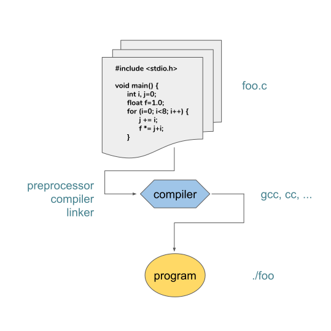

# Preprocessing and libraries {.section}

# Preprocessing directives

- C preprocessor is a part of the compiler that does initial text
substitution, manipulation, inclusion and other activities before the
actual translation is done

    - We have already used **`#include`**, which includes a file

- C relies heavily on preprocessor to accomplish

    - Portability of code
    - Source code control
    - Debugging


# Directives

- Preprocessor directives start with **`#`**, which has to be first token
on a line

- Directives are limited to one line

    - Line can be continued using **`\`**

- Directives are not statements, do not end the line with **`;`**

```c
// These are ok
#define one
	#define two

// Not the first token - WRONG!
int i; #define one
```


# \#define
- **\#define _identifier_  _replacement_**

- **\#define** can be used to define “objects” or macros

- After the definition all instances of **_identifier_** are replaced with **_replacement_**

```c
// Example
#define ONE 1

printf(“Value is %i\n”, ONE);

// Result: Value is 1
```


# Typedef vs. \#define
- **Typedef** is limited to giving symbolic names to types only  
    - **\#define** can be used to define alias for values as well

- **Typedef** interpretation is performed by the compiler  
    - **\#define** statements are processed by the preprocessor


# Directives

- **\#ifdef, \#ifndef**

    - checks whether a macro is defined (\/ not defined)  
    - if check is true, then includes the enclosed code

```c
#include <stdio.h>
#include "myfile.h"

#define DEBUG 1
#define PI 3.14159
#define MAX(a,b) (a)>(b)?(a):(b)

#ifdef DEBUG
/* debug mode is enabled */
#endif
```


# Definitions on compiler command line

- It is also possible to set preprocessor definitions on the compiler command line

- Most compilers accept option `-D` for this purpose:

```bash
gcc -DONE=1 -DUSE_FEATURE
```
  is equivalent with

```c
#define ONE 1 
#define USE_FEATURE
```


# The transition from Code to program
<div class=column>
- Compiling:

    - Transforming the C source code to machine language

- Linker:

    - Combines object files generated by the compiler into a single
    executable program

- The result is an executable binary file
</div>
<div class=column>
{.center width=100%}
</div>


# Working with several files and libraries

- Advantages:

    - Different programmers can work on different files
    - Function definitions can be re-used in other programs
    - Changing a file, only that file needs to be re-compiled to rebuild the program

- UNIX command **`make`** can be very useful tool for this!

    - Most IDEs also provide a tools for building this kind of compilation


# Compilation: working with several files
<div class=column>
- We use header files to define functions that we can use later

- Making .h files for your functions allows you to ‘include’ them in your code

- **Function prototypes** introduce the return value, name and argument of the function to the compiler
</div>
<div class=column>

File: add.c
```c
// we implement the function ‘add’
int add(int first, int second){
    return first + second;
}
```

File: add.h
```c
// we define the function ‘add’
#ifndef ADD_H
#define ADD_H

// Function prototype
int add(int first, int second);
#endif
```
</div>


# Compilation: working with several files

- Another .c file can then use the function `add()` by including the header file:

```c
// we can use #include "" or #include <>
#include "add.h"

int example(int x){
    return add(x, add(x,x));
}
```


# Compilation: working with several files

- So, this is how headers work:

    - `main()` would be in one file, the others will contain functions  

    - Headers usually only contain definitions of data types, function prototypes and C preprocessor commands  

    - We include the header into the C files  

    - We compile the different files and the compiler calls the header file  


# The transition from Code to program

In complex projects:

- Compile each source code file (.c) into an object file (.o)

```bash
$ gcc -c main.c
$ gcc -c add.c
```
- Link object files into a binary and execute the binary

```bash
$ gcc -o foo main.o add.o
$ ./foo
Modify “add.c”
$ gcc –c add.c
$ gcc -o foo main.o add.o
$ ./foo
```


# Libraries

- Libraries contain functions, data types and constants that can be used
by multiple programs

- Two components:

    - header: function etc. definitions  
    - object code in a library file (shared .so or static .a)

- When creating the executable binary file, an additional flag
(`-l`_library name_) is given to the linker to include the library


# Libraries
<div class=column>
- Math operations  
<small>
    `#include <math.h>`  +  link with -`lm` flag!
</small>
- It includes the most common mathematical functions, e.g. `sin()`, `cos()`, `log()` etc.

- Also includes constants such as `M_PI` for π

- For power operation function `pow()` is used (^ is bit-wise XOR in C!)
</div>
<div class=column>

```c
#include <math.h>
int main () {
    float r, theta;
    double area, y;

    // radius and an angle
    r = 1.2;
    theta = 0.456;

    // calculate something
    area = M_PI * pow(r,2);
    y = sin(theta)+ cos(theta/2.0);
    y += exp(-3.1 * area);

    // echo results
    printf("area is %f\n", area);
    printf("y=%.18e\n", y);
}
```
</div>


# Linking with libraries

- Add libraries in linking phase

```bash
$ gcc -c main.c
$ gcc -o foo main.o -lm
$./foo
```


# Compiler optimization

- Compiler flags provides possibilities of also for code optimization. Few instances of the optimization flags are  
 `-O, -O0, -O1, -O2, -O3, -Os.`

```bash
$ gcc -O3 -o toroid -lm toroid.c
$ ./toroid
```

- For further information check the manual of gcc:

```bash
$ man gcc
```


# File I/O{.section}

# File I/O

- **FILE\* fopen(\<filename\>, \<mode\>)**

    - **\<filename\>**
      : name of a file  
    - **\<mode\>**
      : read (r), write (w), append (a)
      : read+write (r+w)
      : binary mode (rb) ...  
    - **FILE**
      : pointer to file  

- **fclose(FILE\*)** closes file

- **fflush(FILE\*)** flush I\/O buffer to disk


# File I/O

- **stdout, stderr**

    - special output streams for `STDOUT` and `STDERR` (stdio.h)

- **fprintf(\<file\>, \<template\> {,\<variables\>})**

    - **\<file\>**
      : pointer to an open file

    - **\<template\>**
      : arbitrary string with optional placeholders for data from variables

    - **\<variables\>**
      : (optional) a list of variables


# File I/O

```c
#include <stdio.h>

fprintf(stdout, "The answer is %d.\n", 42);
//output (STDOUT):
// The answer is 42.

fprintf(stderr,"Pi equals to %.2f (at least to the %dnd decimal).\n",3.14159265, 2);
//output (STDERR):
// Pi equals to 3.14 (at least to the 2nd decimal).
```


# File I/O

```c
 #include <stdio.h>

 FILE *fp;
 int pid=2146;

 fp = fopen("mylog", "w");
 fprintf(fp, "logging my progress for process %d...", pid);
 fprintf(fp, "ok\n");
 fclose(fp);

 //output (in file 'mylog'):
 // logging my progress for process 2146...ok
```


# File I/O

- **fgets(char \*buffer, int size, FILE \*stream)**

    - Reads a single line from file pointer stream

    - Assigns string to buffer

    - The size parameter defines the max. size of characters to read.


# File I/O

- **fscanf(FILE \*stream, char \*format, ...)**

    - scan input according to format e.g. `"name: %s age: %d"`

    - store values of placeholders (%s etc.) to pointers

```c
// read max 64 characters from FILE *fp
fgets(buffer, 64, fp);

// read a matching string from FILE *fp, pick a string and
// an integer and assign them to variables name and age
fscanf(fp, "name: %s age: %d", &name, &age);
```


# Summary
  - Basic syntax

  - Overall structure: **\#include**, **functions**, **main()**

  - Data types: **int**, **float**, **...**, **struct**

  - Control structures: **for**, **while**, **if\/else**, **switch\/case**

  - Memory management: **pointers**, **malloc()**, **...**

  - I/O: **files**, **stdin**, **stdout**

  - Compiling & linking

# Web resources

  - C Programming  
    [http://en.wikibooks.org/wiki/C_Programming](http://en.wikibooks.org/wiki/C_Programming)
  - The C Library Reference Guide  
    [http://www.acm.uiuc.edu/webmonkeys/book/c_guide/](http://www.acm.uiuc.edu/webmonkeys/book/c_guide/)
  - C syntax   
    [http://en.wikipedia.org/wiki/C_syntax](http://en.wikipedia.org/wiki/C_syntax)
  - Ten Reasons to Teach and Learn Computer Programming in C  
    [http://iel.ucdavis.edu/publication/WhyC.html](http://iel.ucdavis.edu/publication/WhyC.html)
  - International Obfuscated C Code Contest  
    [http://en.wikipedia.org/wiki/International_Obfuscated_C_Code_Contest](http://en.wikipedia.org/wiki/International_Obfuscated_C_Code_Contest)

# Say what?

{.center width=15%}


