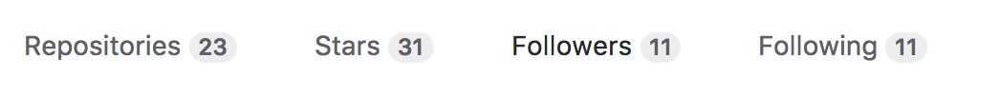

# Hands up - is this familiar?
<div class=column>
{.center width=90%}
</div>
<div class=column>
{.center width=90%}
</div>

# Why is this a problem for you ?

- Keeping track of all of your changes requires a lot of work 
- Sharing code with colleagues and collaborating is slow and prone to errors
 
## You spend less time on things that actually matter! 
Writing your code/scripts, running simulations and getting results 

## Good science is reproducible!
What is the exact version/revision of your code used to produce some results?


# Solution: Version control

- A version control system (VCS) is a kind of a “time machine”

  - Keeps track of changes made to files

- And a project manager

  - Keeps track of multiple versions of the code

- Imagine it as something that sits inside your folder and helps you with
your files

# Advantages of using version control

- You can go back to the code as it was at any given point in time with
single command

- You can compare different versions of the code

- You can merge unrelated changes made by different people

- You can manually decide what to do with conflicting regions and some of
the work is done for you by the version control system

  - e.g. it does what it can and shows you the places where it needs manual intervention

# Version control with git {.section}

# Starting a git repository: git init

- We need to tell git to start "monitoring" our project folder
- Git won't do or save anything unless we tell it to 
- creates a `.git` folder. Don't touch this!
	- contains all the info and data used by git, manual editing can/will break it
- **Terminology:** A git _repository_ = A project folder were git is operating 


```bash
$ mkdir recipe
$ cd recipe
$ git init

```

# Choosing what we want to save: git add

- Selecting what changes we want to save
	- Moving and deleting files is also a change
	- Could be a folder, a couple of files, a single file or just part of a file
	 
- You don't have to add all your changes at once! 

- Does not change our files or save anything yet

```bash
.... editing some files
$ git add ingredients.txt

```


# Creating a snapshot: git commit 
 - A commit is a saved state of your project
 - All changes that were added using `git add` are now part of the commit  
 - A commit can (should) have an associated commit message
 	- The message should be clear and concise: "Fixed bug #1234"
 - Git allows us to compare, merge, and checkout commits
 	- Checkout a commit -> Set our project state to a specific commit 

```bash
$ git commit

```

# Git file states: git status 
 A file in a git repository can be in one of the following states

 - **Untracked**: Untracked files are ignored by git
 - **Unmodified**: The file is tracked by git, but no changes have been made 
 - **Modfied**: The file is tracked by git and has been modified
 - **Staged**:  The file has been added (`git add file1`) and is ready to be committed to your repository 

`git status` shows the current state of your repository

# Project history: git log

- Each commit has a:
	- Message 
	- Author
	- Unique id,  also called a commit hash
	- Submission date

- We use `git log` to inspect the history of our repository 

# Whats the difference: git diff

 - Show the difference between two commits
 - Or the difference between a commit and the current state of your project
 - The commit hash is used to refer to a specific commit

# Remote repositories: Were things get really useful

 - You can have multiple copies of the same project in different places
 	- A different folder, another computer, or a web-bases repository
	- You have a copy, your coworker has a copy, and so on...  
 
 - This is what enables collaboration and sharing changes

 - You can also just copy a git repository and after that never interact with any one

# Centralized vs. Distributed

- Git is a distributed version control system
 	- I.e every repository is self contained and _equally valid_ 

{.center width=50%}

# Remote repositories: Basic commands
  - `git clone`, to copy a repository
  - `git pull`, to retrieve changes from a remote repository  
  - `git push`, to send our changes to a remote repository 

# Remote repositories: Web services

- Git is usually paired up with web-based repository
  - GitHub
  - Bitbucket
  - GitLab 

- **These are not the same as git**, they are services built on top of git

- We will be using github, exercises and materials at  
<https://github.com/csc-training/summerschool>

# Social coding with git+Github

- Interact with collaborators

  - Scales from 1 to 1000+ contributors (may include your supervisor
    too\!)

- Open projects enable other people to join too

- Or have a direct influence on people who contribute by running a closed project

# Social coding with git+Github

- These days Github account also serves as your “code CV”  
  
  
{.center}   
{.center}

# Creating repositories on github

<div class=column>
1. Create a new repository in github
2. After this you can:
	- push a local repository to github 
	<small>
	```bash
	$ git remote add origin https://github.com/User/repo.git
	$ git push -u origin master
	```
	</small>
	- clone the repository  
	<small> 
	```bash	
	git clone https://github.com/User/repo.git
	```
	</small>


3. The local repository is now functioning and synced with github
</div>
<div class=column>

 {.center width=60%}  

 {.center width=60%}

</div>


# Forking repositories

  - Copying a repository on GitHub to your own GitHub
	- So a GitHub feature, _not a part of git_ 
  - This is called “forking”
  - Forking a repository allows you to freely experiment with changes
    without affecting the original project.
  - Once forked, we can again clone the repository to ourselves

{.center width=80%}

# Forking & cloning repositories

- Let’s fork & clone our first repository

  - Fork <https://github.com/csc-training/summerschool>
  - `git clone https://github.com/user/summerschool`  

{.center}

# Git Workflow

1. New file changes are **pull**ed from the remote repository: `git pull`

	- Files are now up-to-date (in respect to the remote repository)

2. Something is modified 
	- E.g. editing, adding or removing a file 

3. Modifications are **add**ed for commit: `git add file.c`
	- Think of this as putting your file changes into a package

4. Changes are **commit**ted to the local repository: `git commit`

5. Commits are **push**ed to the remote repository: `git push`
 


# Git Workflow

- At every point, you can check the current status of the local repository
  - `git status`
  - What is changed? What is staged for commit?

- Sometimes it is useful to drop local changes

  - `git stash`
  - Restores the local repository to the latest commit by stashing your changes (they can be retrieved later on)

- These are super useful, hence, use them often\!

# Branching

- By default everything is happening at “master” branch
- A branch is just a pointer to a commit 
- You can freely create new branches

  - `git branch new_branch_name`
  - `git checkout new_branch_name`

- Extremely useful when you are working on multiple things/features
	- Allows you to keep a properly working version of a program, even though you are in the middle of major modifications.
	- Great for still unstable features


# Branching
<div class=column>

 {.center width=100%}
</div>
<div class=column>
 {.center width=100%}

</div>


# Advanced features - Pull requests

- In bigger projects it is typical not to push directly but to send a
“pull request” from your fork or branch

  - Typically done in the www-interface of GitHub

- Pull request is usually a fix or an improvement containing multiple
commits

- Allows to review and modify changes

# Summary

  - If you are not using git, start using it\!
  - Remember the standard workflow: 
  	- pull -> modify -> add -> commit -> push
  - Explore GitHub, there are many cool repositories\!
   
  - Experiment with git and try out different features, its better to make mistakes now than later.
  

# Version control git commands

  - Download repository: `git clone https://…`
  - Update changes from remote repo: `git pull`
  - Check the status of repository: `git status`
  - Add new file for staging: `git add file1`
  - Commit changes to local repository: `git commit -m “X”`
  - Update local repo to remote repo: `git push`
  - Delete a file from repository: `git rm file1`
  - Documentation: `git help [cmd]`
