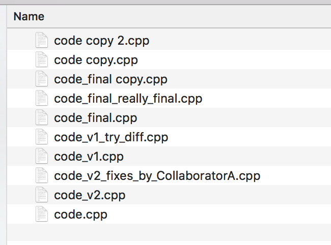
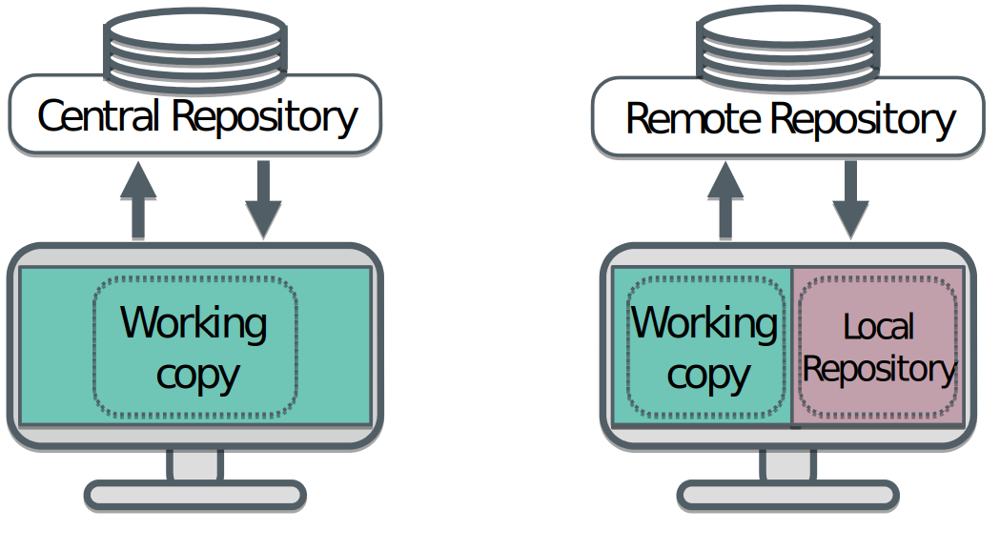
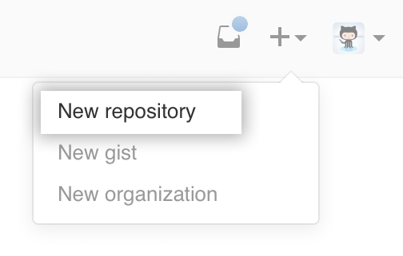

# Hands up - is this familiar?
{.center width=50%}

# Solution: Version control

- A version control system (VCS) is a kind of a “time machine”

  * Keeps track of changes made to files

- And a project manager

  * Keeps track of multiple versions of the code

- Imagine it as something that sits inside your folder and helps you with
your files

# Advantages of using version control

- You can go back to the code as it was at any given point in time with
single command

- You can merge unrelated changes made by different people

- You can manually decide what to do with conflicting regions and some of
the work is done for you by the version control system

  * e.g. it does what it can and shows you the places where it needs manual intervention

# Centralized vs. Distributed
{.center width=80%}

# Remote repositories

- Modern Version control systems are distributed

  * Git (and Mercurial,…)
  * You may also encounter older non-distributed VCSs like svn

- Git is usually paired up with web-based repository

  * GitHub (140k matches in Google Scholar)
  * Bitbucket (12k)
  * GitLab (2k), SourceForge (160k, however…) etc.
  * Your own server

Most modern and widely used combo: Git + Github

# Social coding with git+Github

- Interact with collaborators

  * Scales from 1 to 1000+ contributors (may include your supervisor
    too\!)

- Open projects enable other people to join too

- Or have a direct influence on people who contribute by running a closed project

# Social coding with git+Github

- These days Github account also serves as your “code CV”  
  
  
{.center}   
{.center}

# Initializing repositories
- Git needs to be told that “start operating in this folder”
	* ` git init `  
	* ` git remote add origin github.com/user/repo.git`  
	* ` git push`  

- Repository is now functioning and synced with GitHub

# Initializing repositories, alternative way

- Create a new remote repository in GitHub  

- Clone (=download) it: `git clone https://github.com/user/repo.git`   
{width=30%} \	 ---> \ {width=30%}

# Forking & cloning repositories

  - Sometimes you want to copy repository by somebody else
  - This is called “forking” and can be done in GitHub
  - Forking a repository allows you to freely experiment with changes
    without affecting the original project.
  - Once forked, we can again clone the repository to ourselves

{.center width=80%}

# Forking & cloning repositories

- Let’s fork & clone our first repository

  * Fork `https://github.com/csc-training/summerschool`
  * `git clone https://github.com/user/summerschool`  

{.center}

# Git Workflow

1. New file changes are **pull**ed from the remote repository: `git pull`

	* Files are now up-to-date (in respect to the remote repository)

2. Something is modified 
	* E.g. editing, adding or removing a file 

3. Modifications are **add**ed for commit: `git add file.c`
	* Think of this as putting your file changes into a package

4. Changes are **commit**ted to the local repository: `git commit`

5. Commits are **push**ed to the remote repository: `git push`
 
# Git file states
 A file in a git repository can be in one of the following states

 - **Untracked**: Untracked files are ignored by git
 - **Unmodified**: The file is tracked by git, but no changes have been made 
 - **Modfied**: The file is tracked by git and has been modified
 - **Staged**:  The file has been added (`git add file1`) and is ready to be committed to the local repository 

# Git Workflow

- At every point, you can check the current status of the local repository
  * `git status`
  * What is changed? What is staged for commit?

- Sometimes it is useful to drop local changes

  * `git stash`
  * Restores the local repository to the latest commit by stashing your changes (they can be retrieved later on)

- These are super useful, hence, use them often\!

# Advanced features - Branching

- By default everything is happening at “master” branch

- You can freely create new branches

  * `git branch new_branch_name`
  * `git checkout new_branch_name`

- `git pull` is actually `git fetch` && `git merge` that fetches remote master
branch and merges it into local master branch

- Allows to work on some aspect of the project and then fall back to the
master branch if needed

  * Changes made to the new branch are stored
  * Files can be restored to the default master branch version

# Advanced features - Pull requests

- In bigger projects it is typical not to push directly but to send a
“pull request” from your fork or branch

  - Typically done in the www-interface of GitHub

- Pull request is usually a fix or an improvement containing multiple
commits

- Allows to review and modify changes

# Summary

  - If you are not using git, start using it\!
  - Remember the standard workflow: 
  	* pull -> modify -> add -> commit -> push
  - Explore GitHub, there are quite a many cool repositories\!
  - Check [https://help.github.com/](https://help.github.com/)
	* it has an answer to everything git-related\!

# Version control git commands

  - Download repository: `git clone https://…`
  - Update changes from remote repo: `git pull`
  - Check the status of repository: `git status`
  - Add new file for staging: `git add file1`
  - Commit changes to local repository: `git commit -m “X”`
  - Update local repo to remote repo: `git push`
  - Delete a file from repository: `git rm file1`
  - Documentation: `git help [cmd]`
