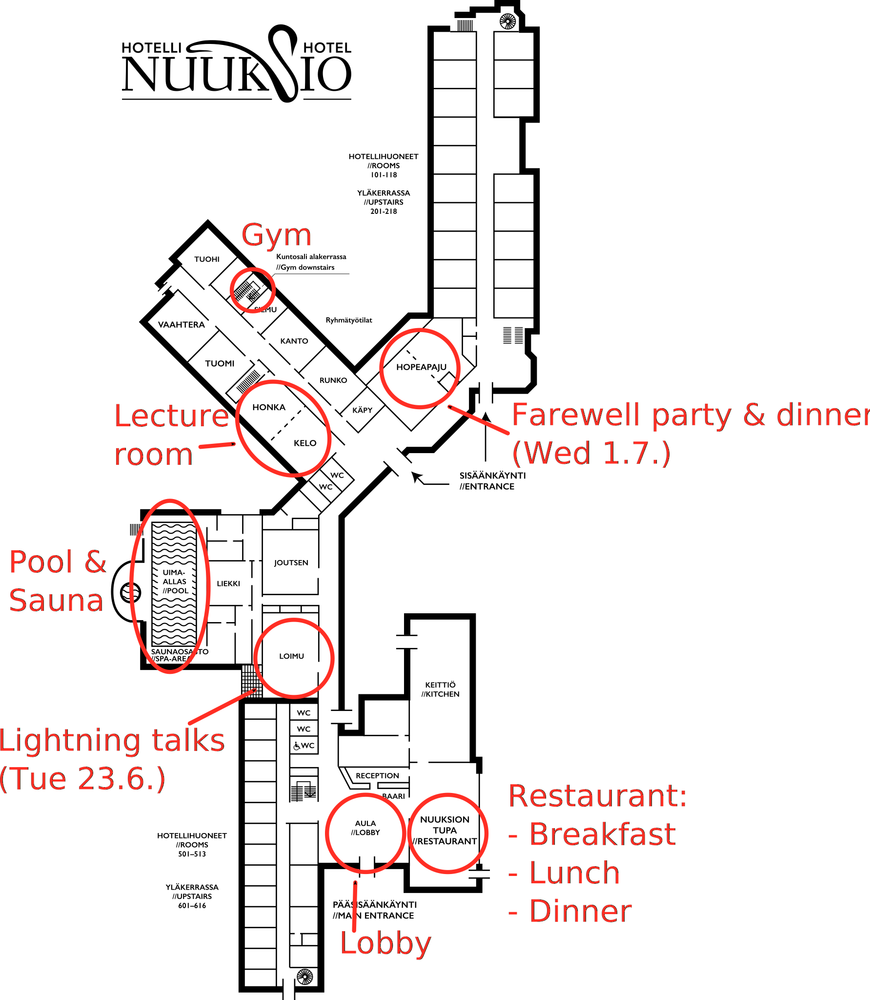
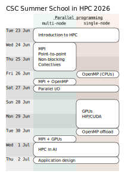

# Where are we? {.section}

# Nuuksio National Park

*A green oasis in the Helsinki capital region*

<https://www.luontoon.fi/en/destinations/nuuksio-national-park>

# Neighborhood

{.center width=100%}

Map: <https://www.retkikartta.fi/> (Good for hiking!)

# Surroundings of Hotelli Nuuksio

{.center width=95%}

# Inside Hotelli Nuuksio

{.center width=55%}

# Getting around

- All lectures and exercises will take place in **Kelohonka** room
- Breakfast, lunch, and dinner will be served in **Nuuksion Tupa** restaurant
- Special events (see [schedule](https://github.com/csc-training/summerschool)):
  - Get together and lighting talks on Tue 23.6. at 19:30 in **Loimu** room
  - **Lake Sauna** reserved for us on Wed 24.6., Fri 26.6., and Mon 29.6. from 20:00--
  - Farewell dinner will be served in **Hopeapaju** room on Wed 1.7. from 19:00--
- Feel free to use hotel facilities at all times
  - Indoor sauna and pool can be used if there is no private bookings

# Outdoor activities (and indoors too)

- Time reserved on most days for free-form activities before dinner at 17:00--18:00
  - Good chance to socialize and get out of the computer!
- Special guided outdoor activities:
  - Wed 24.6. 16:30--18:00: Nuuksio Olympic Games
  - Wed 1.7. 16:00--18:00: Boating at the lake
- Free access to hotel gym, rowing boats, tennis rackets, mölkky games, etc.
- Hiking trails to Nuuksio National Park leave right from the hotel yard
  - <https://www.luontoon.fi/en/destinations/nuuksio-national-park>

# Practicalities {.section}

# Attendance list

- Please mark "x" for your name **every morning** in the list outside the lecture room
- This is a hearbeat signal -- We want to keep track that no-one has gotten lost in the forest etc.
  - Before you do, please save [the phone numbers of organizers](https://github.com/csc-training/summerschool/wiki#contacts) in your phone

# In case a ticks bites

- Remove the tick attached to the skin immediately and monitor the bite site
  - Please borrow thin tweezers from [the organizers](https://github.com/csc-training/summerschool/wiki#contacts) or ask help for removing it
- It's advisable to do regular tick checks to detect tick at an early stage
- See further information [here](https://www.mehilainen.fi/en/tick-bite) or [here](https://www.terveyskyla.fi/en/emergencyhub/self-care-instructions-in-sudden-health-problems/ticks)

# Code of conduct

- We work in the spirit of [the CodeRefinery Code of Conduct](https://coderefinery.org/about/code-of-conduct/) in the summer school
- In short: Please be nice and respectful with one another
- Report any inappropriate behavior to [the organizers](https://github.com/csc-training/summerschool/wiki#contacts)

# Photography

- Be respectful and ask people before photographing them, and before posting their pictures on social media.
- Note the color of lanyards:
  - **white lanyard** means: ok to be visible in photos
  - **black lanyard** means: no photos, no social media
- Please keep your lanyard visible throughout the school, especially for the photoshoot on Wed 1.7.

# Chat channel

- Feel free to use the chat channel for organizing social activities, asking questions, free discussion, etc.
  - <https://chat.csc.fi/group/CSC_Summer_School_in_HPC_2026>

# Acknowledgements

{.center width=80%}

# School content {.section}

# Learning objectives

- The goal is to build HPC expertise up to an intermediate/semi-advanced level during the school.
- After the summer school, the participants will be able to:
  - Identify main parallel programming concepts
  - Create parallel MPI programs with C, C++, or Fortran programming languages
  - Create GPU-accelerated programs using HIP/CUDA
  - Recognize advanced parallel programming constructs
  - Understand and modify HPC applications utilizing MPI, OpenMP, and/or HIP/CUDA

# Schedule

{.center width=90%}

[Detailed schedule here](https://github.com/csc-training/summerschool/)

# Exercises

- We focus on *hands-on* experience in HPC
  - Demos and exercises intermixed with lectures
- Use the exercise slots during the day to work on the topic at hand
- The exercise sessions after dinner are optional and free format
  - No guided program, but a lecturer will be present in these sessions
  - Session can be used for completing any unfinished exercises, discussing HPC topics, or trying out the learned things in your own code (time permitting)

# Materials

- All material is in the Summer School GitHub repository <https://github.com/csc-training/summerschool/>
  - Slides, demo codes, exercises, ...
  - Schedule, practical information (in [wiki](https://github.com/csc-training/summerschool/wiki))
- Feel free to fork the repository for your own use
- After the school, a static copy of the content will be published as a release under GitHub

# It's 15th CSC Summer School in HPC!

2010, 2011, 2012, 2013, 2014, 
2015, 2016, 2017, 2018, 2019, 
<del>2020</del>, <del>2021</del>, 
[2022](https://csc.fi/en/news/the-summer-school-is-built-on-learning-high-performance-computing-and-doing-things-together/),
[2023](https://csc.fi/en/story/summer-school-brings-together-learners-interested-in-high-performance-computing/),
[2024](https://csc.fi/en/story/csc-summer-school-2024-high-performance-computing-in-nuuksio-national-park/),
[2025](https://csc.fi/en/story/summer-school-brings-together-computing-collaboration-and-nature/),
2026!

# Welcome to the school!

- Be active!
- Learn a lot!
- Make friends!
- Have fun!
